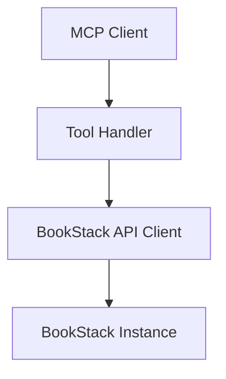

# Feature Spec: [Title]

**ID**: FEAT-NNNN
**Status**: Draft | Review | Approved | Implemented
**Author**: [Name]
**Created**: YYYY-MM-DD
**Last Updated**: YYYY-MM-DD
**Related ADRs**: [ADR-NNNN](../architecture/decisions/ADR-NNNN-title.md)

---

## Problem Statement

<!-- Describe the problem or opportunity this feature addresses. Why does this need to be built? -->

[TODO: Describe the problem]

## Goals

<!-- Numbered list of measurable objectives this feature achieves. -->

1. [TODO: Goal 1]
2. [TODO: Goal 2]

## Non-Goals

<!-- What is explicitly out of scope for this feature. -->

- [TODO: Non-goal 1]

## Requirements

<!-- Use MUST / SHOULD / MAY per RFC 2119. Number each requirement. -->

### Functional Requirements

1. The system MUST [TODO: requirement].
2. The system SHOULD [TODO: requirement].

### Non-Functional Requirements

1. The system MUST respond within [TODO: threshold] under [TODO: load].
2. All inputs MUST be validated at system boundaries.

## Design

<!-- High-level approach: key components, data flows, APIs. Include diagrams where useful. -->

### Component Diagram

### API / Tool Interface

<!-- Describe new or modified MCP tools / resources. -->

| Tool Name | Description | Parameters | Returns |
|---|---|---|---|
| `tool_name` | Description | `param: type` | `ResultType` |

## Acceptance Criteria

<!-- Each criterion must be independently verifiable. -->

- [ ] Given [context], when [action], then [outcome].
- [ ] Given [context], when [action], then [outcome].

## Security Considerations

<!-- Auth, input validation, sensitive data, OWASP mitigations. -->

- [TODO: Security consideration]

## Open Questions

<!-- Unresolved questions; resolve before moving to Approved. -->

- [ ] [TODO: Open question]

## Out of Scope

<!-- Reiterate anything that came up during spec authoring that is deferred. -->

- [TODO: Deferred item]
