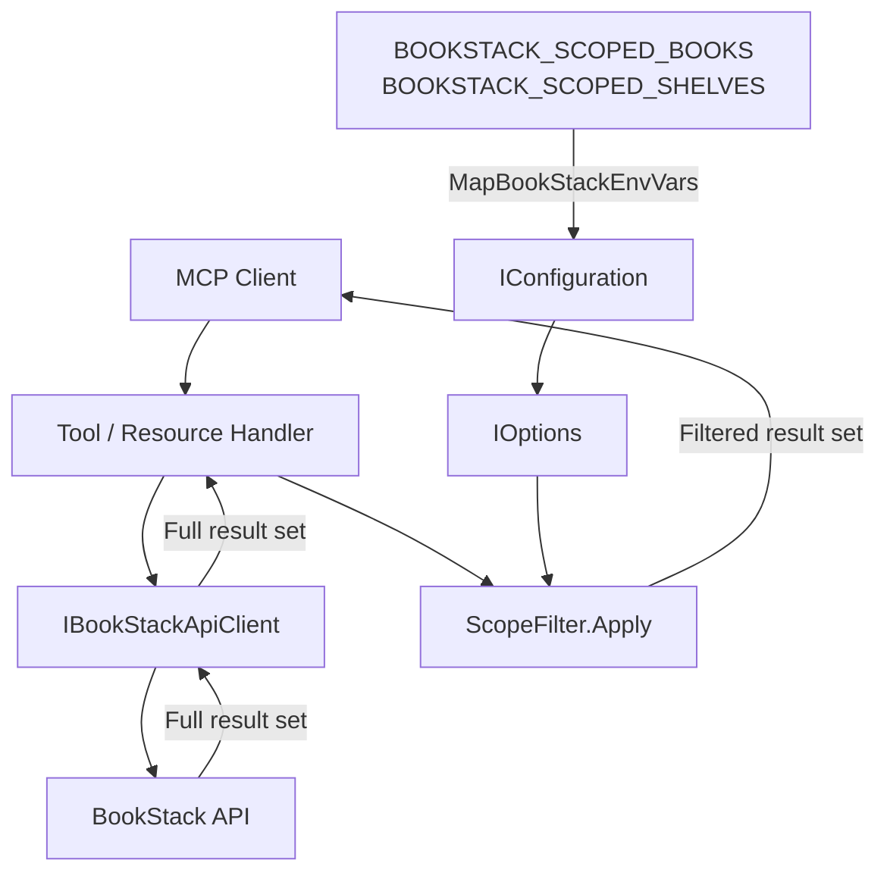
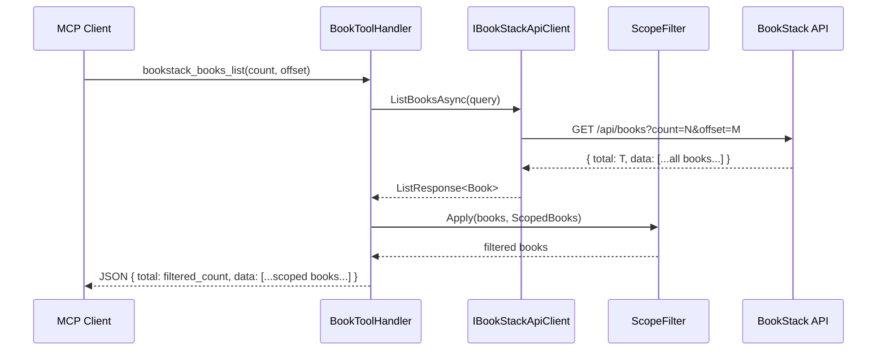

# Feature Spec: Book/Shelf Scope Filtering for MCP Tools

**ID**: FEAT-0054
**Status**: Draft
**Author**: GitHub Copilot
**Created**: 2026-04-25
**Last Updated**: 2026-04-25
**GitHub Issue**: [#54 — Book/Shelf Scope Filtering for MCP Tools](https://github.com/MarkZither/bookstack-mcp-server-dotnet/issues/54)
**Parent Epic**: [#1 — Core MCP Server](https://github.com/MarkZither/bookstack-mcp-server-dotnet/issues/1)
**Related ADRs**: None yet — see Technical Decisions Identified.

---

## Executive Summary

- **Objective**: Allow operators and end-users to restrict which books and shelves the MCP tools and
  resource handlers operate against, so AI agents only surface content from a configured subset of
  the BookStack instance.
- **Primary user**: Operators deploying the server for a team or project who want to limit AI agent
  access to a relevant slice of content; VS Code users who configure their scoped workspace via the
  extension.
- **Value delivered**: Prevents AI agents from surfacing irrelevant or sensitive content from
  unrelated books/shelves, reduces noise in AI responses, and enables per-project MCP server
  deployments without separate BookStack instances.
- **Scope**: New `ScopeFilterOptions` configuration class, `MapBookStackEnvVars()` extension,
  application-layer post-fetch filtering in `bookstack_books_list`, `bookstack_shelves_list`,
  `bookstack_search`, and all list resource handlers. VS Code extension new settings
  `bookstack.scopedShelves` and `bookstack.scopedBooks` mapped to env vars. No changes to
  single-item-by-ID tools, the `IBookStackApiClient` interface, the BookStack API call parameters,
  or the data layer.
- **Primary success criterion**: When scope is configured, list and search results contain only
  items belonging to the configured books/shelves; when scope is empty, behaviour is identical to
  today.

---

## Problem Statement

The BookStack MCP server currently exposes the full set of books, shelves, and search results
visible to the authenticated API token. In shared BookStack instances with many books, AI agents
receive overwhelming or irrelevant results and may surface content that belongs to unrelated teams
or projects. There is no mechanism to restrict the server to a relevant subset of content without
creating a separate BookStack API token with restricted permissions — which requires BookStack
admin access and per-shelf permission configuration.

Operators need a lightweight, configuration-driven way to pin the MCP server to one or more
specific books or shelves without modifying BookStack's permission model.

## Goals

1. Provide two environment variables (`BOOKSTACK_SCOPED_SHELVES`, `BOOKSTACK_SCOPED_BOOKS`) that
   accept comma-separated book/shelf identifiers (numeric IDs or slugs) and restrict list and
   search results to the configured subset.
2. Apply scope filtering at the MCP tool layer so that `bookstack_books_list`,
   `bookstack_shelves_list`, `bookstack_search`, and all MCP resource list handlers return only
   in-scope items when a scope is configured.
3. Expose `bookstack.scopedShelves` and `bookstack.scopedBooks` settings in the VS Code extension
   so users can configure scope through the VS Code Settings UI without editing environment
   variables manually.
4. Leave single-item-by-ID tools (`bookstack_books_read`, `bookstack_pages_read`, etc.) completely
   unaffected by scope — they always pass through to the BookStack API.
5. Preserve the existing default behaviour (empty scope = all content) so no currently deployed
   configuration requires changes.

## Non-Goals

- Modifying the `IBookStackApiClient` interface or any `BookStackApiClient` implementation method.
- Passing scope IDs as query parameters to the BookStack REST API — filtering is applied
  application-side after the API response is received.
- Implementing scope filtering for semantic / vector search (feature #11) — see Out of Scope.
- Per-user or per-role scope — this is a single operator-level configuration.
- Dynamic scope changes without restarting the server process.
- Slug-to-ID resolution at startup — slugs and IDs are matched directly against the `Slug` and `Id`
  fields of each returned item, requiring no extra API calls.

## Requirements

### Functional Requirements

1. The system MUST read `BOOKSTACK_SCOPED_SHELVES` from the environment as a comma-separated list
   of shelf identifiers (integer IDs and/or slugs). Leading and trailing whitespace around each
   entry MUST be trimmed.
2. The system MUST read `BOOKSTACK_SCOPED_BOOKS` from the environment as a comma-separated list of
   book identifiers (integer IDs and/or slugs), with the same trimming rule.
3. A new `ScopeFilterOptions` configuration class MUST be introduced in the
   `BookStack.Mcp.Server.Config` namespace and registered via `IOptions<ScopeFilterOptions>`. It
   MUST expose:
   - `IReadOnlyList<string> ScopedShelves` — parsed from `BookStack:ScopedShelves`
   - `IReadOnlyList<string> ScopedBooks` — parsed from `BookStack:ScopedBooks`
4. `MapBookStackEnvVars()` in `Program.cs` MUST be extended to map:
   - `BOOKSTACK_SCOPED_SHELVES` → `BookStack:ScopedShelves`
   - `BOOKSTACK_SCOPED_BOOKS` → `BookStack:ScopedBooks`
5. When `ScopedBooks` is non-empty, `bookstack_books_list` MUST return only books whose `Id` (when
   the entry is numeric) or `Slug` (when the entry is non-numeric) matches any entry in
   `ScopedBooks`. Non-matching books MUST be omitted from the result.
6. When `ScopedShelves` is non-empty, `bookstack_shelves_list` MUST return only shelves whose `Id`
   or `Slug` matches any entry in `ScopedShelves`. Non-matching shelves MUST be omitted.
7. When `ScopedBooks` is non-empty, `bookstack_search` MUST post-filter results: any
   `SearchResultItem` where the associated `Book.Id` or `Book.Slug` does not match any entry in
   `ScopedBooks` MUST be omitted. Items whose `Type` is `book` are matched directly on their own
   `Id`/`Slug`. Items of type `shelf`, `chapter`, or `page` without a resolvable book association
   MUST also be omitted when `ScopedBooks` is configured.
8. The `bookstack://books` MCP resource handler MUST apply the same book scope filter as
   requirement 5.
9. The `bookstack://shelves` MCP resource handler MUST apply the same shelf scope filter as
   requirement 6.
10. When scope is empty (both env vars absent or blank), all filtering logic MUST be bypassed and
    the full API response MUST be returned unchanged — this is the existing default behaviour.
11. The `Total` field in paginated responses returned by list tools MUST reflect the count of
    items after scope filtering, not the raw total from the BookStack API.
12. Single-item-by-ID tools (`bookstack_books_read`, `bookstack_shelves_read`,
    `bookstack_chapters_read`, `bookstack_pages_read`, etc.) MUST NOT apply any scope filtering.
13. The VS Code extension MUST expose two new settings:
    - `bookstack.scopedShelves` — `string`, default `""`, description: comma-separated shelf IDs
      or slugs.
    - `bookstack.scopedBooks` — `string`, default `""`, description: comma-separated book IDs or
      slugs.
    These settings MUST be passed as `BOOKSTACK_SCOPED_SHELVES` and `BOOKSTACK_SCOPED_BOOKS`
    environment variables when the extension launches the MCP server process.

### Non-Functional Requirements

1. Scope filtering MUST add no additional HTTP requests to the BookStack API; all filtering is
   applied to data already retrieved by the existing API call.
2. `ScopeFilterOptions` MUST be injected via `IOptions<ScopeFilterOptions>` so that it is
   testable with `Options.Create(...)` in unit tests without a running server.
3. All filter logic MUST be covered by unit tests in `BookStack.Mcp.Server.Tests` using TUnit
   and mocked `IBookStackApiClient`.
4. Scope identifiers MUST be compared case-insensitively for slug values (BookStack slugs are
   lowercase but user input may vary).
5. The feature MUST not introduce any breaking changes to existing MCP tool names, parameters, or
   response schemas.

## Design

### Open Questions Resolution

The three open questions from issue #54 are resolved as follows:

**Q1 — Filter at MCP tool layer vs pass IDs as query params to BookStack API?**

**Decision: MCP tool layer (application-side post-fetch filtering).**

Rationale: BookStack's list endpoints (`/api/books`, `/api/shelves`) do not support filtering by
shelf membership or arbitrary ID lists. BookStack's search endpoint supports `{filter:book_id=N}`
syntax in the query string, but only for a single book ID; injecting multiple IDs would require
constructing complex query syntax that is undocumented and may be silently ignored. Slug-to-ID
resolution (needed to use server-side filters) would require extra API calls, adding latency and
complexity. Post-fetch filtering is simpler, transparent, and consistent across all affected
endpoints. The trade-off — that pagination `count`/`offset` parameters are applied to the
unfiltered set before filtering — is documented as a known limitation and is acceptable for the
expected scope sizes (typically 1–10 books/shelves per deployment).

**Q2 — Server-side (env vars) or client-side (VS Code settings) enforcement?**

**Decision: Server-side enforcement via env vars; VS Code settings are mapped to env vars by
the extension.**

Rationale: Filtering at the server is the authoritative enforcement point regardless of the MCP
client in use (VS Code, Claude Desktop, CI pipelines, etc.). VS Code settings provide a
user-friendly configuration surface that the extension converts to env vars when launching the
server process — the same pattern already used for `bookstack.url` and token settings. The server
is the single source of truth; the VS Code extension is a configuration façade.

**Q3 — How does scoping interact with semantic search (feature #11)?**

**Decision: Deferred to feature #11. This feature makes no provision for semantic/vector search.**

Rationale: Feature #11 (vector search / pgvector) has not begun implementation. When it is
designed, `ScopeFilterOptions` will be injected into the semantic search handler, which will
apply book scope to candidate set retrieval (either as a pre-filter on indexed book IDs or as a
post-filter on the ranked result set). Feature #11's spec must reference this spec and explicitly
enumerate how `ScopedBooks` and `ScopedShelves` apply to vector queries. No assumptions are
encoded in this feature.

---

### Component Diagram



### Data Flow: Scoped Book List



### New Configuration Class

```csharp
// src/BookStack.Mcp.Server/config/ScopeFilterOptions.cs
namespace BookStack.Mcp.Server.Config;

public sealed class ScopeFilterOptions
{
    public IReadOnlyList<string> ScopedShelves { get; set; } = [];
    public IReadOnlyList<string> ScopedBooks   { get; set; } = [];

    public bool HasBookScope   => ScopedBooks.Count   > 0;
    public bool HasShelfScope  => ScopedShelves.Count > 0;
}
```

### Env Var Mapping Extension

```csharp
// Addition to MapBookStackEnvVars() in Program.cs
var scopedShelves = Environment.GetEnvironmentVariable("BOOKSTACK_SCOPED_SHELVES");
if (scopedShelves is not null)
    map["BookStack:ScopedShelves"] = scopedShelves;

var scopedBooks = Environment.GetEnvironmentVariable("BOOKSTACK_SCOPED_BOOKS");
if (scopedBooks is not null)
    map["BookStack:ScopedBooks"] = scopedBooks;
```

> **Note**: `IConfiguration` binding for a `IReadOnlyList<string>` from a comma-separated value
> requires either a custom converter or splitting the string before passing to `AddInMemoryCollection`.
> The recommended approach is to split on comma in `MapBookStackEnvVars()` and populate indexed keys
> (`BookStack:ScopedBooks:0`, `BookStack:ScopedBooks:1`, …`) so that `Configure<ScopeFilterOptions>`
> binds directly.

### Filter Helper

```csharp
// Suggested placement: src/BookStack.Mcp.Server/config/ScopeFilter.cs
internal static class ScopeFilter
{
    internal static bool MatchesScope(int id, string slug, IReadOnlyList<string> scope)
    {
        foreach (var entry in scope)
        {
            if (int.TryParse(entry, out var scopeId) && scopeId == id)
                return true;
            if (string.Equals(entry, slug, StringComparison.OrdinalIgnoreCase))
                return true;
        }
        return false;
    }
}
```

### Affected Tool and Resource Handlers

| Handler | Method | Scope Applied | Filter Field |
| ------- | ------ | ------------- | ------------ |
| `BookToolHandler` | `ListBooksAsync` | `ScopedBooks` | `Book.Id` / `Book.Slug` |
| `ShelfToolHandler` | `ListShelvesAsync` | `ScopedShelves` | `Bookshelf.Id` / `Bookshelf.Slug` |
| `SearchToolHandler` | `SearchAsync` | `ScopedBooks` | `SearchResultItem.Book.Id/.Slug` or item `Id`/`Slug` when `Type == "book"` |
| `BookResourceHandler` | `GetBooksAsync` (resource) | `ScopedBooks` | `Book.Id` / `Book.Slug` |
| `ShelfResourceHandler` | `GetShelvesAsync` (resource) | `ScopedShelves` | `Bookshelf.Id` / `Bookshelf.Slug` |

### VS Code Extension Settings

New entries in `package.json` `contributes.configuration.properties`:

```json
"bookstack.scopedShelves": {
  "type": "string",
  "default": "",
  "markdownDescription": "Comma-separated shelf IDs or slugs to restrict MCP tools to specific shelves. Leave blank for all shelves."
},
"bookstack.scopedBooks": {
  "type": "string",
  "default": "",
  "markdownDescription": "Comma-separated book IDs or slugs to restrict MCP tools to specific books. Leave blank for all books."
}
```

The extension's MCP server definition provider MUST pass these as env vars when constructing the
server spawn configuration:

```typescript
env: {
  BOOKSTACK_BASE_URL:       config.get<string>('bookstack.url', ''),
  BOOKSTACK_TOKEN_SECRET:   `${tokenId}:${tokenSecret}`,
  BOOKSTACK_SCOPED_SHELVES: config.get<string>('bookstack.scopedShelves', ''),
  BOOKSTACK_SCOPED_BOOKS:   config.get<string>('bookstack.scopedBooks', ''),
}
```

## Acceptance Criteria

- [ ] Given `BOOKSTACK_SCOPED_BOOKS` is unset, when `bookstack_books_list` is called, then all
  books returned by the BookStack API are included in the response.
- [ ] Given `BOOKSTACK_SCOPED_BOOKS=42`, when `bookstack_books_list` is called and the API returns
  books with IDs 42, 99, and 7, then only the book with ID 42 is present in the response.
- [ ] Given `BOOKSTACK_SCOPED_BOOKS=my-team-guide`, when `bookstack_books_list` is called and the
  API returns a book with slug `my-team-guide` and other books, then only the book with slug
  `my-team-guide` is returned (case-insensitive match).
- [ ] Given `BOOKSTACK_SCOPED_BOOKS=42,my-team-guide`, when `bookstack_books_list` is called,
  then books matching ID 42 OR slug `my-team-guide` are both returned.
- [ ] Given `BOOKSTACK_SCOPED_SHELVES=5`, when `bookstack_shelves_list` is called and the API
  returns shelf 5 and shelf 9, then only shelf 5 is present in the response.
- [ ] Given `BOOKSTACK_SCOPED_BOOKS=42`, when `bookstack_search` is called with query `"meeting
  notes"`, then search results whose associated book ID is not 42 are omitted from the response.
- [ ] Given `BOOKSTACK_SCOPED_BOOKS=42`, when `bookstack_books_read` is called with `id=99`, then
  the full book 99 is returned without any scope filtering.
- [ ] Given `BOOKSTACK_SCOPED_BOOKS=42`, when the `bookstack://books` resource is read, then only
  books matching ID 42 are included.
- [ ] Given `BOOKSTACK_SCOPED_BOOKS= 42 , my-guide ` (entries with whitespace), when the server
  starts, then entries are trimmed to `42` and `my-guide`.
- [ ] Given VS Code settings `bookstack.scopedBooks = "42"`, when the extension launches the MCP
  server, then the process receives `BOOKSTACK_SCOPED_BOOKS=42` as an environment variable.
- [ ] Given `BOOKSTACK_SCOPED_BOOKS=42`, when `bookstack_books_list` returns 3 matching books from
  a raw API result of 10, then the `total` field in the response is 3.

## Compliance Criteria

| ID | Scenario | Input / Condition | Expected Output |
|----|----------|-------------------|-----------------|
| CC-01 | Scope matches by ID | `BOOKSTACK_SCOPED_BOOKS=42`; API returns books [42, 7, 99] | Response contains only book 42; `total = 1` |
| CC-02 | Scope matches by slug (case-insensitive) | `BOOKSTACK_SCOPED_BOOKS=My-Team-Guide`; API returns book with slug `my-team-guide` and book with slug `other` | Response contains only the `my-team-guide` book |
| CC-03 | Empty scope — no filtering | `BOOKSTACK_SCOPED_BOOKS` unset; API returns 5 books | Response contains all 5 books unchanged |
| CC-04 | Scope configured but no match | `BOOKSTACK_SCOPED_BOOKS=999`; API returns books [1, 2, 3] | Response contains zero books; `total = 0` |
| CC-05 | Single-item tool bypasses scope | `BOOKSTACK_SCOPED_BOOKS=42`; `bookstack_books_read(id=7)` called | Book 7 returned in full with no filtering |
| CC-06 | Search result filtered | `BOOKSTACK_SCOPED_BOOKS=42`; search returns 3 items: book 42, page in book 10, page in book 42 | Response contains 2 items (book 42 and page in book 42); item in book 10 omitted |
| CC-07 | Must NOT — scope leaks to read tool | `BOOKSTACK_SCOPED_BOOKS=42`; any `*_read` or `*_create` tool called | No filtering applied; full API response returned |
| CC-08 | Whitespace trimming | `BOOKSTACK_SCOPED_BOOKS=" 42 , my-guide "` | Parsed as IDs/slugs `["42", "my-guide"]` |
| CC-09 | Mixed IDs and slugs | `BOOKSTACK_SCOPED_BOOKS=42,roadmap` | Books with ID 42 OR slug `roadmap` are included |

## Security Considerations

- `BOOKSTACK_SCOPED_SHELVES` and `BOOKSTACK_SCOPED_BOOKS` contain only IDs and slugs — no
  credentials or secrets. They MAY be logged at the information level on startup to aid
  diagnostics.
- Scope filtering is an access-narrowing control, not an access-granting control. A user who can
  call `bookstack_books_read` with an arbitrary ID can still read any book the API token permits.
  Operators who require true access restriction must configure BookStack's own permission model.
- Input validation: each scope entry MUST be validated to contain only alphanumeric characters,
  hyphens, and underscores (the valid character set for BookStack slugs and positive integers). Any
  entry that does not match this pattern MUST be rejected at startup with a logged warning and the
  entry MUST be discarded to prevent injection into comparison logic (OWASP A03 — Injection).

## Known Limitations

- **Pagination accuracy**: `count` and `offset` parameters are applied by the BookStack API before
  scope filtering. If a caller requests `count=10, offset=0` and only 2 of the returned 10 books
  are in scope, the filtered response contains 2 items. Callers iterating with pagination should
  use a large `count` value or iterate until no results are returned. This is documented in the
  tool description strings.
- **Search scope is book-only**: Shelf scope does not apply to `bookstack_search` because
  `SearchResultItem` carries a book reference but not a direct shelf reference. Restricting search
  by shelf would require fetching shelf membership for each result — deferred to a future
  enhancement.

## Out of Scope

- Semantic / vector search integration (feature #11) — feature #11 must consume `ScopeFilterOptions`
  when implemented.
- Dynamic scope changes at runtime without restarting the server process.
- Per-user or per-role scope configuration.
- Using BookStack API-side query filters (e.g., `{filter:book_id=N}`) as the filtering mechanism.
- Search result filtering by shelf scope.
