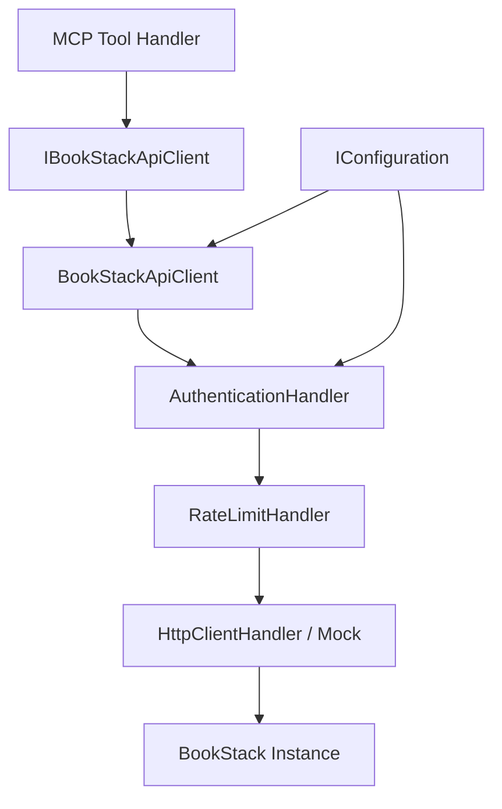
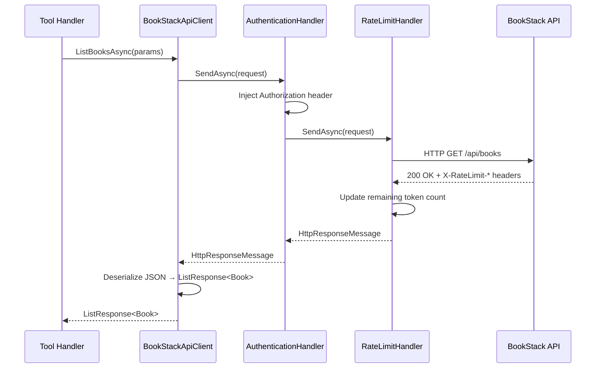
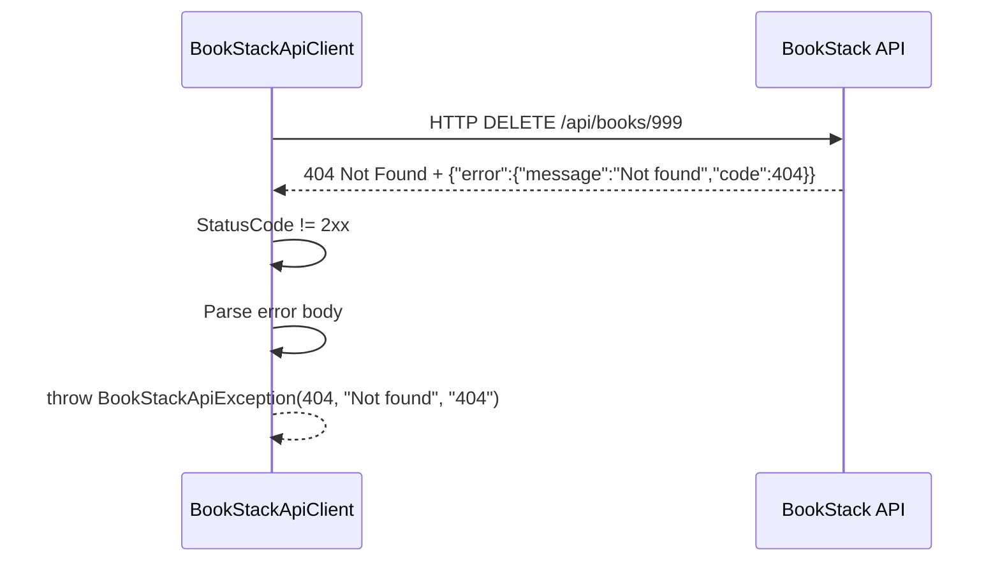

# Feature Spec: BookStack API v25 HTTP Client

**ID**: FEAT-0018
**Status**: Draft
**Author**: GitHub Copilot
**Created**: 2026-04-20
**Last Updated**: 2026-04-20
**GitHub Issue**: [#18 — BookStack API v25 HTTP Client](https://github.com/MarkZither/bookstack-mcp-server-dotnet/issues/18)
**Parent Epic**: [#1 — Core MCP Server](https://github.com/MarkZither/bookstack-mcp-server-dotnet/issues/1)
**Related ADRs**: [ADR-0002](../../architecture/decisions/ADR-0002-solution-structure.md)

---

## Executive Summary

- **Objective**: Deliver a fully typed `HttpClient` wrapper for every BookStack REST API v25 endpoint, enabling all Model Context Protocol (MCP) tool and resource handlers to interact with a BookStack instance through a single, testable abstraction.
- **Primary user**: MCP tool and resource handler authors within `bookstack-mcp-server-dotnet`.
- **Value delivered**: A single, dependency-injected HTTP client that handles authentication, rate limiting, structured error handling, and JSON deserialization, so no tool handler ever deals with raw HTTP.
- **Scope**: `IBookStackApiClient` interface, typed `BookStackApiClient` implementation, `AuthenticationHandler` and `RateLimitHandler` delegating handlers, `BookStackApiException`, `System.Text.Json` response models, and a `IServiceCollection` extension method. No MCP tool or resource implementations are in scope.
- **Primary success criterion**: Every BookStack API v25 endpoint group is reachable through a typed method, authentication headers are injected automatically, rate limit headers are respected, and the client is fully testable via `HttpMessageHandler` substitution without a live BookStack instance.

---

## Problem Statement

The MCP tool and resource handlers (#8, #7, #9, #16, #6, #12, #10) each need to call BookStack REST API v25. Without a shared typed client, every handler would duplicate HTTP setup, authentication header injection, error parsing, and rate-limit management. This creates inconsistency, untested edge cases, and leakage of API tokens into logs. A single, injected `IBookStackApiClient` eliminates this duplication and provides a clean unit-test seam for all downstream features.

## Goals

1. Provide a typed `IBookStackApiClient` interface covering all BookStack API v25 endpoint groups: books, chapters, pages, shelves, users, roles, attachments, image gallery, search, recycle bin, content permissions, audit log, and system info.
2. Inject the `Authorization: Token {id}:{secret}` header via a `DelegatingHandler` so that no consumer code ever constructs authentication headers manually.
3. Respect the `X-RateLimit-Remaining` and `X-RateLimit-Reset` response headers via a `RateLimitHandler` so the client self-throttles before the server returns HTTP 429.
4. Translate every non-success HTTP response into a typed `BookStackApiException` carrying the status code and BookStack error body, making error handling consistent across all tool handlers.
5. Deserialize all responses using `System.Text.Json` with a snake_case naming policy so that BookStack's JSON field names map directly to idiomatic C# properties.
6. Register the client and its handlers through a single `IServiceCollection` extension method that reads configuration from `IConfiguration`, enabling clean dependency injection in both the server and test harnesses.

## Non-Goals

- Implementing any MCP tool handler, resource handler, or prompt.
- Providing an HTTP caching layer or response persistence.
- Supporting BookStack API versions earlier than v25.
- Implementing multipart form-data upload for attachments or images — this is deferred to the individual tool handler features.
- Supporting OAuth or Basic authentication — only token-based authentication is in scope.
- Implementing retry logic with exponential back-off — the rate limiter handles self-throttling; retries are deferred.

## Requirements

### Functional Requirements

1. The client MUST expose `IBookStackApiClient`, a public interface declaring typed async methods for every endpoint in the following groups:
   - **Books**: `ListBooksAsync`, `CreateBookAsync`, `GetBookAsync`, `UpdateBookAsync`, `DeleteBookAsync`, `ExportBookAsync`
   - **Chapters**: `ListChaptersAsync`, `CreateChapterAsync`, `GetChapterAsync`, `UpdateChapterAsync`, `DeleteChapterAsync`, `ExportChapterAsync`
   - **Pages**: `ListPagesAsync`, `CreatePageAsync`, `GetPageAsync`, `UpdatePageAsync`, `DeletePageAsync`, `ExportPageAsync`
   - **Shelves**: `ListShelvesAsync`, `CreateShelfAsync`, `GetShelfAsync`, `UpdateShelfAsync`, `DeleteShelfAsync`
   - **Users**: `ListUsersAsync`, `CreateUserAsync`, `GetUserAsync`, `UpdateUserAsync`, `DeleteUserAsync`
   - **Roles**: `ListRolesAsync`, `CreateRoleAsync`, `GetRoleAsync`, `UpdateRoleAsync`, `DeleteRoleAsync`
   - **Attachments**: `ListAttachmentsAsync`, `CreateAttachmentAsync`, `GetAttachmentAsync`, `UpdateAttachmentAsync`, `DeleteAttachmentAsync`
   - **Image Gallery**: `ListImagesAsync`, `CreateImageAsync`, `GetImageAsync`, `UpdateImageAsync`, `DeleteImageAsync`
   - **Search**: `SearchAsync`
   - **Recycle Bin**: `ListRecycleBinAsync`, `RestoreFromRecycleBinAsync`, `PermanentlyDeleteAsync`
   - **Content Permissions**: `GetContentPermissionsAsync`, `UpdateContentPermissionsAsync`
   - **Audit Log**: `ListAuditLogAsync`
   - **System**: `GetSystemInfoAsync`
2. The implementation `BookStackApiClient` MUST implement `IBookStackApiClient` and be registered as a typed `HttpClient` using `IHttpClientFactory`.
3. An `AuthenticationHandler` (`DelegatingHandler`) MUST inject `Authorization: Token {TokenId}:{TokenSecret}` into every outbound request header, reading `TokenId` and `TokenSecret` exclusively from `IConfiguration` (keys: `BookStack:TokenId` and `BookStack:TokenSecret`).
4. A `RateLimitHandler` (`DelegatingHandler`) MUST inspect `X-RateLimit-Remaining` and `X-RateLimit-Reset` on every HTTP response; when `X-RateLimit-Remaining` reaches zero it MUST delay the next request until the UTC epoch timestamp in `X-RateLimit-Reset` has elapsed.
5. When the BookStack API returns a non-2xx HTTP response, the client MUST throw `BookStackApiException`, a public exception type that exposes `int StatusCode`, `string? ErrorMessage`, and `string? ErrorCode` populated from the BookStack JSON error body (`{"error": {"message": "...", "code": ...}}`).
6. All response bodies MUST be deserialized using `System.Text.Json` configured with `JsonNamingPolicy.SnakeCaseLower` so that BookStack snake_case field names map to PascalCase C# properties without manual `[JsonPropertyName]` attributes.
7. All list endpoints MUST return a strongly-typed `ListResponse<T>` wrapper exposing `int Total`, `int From`, `int To`, `IReadOnlyList<T> Data`, matching the BookStack paginated response envelope.
8. All export endpoints (`ExportBookAsync`, `ExportChapterAsync`, `ExportPageAsync`) MUST accept an `ExportFormat` enum (`Html`, `Pdf`, `Plaintext`, `Markdown`) and return the raw response body as `string`.
9. A `BookStackApiClientOptions` configuration class MUST be bindable from `IConfiguration` section `BookStack`, exposing `string BaseUrl`, `string TokenId`, `string TokenSecret`, and `int TimeoutSeconds` (default 30).
10. An `IServiceCollection` extension method `AddBookStackApiClient(this IServiceCollection services, IConfiguration configuration)` MUST register `BookStackApiClient`, `AuthenticationHandler`, `RateLimitHandler`, and `BookStackApiClientOptions` in a single call.

### Non-Functional Requirements

1. The client MUST be unit-testable by substituting a custom `HttpMessageHandler`; no network connection to a BookStack instance is required to run the test suite.
2. The `AuthenticationHandler` MUST NEVER write the value of `TokenId`, `TokenSecret`, or the `Authorization` header to any log output, at any log level (OWASP A02 — Cryptographic Failures).
3. All public async methods MUST accept a `CancellationToken` parameter and propagate it to the underlying `HttpClient` calls.
4. HTTP connections MUST use `SocketsHttpHandler` with `PooledConnectionLifetime` set to two minutes to prevent stale DNS entries in long-running server processes.
5. The client MUST compile and run on .NET 10 (`net10.0`) without any platform-specific conditional compilation.

## Design

### Component Diagram



### Handler Pipeline



### Error Flow



### Key Types

```csharp
// Options — bound from IConfiguration section "BookStack"
public sealed class BookStackApiClientOptions
{
    public string BaseUrl { get; set; } = "http://localhost:8080";
    public string TokenId { get; set; } = string.Empty;
    public string TokenSecret { get; set; } = string.Empty;
    public int TimeoutSeconds { get; set; } = 30;
}

// Paginated envelope
public sealed class ListResponse<T>
{
    public int Total { get; set; }
    public int From { get; set; }
    public int To { get; set; }
    public IReadOnlyList<T> Data { get; set; } = [];
}

// Typed exception
public sealed class BookStackApiException : Exception
{
    public int StatusCode { get; }
    public string? ErrorMessage { get; }
    public string? ErrorCode { get; }
}

// Export format
public enum ExportFormat { Html, Pdf, Plaintext, Markdown }

// Content type (for permissions endpoint)
public enum ContentType { Book, Chapter, Page, Bookshelf }
```

### DI Registration

```csharp
// Extension method — single call from Program.cs or test harness
services.AddBookStackApiClient(configuration);

// Internally wires:
services.Configure<BookStackApiClientOptions>(configuration.GetSection("BookStack"));
services.AddTransient<AuthenticationHandler>();
services.AddTransient<RateLimitHandler>();
services.AddHttpClient<IBookStackApiClient, BookStackApiClient>()
        .AddHttpMessageHandler<AuthenticationHandler>()
        .AddHttpMessageHandler<RateLimitHandler>()
        .ConfigurePrimaryHttpMessageHandler(() =>
            new SocketsHttpHandler { PooledConnectionLifetime = TimeSpan.FromMinutes(2) });
```

### Configuration Binding

| `IConfiguration` key | Environment variable | Required | Default |
|---|---|---|---|
| `BookStack:BaseUrl` | `BOOKSTACK_BASE_URL` | No | `http://localhost:8080` |
| `BookStack:TokenId` | `BOOKSTACK_TOKEN_ID` | Yes | — |
| `BookStack:TokenSecret` | `BOOKSTACK_TOKEN_SECRET` | Yes | — |
| `BookStack:TimeoutSeconds` | `BOOKSTACK_TIMEOUT_SECONDS` | No | `30` |

> **Note**: `IConfiguration` reads environment variables automatically when the standard
> `Host.CreateDefaultBuilder` / `WebApplication.CreateBuilder` is used. No explicit
> `Environment.GetEnvironmentVariable` calls are needed in the client code.

### Error Mapping

| HTTP Status | `BookStackApiException.StatusCode` | Typical cause |
|---|---|---|
| 400 | 400 | Malformed request body |
| 401 | 401 | Missing or invalid token |
| 403 | 403 | Insufficient permissions |
| 404 | 404 | Resource not found |
| 422 | 422 | Validation failure |
| 429 | 429 | Rate limit exceeded (should be rare with `RateLimitHandler`) |
| 500–504 | As returned | BookStack server error |

## Acceptance Criteria

- [ ] Given a configured `BookStackApiClient` with a mock `HttpMessageHandler` returning `200 OK` with valid JSON, when `ListBooksAsync()` is called, then a `ListResponse<Book>` is returned with `Total`, `From`, `To`, and `Data` populated correctly.
- [ ] Given a configured `BookStackApiClient`, when any method is invoked, then the outbound HTTP request contains the header `Authorization: Token {TokenId}:{TokenSecret}` and neither value appears in any log output.
- [ ] Given a mock `HttpMessageHandler` returning a response with `X-RateLimit-Remaining: 0` and `X-RateLimit-Reset: {futureEpoch}`, when the next request is made, then the `RateLimitHandler` delays dispatch until the reset time has elapsed.
- [ ] Given a mock handler returning `404 Not Found` with body `{"error":{"message":"Not found","code":404}}`, when any `GetAsync` method is called, then a `BookStackApiException` is thrown with `StatusCode == 404` and `ErrorMessage == "Not found"`.
- [ ] Given a mock handler returning `401 Unauthorized`, when any method is called, then a `BookStackApiException` is thrown with `StatusCode == 401` and the exception message does not contain the token value.
- [ ] Given the `AddBookStackApiClient` extension method called with a valid `IConfiguration`, when the service provider is built, then `IBookStackApiClient` resolves without error and the handler pipeline contains `AuthenticationHandler` followed by `RateLimitHandler`.
- [ ] Given `ExportBookAsync(id, ExportFormat.Pdf)`, when the mock returns `200 OK` with a non-JSON body, then the raw response body string is returned without attempting JSON deserialization.
- [ ] Given a JSON response with snake_case field names (e.g., `"created_at"`, `"book_id"`), when deserialized, then the corresponding C# properties (`CreatedAt`, `BookId`) are populated without requiring `[JsonPropertyName]` attributes.
- [ ] Given all typed methods on `IBookStackApiClient`, when each is invoked with a mock handler, then every call passes `CancellationToken` through to the underlying `HttpClient.SendAsync`.
- [ ] Given unit tests exercising each endpoint group (books, chapters, pages, shelves, users, roles, attachments, images, search, recycle bin, permissions, audit log, system), when the test suite runs, then all tests pass without a network connection.

## Security Considerations

- `TokenId` and `TokenSecret` MUST be read from `IConfiguration`; they MUST NOT be hard-coded or appear in source code, committed configuration files, or log output (OWASP A02).
- `AuthenticationHandler` MUST suppress all logging of the `Authorization` header value. The header name alone may be logged at `Debug` level.
- `BookStackApiException` MUST NOT include the `Authorization` header value in its `Message`, `Data`, or inner exception properties.
- All inputs passed as URL path segments (e.g., resource IDs) MUST be integers; the interface enforces this via `int` parameter types, preventing path traversal.
- `BaseUrl` MUST be validated at startup to be a well-formed HTTP or HTTPS URI; the client MUST throw `InvalidOperationException` during `IHttpClientFactory` build if `BaseUrl` is empty or malformed.
- HTTPS SHOULD be used for `BaseUrl` in production. The client MUST NOT disable TLS certificate validation.

## Open Questions

- None — scope is fully defined by issue #18 and the TypeScript reference implementation.

## Out of Scope

- Retry logic with exponential back-off — deferred to a follow-up resilience feature.
- Multipart form-data upload for attachments and images — deferred to the individual tool handler features (#6, #12).
- Response caching — deferred; no caching requirement exists at this stage.
- BookStack webhook or real-time notification support — not part of the REST API v25 surface.
