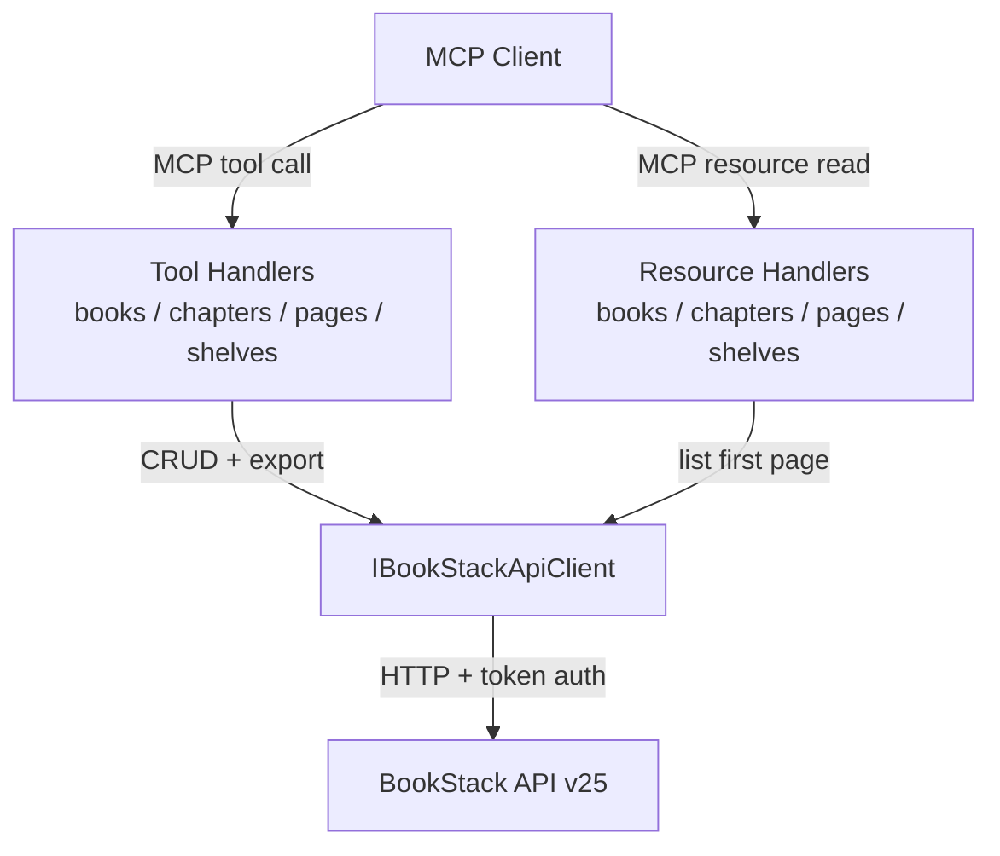

# Feature Spec: Content Tools & Resources — Books, Chapters, Pages, Shelves

**ID**: FEAT-0007
**Status**: Draft
**Author**: Mark Burton
**Created**: 2026-04-20
**Last Updated**: 2026-04-20
**GitHub Issue**: [#7](https://github.com/MarkZither/bookstack-mcp-server-dotnet/issues/7)
**Related ADRs**:
- [ADR-0001](../architecture/decisions/ADR-0001-mcp-sdk-selection.md) — MCP SDK Selection
- [ADR-0002](../architecture/decisions/ADR-0002-solution-structure.md) — Solution and Project Structure
- [ADR-0005](../architecture/decisions/ADR-0005-ihttpclientfactory-typed-client.md) — IHttpClientFactory Typed Client
- [ADR-0006](../architecture/decisions/ADR-0006-systemtextjson-snakecase.md) — System.Text.Json snake_case serialisation
- [ADR-0008](../architecture/decisions/ADR-0008-bookstackapiexception.md) — BookStackApiException

---

## Problem Statement

The MCP server infrastructure (FEAT-0008) established the dual-transport entry point and
registered 14 stub tool handlers and 6 stub resource handlers via assembly scan. All stub methods
currently throw `NotImplementedException`. This means no MCP client can yet perform any meaningful
operation against a BookStack instance. The content domain — books, chapters, pages, and shelves —
represents the majority of day-to-day MCP usage and must be fully implemented first.

---

## Goals

1. Replace the `NotImplementedException` stubs in `BookToolHandler`, `ChapterToolHandler`,
   `PageToolHandler`, and `ShelfToolHandler` with real implementations that call
   `IBookStackApiClient`.
2. Replace the stubs in `BookResourceHandler`, `ChapterResourceHandler`, `PageResourceHandler`, and
   `ShelfResourceHandler` with real implementations.
3. Validate all MCP tool inputs at the handler boundary before forwarding to the API client.
4. Return structured JSON strings that MCP clients can parse and display.
5. Propagate `BookStackApiException` as a meaningful MCP error rather than an unhandled exception.

---

## Non-Goals

- Implementing users, roles, attachments, images, search, recycle bin, permissions, or audit log
  (covered by separate issues #9, #6, #12, #10).
- Pagination UI or cursor-based pagination beyond what the BookStack API supports.
- Real-time streaming or WebSocket push of content changes.
- Full-text content indexing or local caching.

---

## Requirements

### Functional Requirements

#### Books

1. `bookstack_books_list` MUST accept optional `count` (int, 1–500, default 20), `offset` (int,
   ≥0, default 0), and `sort` (`name` | `created_at` | `updated_at`, default `name`) parameters
   and return a JSON-serialised `ListResponse<Book>`.
2. `bookstack_books_create` MUST accept required `name` (string, max 255 chars) and optional
   `description` (string, max 1900 chars), `description_html` (string, max 2000 chars), `tags`
   (array of `{name, value}` objects), `image_id` (int), and `default_template_id` (int). It MUST
   return the created `Book` as JSON.
3. `bookstack_books_read` MUST accept required `id` (int, >0) and return the `BookWithContents`
   (including nested chapters and pages) as JSON.
4. `bookstack_books_update` MUST accept required `id` (int, >0) and any subset of the fields
   listed for create (all optional on update). It MUST return the updated `Book` as JSON.
5. `bookstack_books_delete` MUST accept required `id` (int, >0) and return a confirmation message
   on success.
6. `bookstack_books_export` MUST accept required `id` (int, >0) and required `format`
   (`html` | `pdf` | `plaintext` | `markdown`) and return the export content as a string.

#### Chapters

7. `bookstack_chapters_list` MUST accept the same pagination/sort parameters as books list and
   return `ListResponse<Chapter>` as JSON.
8. `bookstack_chapters_create` MUST accept required `book_id` (int, >0) and `name` (string, max
   255 chars), plus optional `description`, `description_html`, and `tags`. It MUST return the
   created `Chapter` as JSON.
9. `bookstack_chapters_read` MUST accept required `id` (int, >0) and return `ChapterWithPages`
   (including nested pages) as JSON.
10. `bookstack_chapters_update` MUST accept required `id` (int, >0) and any subset of the
    writeable chapter fields. It MUST return the updated `Chapter` as JSON.
11. `bookstack_chapters_delete` MUST accept required `id` (int, >0) and return a confirmation
    message on success.
12. `bookstack_chapters_export` MUST accept required `id` (int, >0) and required `format`
    (`html` | `pdf` | `plaintext` | `markdown`) and return the export content as a string.

#### Pages

13. `bookstack_pages_list` MUST accept the same pagination/sort parameters and return
    `ListResponse<Page>` as JSON.
14. `bookstack_pages_create` MUST accept optional `book_id` (int, >0) OR `chapter_id` (int, >0)
    (at least one MUST be provided), required `name` (string, max 255 chars), and optional `html`
    (string), `markdown` (string), and `tags`. Only one of `html` or `markdown` SHOULD be
    provided; `html` takes precedence if both are given. It MUST return the created `Page` as JSON.
15. `bookstack_pages_read` MUST accept required `id` (int, >0) and return `PageWithContent`
    (including `html` and `markdown` body fields) as JSON.
16. `bookstack_pages_update` MUST accept required `id` (int, >0) and any subset of the writeable
    page fields. It MUST return the updated `Page` as JSON.
17. `bookstack_pages_delete` MUST accept required `id` (int, >0) and return a confirmation message
    on success.
18. `bookstack_pages_export` MUST accept required `id` (int, >0) and required `format`
    (`html` | `pdf` | `plaintext` | `markdown`) and return the export content as a string.

#### Shelves

19. `bookstack_shelves_list` MUST accept the same pagination/sort parameters and return
    `ListResponse<Bookshelf>` as JSON.
20. `bookstack_shelves_create` MUST accept required `name` (string, max 255 chars), optional
    `description`, `description_html`, `tags`, and `books` (array of int book IDs). It MUST return
    the created `Bookshelf` as JSON.
21. `bookstack_shelves_read` MUST accept required `id` (int, >0) and return `BookshelfWithBooks`
    (including nested book list) as JSON.
22. `bookstack_shelves_update` MUST accept required `id` (int, >0) and any subset of the writeable
    shelf fields. It MUST return the updated `Bookshelf` as JSON.
23. `bookstack_shelves_delete` MUST accept required `id` (int, >0) and return a confirmation
    message on success.

#### Resources

24. `bookstack://books` resource MUST return a JSON-serialised `ListResponse<Book>` for the first
    page (count=20).
25. `bookstack://chapters` resource MUST return a JSON-serialised `ListResponse<Chapter>` for the
    first page.
26. `bookstack://pages` resource MUST return a JSON-serialised `ListResponse<Page>` for the first
    page.
27. `bookstack://shelves` resource MUST return a JSON-serialised `ListResponse<Bookshelf>` for the
    first page.

#### Error Handling

28. When `IBookStackApiClient` throws a `BookStackApiException` with HTTP 404, the tool MUST
    return an MCP error response with message `"Not found: {entity} {id}"` rather than propagating
    the exception unhandled.
29. When required parameters are missing or invalid (e.g., `id ≤ 0`, `name` empty or too long),
    the tool MUST return an MCP error response with a descriptive validation message before making
    any API call.
30. When `IBookStackApiClient` throws a `BookStackApiException` with HTTP 429 (rate-limit), the
    tool MUST surface the error as an MCP error response with a `"Rate limit exceeded"` message.

### Non-Functional Requirements

1. Each tool implementation MUST NOT make more than one HTTP call to BookStack per tool invocation.
2. Serialised JSON responses MUST use snake_case field names (per ADR-0006).
3. Tool handlers MUST use `ILogger<T>` at `Debug` level for successful operations and `Warning`
   level for validation errors; `Console.WriteLine` MUST NOT be used.
4. All handler methods MUST be `async Task<string>` and `await` all async calls with
   `.ConfigureAwait(false)`.

---

## Design

### Component Diagram



### Tool Interface

#### Books

| Tool | Required params | Optional params | Return type |
|---|---|---|---|
| `bookstack_books_list` | — | `count`, `offset`, `sort` | `ListResponse<Book>` JSON |
| `bookstack_books_create` | `name` | `description`, `description_html`, `tags`, `image_id`, `default_template_id` | `Book` JSON |
| `bookstack_books_read` | `id` | — | `BookWithContents` JSON |
| `bookstack_books_update` | `id` | `name`, `description`, `description_html`, `tags`, `image_id`, `default_template_id` | `Book` JSON |
| `bookstack_books_delete` | `id` | — | confirmation string |
| `bookstack_books_export` | `id`, `format` | — | export content string |

#### Chapters

| Tool | Required params | Optional params | Return type |
|---|---|---|---|
| `bookstack_chapters_list` | — | `count`, `offset`, `sort` | `ListResponse<Chapter>` JSON |
| `bookstack_chapters_create` | `book_id`, `name` | `description`, `description_html`, `tags` | `Chapter` JSON |
| `bookstack_chapters_read` | `id` | — | `ChapterWithPages` JSON |
| `bookstack_chapters_update` | `id` | `book_id`, `name`, `description`, `description_html`, `tags` | `Chapter` JSON |
| `bookstack_chapters_delete` | `id` | — | confirmation string |
| `bookstack_chapters_export` | `id`, `format` | — | export content string |

#### Pages

| Tool | Required params | Optional params | Return type |
|---|---|---|---|
| `bookstack_pages_list` | — | `count`, `offset`, `sort` | `ListResponse<Page>` JSON |
| `bookstack_pages_create` | `name`, (`book_id` OR `chapter_id`) | `html`, `markdown`, `tags` | `Page` JSON |
| `bookstack_pages_read` | `id` | — | `PageWithContent` JSON |
| `bookstack_pages_update` | `id` | `book_id`, `chapter_id`, `name`, `html`, `markdown`, `tags` | `Page` JSON |
| `bookstack_pages_delete` | `id` | — | confirmation string |
| `bookstack_pages_export` | `id`, `format` | — | export content string |

#### Shelves

| Tool | Required params | Optional params | Return type |
|---|---|---|---|
| `bookstack_shelves_list` | — | `count`, `offset`, `sort` | `ListResponse<Bookshelf>` JSON |
| `bookstack_shelves_create` | `name` | `description`, `description_html`, `tags`, `books` | `Bookshelf` JSON |
| `bookstack_shelves_read` | `id` | — | `BookshelfWithBooks` JSON |
| `bookstack_shelves_update` | `id` | `name`, `description`, `description_html`, `tags`, `books` | `Bookshelf` JSON |
| `bookstack_shelves_delete` | `id` | — | confirmation string |

### Implementation Pattern

All tool handlers follow a uniform pattern:

```csharp
[McpServerTool(Name = "bookstack_books_list"), Description("...")]
public async Task<string> ListBooksAsync(
    [Description("Number of books to return (1–500)")] int count = 20,
    [Description("Number of books to skip")] int offset = 0,
    [Description("Sort field: name, created_at, updated_at")] string sort = "name",
    CancellationToken ct = default)
{
    _logger.LogDebug("Listing books count={Count} offset={Offset}", count, offset);
    var result = await _client.ListBooksAsync(
        new ListQueryParams { Count = count, Offset = offset, Sort = sort },
        ct).ConfigureAwait(false);
    return JsonSerializer.Serialize(result, JsonOptions.Default);
}
```

Error handling is centralised in a private helper that catches `BookStackApiException` and converts
it to a descriptive string error response.

---

## Acceptance Criteria

- [ ] Given a BookStack instance with 3 books, when `bookstack_books_list` is called with no
  arguments, then the response is valid JSON containing a `data` array of 3 book objects.
- [ ] Given a valid book `name`, when `bookstack_books_create` is called, then a `Book` JSON object
  with a non-zero `id` is returned.
- [ ] Given a valid book `id`, when `bookstack_books_read` is called, then a `BookWithContents`
  JSON object is returned including the `contents` array.
- [ ] Given a valid book `id` and a changed `name`, when `bookstack_books_update` is called, then
  the returned `Book` JSON reflects the updated name.
- [ ] Given a valid book `id`, when `bookstack_books_delete` is called, then a `"Book {id} deleted
  successfully"` string is returned and a subsequent `bookstack_books_read` with the same `id`
  returns a 404 error response.
- [ ] Given a valid book `id` and `format = "html"`, when `bookstack_books_export` is called, then
  a non-empty HTML string is returned.
- [ ] Given an `id` of `0`, when any read/update/delete/export tool is called, then an MCP error
  response containing `"id must be greater than 0"` is returned without making an HTTP call.
- [ ] Given a non-existent `id`, when `bookstack_books_read` is called, then an MCP error response
  containing `"Not found"` is returned.
- [ ] Given chapters, pages, and shelves: all equivalent CRUD criteria above hold for
  `bookstack_chapters_*`, `bookstack_pages_*`, and `bookstack_shelves_*` tools.
- [ ] Reading resource `bookstack://books` returns a valid JSON `ListResponse<Book>`.
- [ ] `dotnet test` passes with zero failures; all new tests use mocked `IBookStackApiClient`.

---

## Security Considerations

- All `id` parameters MUST be validated as positive integers; negative or zero values MUST be
  rejected before any API call is made (prevents unintended API calls).
- `name`, `description`, and content fields MUST have length validated per the limits defined in
  the requirements; oversized inputs are rejected at the MCP boundary (not passed to BookStack).
- The `format` parameter for export tools MUST be validated against the fixed enum
  (`html`, `pdf`, `plaintext`, `markdown`); unknown values MUST be rejected.
- Authentication credentials (`BOOKSTACK_TOKEN_ID`, `BOOKSTACK_TOKEN_SECRET`) are handled
  exclusively by `AuthenticationHandler` and MUST NOT be logged or returned in tool responses.
- `BookStackApiException` messages from the API MAY be included in error responses; they MUST NOT
  include the raw HTTP request (which could contain auth headers).

---

## Open Questions

- Should export tools return raw content (HTML/Markdown string) or wrap it in a JSON envelope?
  Current preference: raw content, since the MCP client can choose how to display it.
- Should `bookstack_pages_create` enforce that exactly one of `book_id`/`chapter_id` is provided,
  or silently accept both and let BookStack decide? Current preference: require at least one,
  pass both through if provided.
