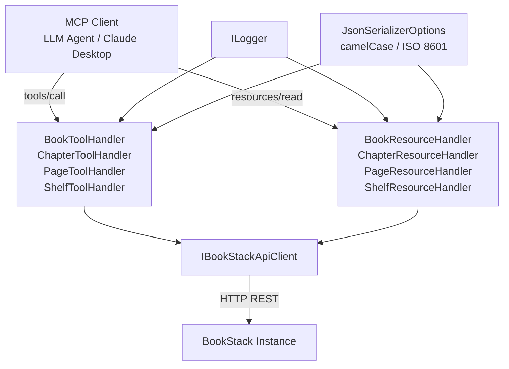
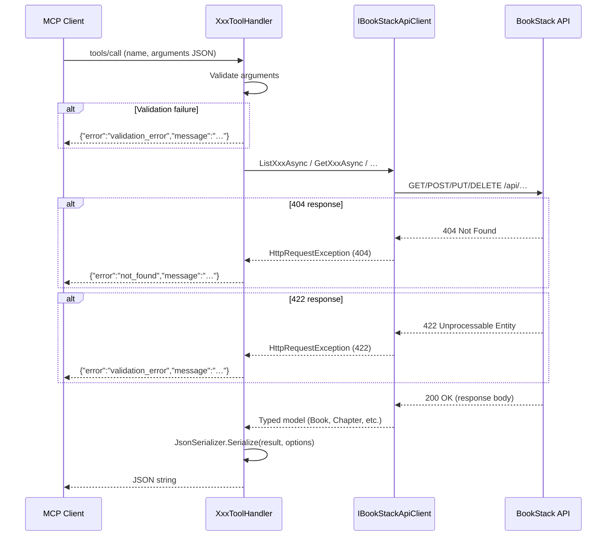

# Feature Spec: Content Tools and Resources — Books, Chapters, Pages, and Shelves CRUD

**ID**: FEAT-0007
**Status**: Draft
**Author**: GitHub Copilot
**Created**: 2026-04-20
**Last Updated**: 2026-04-20
**GitHub Issue**: [#7 — Books, Chapters, Pages, and Shelves CRUD tool implementations](https://github.com/MarkZither/bookstack-mcp-server-dotnet/issues/7)
**Parent Epic**: [#1 — Core MCP Server](https://github.com/MarkZither/bookstack-mcp-server-dotnet/issues/1)
**Related ADRs**:
[ADR-0001](../../architecture/decisions/ADR-0001-mcp-sdk-selection.md),
[ADR-0002](../../architecture/decisions/ADR-0002-solution-structure.md),
[ADR-0005](../../architecture/decisions/ADR-0005-ihttpclientfactory-typed-client.md)

---

## Executive Summary

- **Objective**: Replace the `NotImplementedException` stubs in `BookToolHandler`, `ChapterToolHandler`,
  `PageToolHandler`, and `ShelfToolHandler` — and their corresponding resource handlers — with fully working
  implementations that delegate to `IBookStackApiClient` and return JSON-serialized results to MCP clients.
- **Primary user**: MCP clients (LLM agents, Claude Desktop) that need to read, create, update, delete, and
  export BookStack content.
- **Value delivered**: 23 operational MCP tools and 8 MCP resources covering the four core BookStack
  content-hierarchy entities, unblocking all knowledge-management workflows for AI agents.
- **Scope**: `BookToolHandler`, `ChapterToolHandler`, `PageToolHandler`, `ShelfToolHandler`,
  `BookResourceHandler`, `ChapterResourceHandler`, `PageResourceHandler`, and `ShelfResourceHandler`.
  No new API client methods, no schema migrations, no authentication changes.
- **Primary success criterion**: Every tool listed in this spec returns a valid JSON string (not an exception)
  when called with valid parameters, and returns a structured error message for invalid inputs.

---

## Problem Statement

The MCP server infrastructure (FEAT-0008) registered stub tool and resource handlers so that
`tools/list` and `resources/list` return complete descriptors. However, calling any content tool
currently throws `NotImplementedException`, making the server unusable for its primary purpose of
providing AI agents with access to BookStack content. `IBookStackApiClient` (FEAT-0018) already
implements all required HTTP calls; this feature simply wires the MCP tool layer to the client.

## Goals

1. Implement all 23 content CRUD tools (6 each for Books, Chapters, and Pages; 5 for Shelves) so
   they proxy to `IBookStackApiClient` and return serialized JSON strings.
2. Implement all 8 content resources (collection and individual-item URIs for each entity) so they
   return the same serialized JSON format as the corresponding read tools.
3. Provide correct, descriptive `[Description]` attributes on every tool parameter so that MCP
   clients can discover parameter semantics without consulting external documentation.
4. Handle all foreseeable error conditions (resource-not-found, validation errors, API connectivity
   failures) with structured error messages rather than unhandled exceptions.

## Non-Goals

- Implementing tools for Users, Roles, Attachments, Images, Search, Recycle Bin, Permissions,
  Audit Log, or System Info (covered by separate issues).
- Adding new methods to `IBookStackApiClient` or changing existing API model types.
- Adding pagination cursor support beyond `count`/`offset` (BookStack API v25 only supports offset pagination).
- Image upload for cover images (`imageId` parameter) on Create/Update book and shelf calls.
- Implementing server-side caching of BookStack API responses.

---

## Requirements

### Functional Requirements

1. Each of the 23 tool handler methods MUST replace its `NotImplementedException` stub with a
   complete implementation that constructs the appropriate request model, calls the corresponding
   `IBookStackApiClient` method, and returns the result serialized as a JSON string.
2. All tool methods that accept an `id` parameter MUST validate that the value is a positive integer
   and return a descriptive error string (not throw) when the constraint is violated.
3. `bookstack_pages_create` MUST validate that exactly one of `book_id` or `chapter_id` is provided,
   and return a validation error string if neither is supplied.
4. `bookstack_books_export`, `bookstack_chapters_export`, and `bookstack_pages_export` MUST validate
   that `format` is one of `html`, `pdf`, `plaintext`, or `markdown`; invalid values MUST return a
   descriptive error string.
5. Tag arrays MUST be accepted as an optional list of `{name, value}` objects on all create and
   update operations; when omitted, no tags are set on create and existing tags are unchanged on update.
   When provided on an update, they MUST replace all existing tags (BookStack API behavior).
6. The `books` array on `bookstack_shelves_create` and `bookstack_shelves_update` MUST accept a list
   of book IDs; when provided on an update, it MUST replace all books currently assigned to the shelf.
7. All list tools MUST pass `count`, `offset`, and `sort` to `ListQueryParams` when the caller
   provides them; omitted parameters MUST be left `null` so that the BookStack API applies its own
   defaults (count=20, offset=0, sort=name).
8. When `IBookStackApiClient` throws `HttpRequestException` with a 404 status code, the tool MUST
   return a JSON error object `{"error": "not_found", "message": "…"}` rather than propagating the
   exception.
9. When `IBookStackApiClient` throws `HttpRequestException` with a 422 status code, the tool MUST
   return a JSON error object `{"error": "validation_error", "message": "…"}` rather than propagating.
10. When `IBookStackApiClient` throws any other `HttpRequestException`, the tool MUST log the error
    at `Error` level via `ILogger<T>` and return a JSON error object
    `{"error": "api_error", "message": "…"}`.
11. Delete tools (`bookstack_books_delete`, `bookstack_chapters_delete`, `bookstack_pages_delete`,
    `bookstack_shelves_delete`) MUST return `{"success": true, "message": "… deleted successfully"}`
    on success.
12. Export tools MUST return the raw export content (HTML string, Markdown string, plain text string,
    or base64-encoded PDF) unchanged as the tool result string.
13. Each `BookResourceHandler`, `ChapterResourceHandler`, `PageResourceHandler`, and
    `ShelfResourceHandler` MUST implement both a collection resource (e.g., `bookstack://books`) that
    returns the JSON-serialized list, and an individual-item resource (e.g., `bookstack://books/{id}`)
    that returns the JSON-serialized detail object.
14. All tool and resource methods MUST accept a `CancellationToken` and propagate it to every
    `IBookStackApiClient` call.
15. All log statements MUST use `ILogger<T>` structured logging with named placeholders; no
    `Console.WriteLine` or string interpolation in log calls.

### Non-Functional Requirements

1. JSON serialization MUST use `System.Text.Json` with `JsonSerializerOptions` configured for
   camelCase property naming and ISO 8601 date formatting, consistent with the API client layer.
2. All tool and resource methods MUST complete within the `IBookStackApiClient` timeout window
   (default 30 s); no additional per-tool timeout is introduced.
3. No synchronous blocking calls (`.Result`, `.Wait()`, `Thread.Sleep`) are permitted in any tool
   or resource method.
4. Tool handler classes MUST remain stateless; all per-request state MUST be in method-local
   variables.
5. Each handler class MUST live in its own file under its respective subdirectory
   (`tools/books/`, `tools/chapters/`, `tools/pages/`, `tools/shelves/`,
   `resources/books/`, `resources/chapters/`, `resources/pages/`, `resources/shelves/`).

---

## Design

### Component Diagram



### Call Flow — Tool Invocation



### Tool Interface

#### Books (6 tools)

| Tool | Required Parameters | Optional Parameters | Returns |
|---|---|---|---|
| `bookstack_books_list` | — | `count: int`, `offset: int`, `sort: string` | JSON `ListResponse<Book>` |
| `bookstack_books_read` | `id: int` | — | JSON `BookWithContents` |
| `bookstack_books_create` | `name: string` | `description: string`, `description_html: string`, `tags: Tag[]`, `default_template_id: int` | JSON `Book` |
| `bookstack_books_update` | `id: int` | `name: string`, `description: string`, `description_html: string`, `tags: Tag[]`, `default_template_id: int` | JSON `Book` |
| `bookstack_books_delete` | `id: int` | — | JSON `{success, message}` |
| `bookstack_books_export` | `id: int`, `format: string` | — | Export content string |

#### Chapters (6 tools)

| Tool | Required Parameters | Optional Parameters | Returns |
|---|---|---|---|
| `bookstack_chapters_list` | — | `count: int`, `offset: int`, `sort: string` | JSON `ListResponse<Chapter>` |
| `bookstack_chapters_read` | `id: int` | — | JSON `ChapterWithPages` |
| `bookstack_chapters_create` | `book_id: int`, `name: string` | `description: string`, `description_html: string`, `tags: Tag[]` | JSON `Chapter` |
| `bookstack_chapters_update` | `id: int` | `book_id: int`, `name: string`, `description: string`, `description_html: string`, `tags: Tag[]` | JSON `Chapter` |
| `bookstack_chapters_delete` | `id: int` | — | JSON `{success, message}` |
| `bookstack_chapters_export` | `id: int`, `format: string` | — | Export content string |

#### Pages (6 tools)

| Tool | Required Parameters | Optional Parameters | Returns |
|---|---|---|---|
| `bookstack_pages_list` | — | `count: int`, `offset: int`, `sort: string` | JSON `ListResponse<Page>` |
| `bookstack_pages_read` | `id: int` | — | JSON `PageWithContent` |
| `bookstack_pages_create` | `name: string`, one of `book_id` or `chapter_id` | `html: string`, `markdown: string`, `tags: Tag[]` | JSON `Page` |
| `bookstack_pages_update` | `id: int` | `name: string`, `book_id: int`, `chapter_id: int`, `html: string`, `markdown: string`, `tags: Tag[]` | JSON `Page` |
| `bookstack_pages_delete` | `id: int` | — | JSON `{success, message}` |
| `bookstack_pages_export` | `id: int`, `format: string` | — | Export content string |

#### Shelves (5 tools)

| Tool | Required Parameters | Optional Parameters | Returns |
|---|---|---|---|
| `bookstack_shelves_list` | — | `count: int`, `offset: int`, `sort: string` | JSON `ListResponse<Bookshelf>` |
| `bookstack_shelves_read` | `id: int` | — | JSON `BookshelfWithBooks` |
| `bookstack_shelves_create` | `name: string` | `description: string`, `description_html: string`, `tags: Tag[]`, `books: int[]` | JSON `Bookshelf` |
| `bookstack_shelves_update` | `id: int` | `name: string`, `description: string`, `description_html: string`, `tags: Tag[]`, `books: int[]` | JSON `Bookshelf` |
| `bookstack_shelves_delete` | `id: int` | — | JSON `{success, message}` |

### Resource URI Contracts

| Resource URI Template | Description | Returns |
|---|---|---|
| `bookstack://books` | All books visible to the authenticated user | JSON `ListResponse<Book>` |
| `bookstack://books/{id}` | Single book including chapter and page hierarchy | JSON `BookWithContents` |
| `bookstack://chapters` | All chapters visible to the authenticated user | JSON `ListResponse<Chapter>` |
| `bookstack://chapters/{id}` | Single chapter including its pages list | JSON `ChapterWithPages` |
| `bookstack://pages` | All pages visible to the authenticated user | JSON `ListResponse<Page>` |
| `bookstack://pages/{id}` | Single page including HTML and Markdown content | JSON `PageWithContent` |
| `bookstack://shelves` | All shelves visible to the authenticated user | JSON `ListResponse<Bookshelf>` |
| `bookstack://shelves/{id}` | Single shelf including its assigned books list | JSON `BookshelfWithBooks` |

### Parameter Detail — Tags

All create and update tools that accept `tags` MUST document the parameter as:

> Array of tag objects. Each object MUST have a `name` (string) and a `value` (string).
> On update, providing this array replaces ALL existing tags. Omit to leave tags unchanged.

The C# model is `IList<Tag>` where `Tag` is the existing `BookStack.Mcp.Server.Api.Models.Tag` type.
The MCP SDK 1.2.0 binds complex parameters via `System.Text.Json`, so `IList<Tag>` can be used directly as
a method parameter — no `tagsJson: string?` workaround is needed.

### Parameter Detail — Export Formats

The `format` parameter on all export tools MUST be one of: `html`, `pdf`, `plaintext`, `markdown`.
This maps directly to the `ExportFormat` enum in `BookStack.Mcp.Server.Api.Models`.

### Key Code Shapes

```csharp
// tools/books/BookToolHandler.cs — list with optional params, error handling
[McpServerTool(Name = "bookstack_books_list")]
[Description("List all books visible to the authenticated user with pagination options.")]
public async Task<string> ListBooksAsync(
    [Description("Number of books to return (1–500). Defaults to 20.")] int? count = null,
    [Description("Number of books to skip for pagination. Defaults to 0.")] int? offset = null,
    [Description("Sort field: name, created_at, updated_at. Defaults to name.")] string? sort = null,
    CancellationToken ct = default)
{
    try
    {
        var query = (count.HasValue || offset.HasValue || sort is not null)
            ? new ListQueryParams { Count = count, Offset = offset, Sort = sort }
            : null;
        var result = await _client.ListBooksAsync(query, ct);
        return JsonSerializer.Serialize(result, _jsonOptions);
    }
    catch (HttpRequestException ex) when (ex.StatusCode == HttpStatusCode.NotFound)
    {
        return JsonSerializer.Serialize(new { error = "not_found", message = ex.Message }, _jsonOptions);
    }
    catch (HttpRequestException ex) when (ex.StatusCode == HttpStatusCode.UnprocessableEntity)
    {
        return JsonSerializer.Serialize(new { error = "validation_error", message = ex.Message }, _jsonOptions);
    }
    catch (HttpRequestException ex)
    {
        _logger.LogError(ex, "BookStack API error listing books");
        return JsonSerializer.Serialize(new { error = "api_error", message = ex.Message }, _jsonOptions);
    }
}
```

```csharp
// tools/books/BookToolHandler.cs — create
[McpServerTool(Name = "bookstack_books_create")]
[Description("Create a new book. Books are the top-level containers in BookStack.")]
public async Task<string> CreateBookAsync(
    [Description("The book name (required, max 255 characters).")] string name,
    [Description("Plain text description (max 1900 characters).")] string? description = null,
    [Description("HTML description (max 2000 characters). Overrides description.")] string? descriptionHtml = null,
    [Description("Tags to assign. Each tag must have a name and a value.")] IList<Tag>? tags = null,
    [Description("ID of a page to use as the default template for new pages in this book.")] int? defaultTemplateId = null,
    CancellationToken ct = default)
{
    // … construct CreateBookRequest, call _client.CreateBookAsync, serialize result
}
```

```csharp
// Shared JsonSerializerOptions — injected or constructed once per handler
private static readonly JsonSerializerOptions _jsonOptions = new()
{
    PropertyNamingPolicy = JsonNamingPolicy.CamelCase,
    WriteIndented = false,
};
```

```csharp
// resources/books/BookResourceHandler.cs — collection + individual item
[McpServerResource(UriTemplate = "bookstack://books", Name = "Books")]
[Description("All books visible to the authenticated user.")]
public async Task<string> GetBooksAsync(CancellationToken ct)
{
    var result = await _client.ListBooksAsync(null, ct);
    return JsonSerializer.Serialize(result, _jsonOptions);
}

[McpServerResource(UriTemplate = "bookstack://books/{id}", Name = "Book")]
[Description("A single book including its chapter and page hierarchy.")]
public async Task<string> GetBookAsync(
    [Description("The book ID.")] int id,
    CancellationToken ct)
{
    var result = await _client.GetBookAsync(id, ct);
    return JsonSerializer.Serialize(result, _jsonOptions);
}
```

> **Note**: The MCP SDK 1.2.0 binds tool arguments via `System.Text.Json`, so `IList<Tag>?` works
> as a native parameter type. MCP clients pass tags as a JSON array: `[{"name":"env","value":"prod"}]`.
> No `tagsJson: string?` workaround is needed.

---

## Acceptance Criteria

### Books

- [ ] Given a running server, when `bookstack_books_list` is called with no arguments, then it
  returns a JSON string deserializable to `ListResponse<Book>` with `data` and `total` fields.
- [ ] Given a running server, when `bookstack_books_list` is called with `count=5` and `offset=10`,
  then the API client receives `ListQueryParams { Count = 5, Offset = 10 }`.
- [ ] Given a valid book ID, when `bookstack_books_read` is called, then it returns a JSON string
  deserializable to `BookWithContents` containing a `contents` array.
- [ ] Given a non-existent book ID, when `bookstack_books_read` is called, then it returns a JSON
  string with `"error": "not_found"` and does not throw an exception.
- [ ] Given a valid `name`, when `bookstack_books_create` is called, then it returns a JSON string
  deserializable to `Book` with a non-zero `id` field.
- [ ] Given an existing book ID, when `bookstack_books_update` is called with a new `name`, then it
  returns a JSON string with the updated name.
- [ ] Given an existing book ID, when `bookstack_books_delete` is called, then it returns
  `{"success":true,"message":"Book <id> deleted successfully"}`.
- [ ] Given an existing book ID and `format=markdown`, when `bookstack_books_export` is called, then
  it returns the raw Markdown export string from the BookStack API.
- [ ] Given `format=invalid`, when `bookstack_books_export` is called, then it returns a JSON string
  with `"error": "validation_error"`.
- [ ] When `bookstack://books` resource is read, then it returns JSON deserializable to
  `ListResponse<Book>`.
- [ ] When `bookstack://books/{id}` resource is read with a valid ID, then it returns JSON
  deserializable to `BookWithContents`.

### Chapters

- [ ] Given a valid `book_id` and `name`, when `bookstack_chapters_create` is called, then it
  returns a JSON string deserializable to `Chapter` containing the correct `book_id`.
- [ ] Given a non-existent chapter ID, when `bookstack_chapters_read` is called, then it returns
  `{"error":"not_found","message":"…"}`.
- [ ] Given `bookstack_chapters_update` called with a `book_id`, then the chapter is moved to the
  specified book (API proxied correctly).
- [ ] Given an existing chapter ID, when `bookstack_chapters_delete` is called, then it returns
  `{"success":true,"message":"Chapter <id> deleted successfully"}`.
- [ ] Given `format=pdf`, when `bookstack_chapters_export` is called, then it returns the raw export
  string from the API.
- [ ] When `bookstack://chapters/{id}` resource is read, then it returns JSON deserializable to
  `ChapterWithPages` containing a `pages` array.

### Pages

- [ ] Given `name` and `book_id`, when `bookstack_pages_create` is called, then it returns JSON
  deserializable to `Page`.
- [ ] Given `name` with neither `book_id` nor `chapter_id`, when `bookstack_pages_create` is called,
  then it returns `{"error":"validation_error","message":"Either book_id or chapter_id is required"}`.
- [ ] Given `name` with both `book_id` and `chapter_id` provided, then `bookstack_pages_create`
  passes both to `CreatePageRequest` without error (BookStack API resolves parent precedence).
- [ ] Given `markdown` content, when `bookstack_pages_create` is called, then `CreatePageRequest.Markdown`
  is populated and `Html` is null.
- [ ] Given an existing page ID, when `bookstack_pages_read` is called, then the returned JSON is
  deserializable to `PageWithContent` containing non-empty `html` and optionally `markdown` fields.
- [ ] Given a non-existent page ID, when `bookstack_pages_delete` is called, then it returns
  `{"error":"not_found","message":"…"}`.
- [ ] When `bookstack://pages/{id}` resource is read, then it returns JSON deserializable to
  `PageWithContent`.

### Shelves

- [ ] Given a valid `name`, when `bookstack_shelves_create` is called, then it returns JSON
  deserializable to `Bookshelf`.
- [ ] Given `books=[1,2,3]`, when `bookstack_shelves_create` is called, then `CreateShelfRequest.Books`
  is `[1, 2, 3]`.
- [ ] Given an existing shelf ID and `books=[5]`, when `bookstack_shelves_update` is called, then
  `UpdateShelfRequest.Books` is `[5]` (replaces all existing books on the shelf).
- [ ] Given a non-existent shelf ID, when `bookstack_shelves_read` is called, then it returns
  `{"error":"not_found","message":"…"}`.
- [ ] Given an existing shelf ID, when `bookstack_shelves_delete` is called, then it returns
  `{"success":true,"message":"Shelf <id> deleted successfully"}` and the shelf's assigned books are
  NOT deleted.
- [ ] When `bookstack://shelves/{id}` resource is read, then it returns JSON deserializable to
  `BookshelfWithBooks` containing a `books` array.

### Cross-Cutting

- [ ] Given a network timeout, any tool call returns `{"error":"api_error","message":"…"}` and logs
  the exception at `Error` level.
- [ ] All 23 tools are returned in `tools/list` with accurate names and non-empty descriptions.
- [ ] All 8 resources are returned in `resources/list` with correct URI templates.
- [ ] No tool or resource method writes to `Console.Out` or `Console.Error`.

---

## Security Considerations

- All tool parameters originate from MCP clients and MUST be treated as untrusted input. Integer IDs
  MUST be validated as positive integers before use. String parameters such as `name`, `description`,
  and `markdown` content are passed directly to the BookStack API, which enforces its own length and
  content limits; the tool layer MUST NOT perform HTML escaping of content fields.
- The `tags` parameter is bound by the SDK as `IList<Tag>?`; malformed JSON from the MCP client
  will result in a protocol-level binding error before the handler is invoked.
- API credentials (`BOOKSTACK_TOKEN_ID`, `BOOKSTACK_TOKEN_SECRET`) are handled entirely by
  `IBookStackApiClient` (FEAT-0018) and MUST NOT be logged or echoed in tool responses.
- Export tool responses may contain arbitrary HTML content from BookStack. MCP clients that render
  the output are responsible for their own escaping; the tool layer MUST NOT strip or sanitize export
  content.
- Delete operations are irreversible at the tool level (BookStack moves content to the recycle bin;
  permanent deletion is a separate operation). No confirmation handshake is required because MCP
  callers are assumed to be LLM agents that have already obtained user intent.

---

## Test Cases

The following test cases MUST be implemented in `tests/BookStack.Mcp.Server.Tests/` using TUnit,
Moq, and FluentAssertions. Each test MUST mock `IBookStackApiClient` to avoid real HTTP calls.

### Books

1. `ListBooksAsync_NoParams_CallsClientWithNullQuery` — verifies `ListBooksAsync(null, ct)` is called.
2. `ListBooksAsync_WithCountAndOffset_PassesParams` — verifies `ListQueryParams` is populated correctly.
3. `ReadBookAsync_ValidId_ReturnsSerializedBook` — verifies JSON output is deserializable to `BookWithContents`.
4. `ReadBookAsync_NotFound_ReturnsErrorJson` — mocks `HttpRequestException(HttpStatusCode.NotFound)`.
5. `CreateBookAsync_ValidName_ReturnsSerializedBook` — verifies `CreateBookRequest.Name` is set.
6. `CreateBookAsync_WithTags_PassesTagsToRequest` — verifies `CreateBookRequest.Tags` is populated correctly.
7. `UpdateBookAsync_ValidId_ReturnsUpdatedBook`.
8. `DeleteBookAsync_ValidId_ReturnsSuccessJson`.
9. `ExportBookAsync_InvalidFormat_ReturnsValidationError`.
10. `ExportBookAsync_ValidFormatMarkdown_ReturnsExportString`.

### Chapters

11. `CreateChapterAsync_ValidBookIdAndName_ReturnsSerializedChapter`.
12. `ReadChapterAsync_NotFound_ReturnsErrorJson`.
13. `DeleteChapterAsync_ValidId_ReturnsSuccessJson`.

### Pages

14. `CreatePageAsync_NoParentId_ReturnsValidationError`.
15. `CreatePageAsync_WithBookId_CallsClientWithCorrectRequest`.
16. `CreatePageAsync_WithMarkdown_SetsMarkdownField`.
17. `ReadPageAsync_ValidId_ReturnsPageWithContent`.
18. `DeletePageAsync_NotFound_ReturnsErrorJson`.

### Shelves

19. `CreateShelfAsync_WithBooks_SetsBooksList`.
20. `UpdateShelfAsync_WithBooks_ReplacesExistingBooks`.
21. `DeleteShelfAsync_ValidId_ReturnsSuccessJson`.

### Resources

22. `GetBooksResource_ReturnsSerializedListResponse`.
23. `GetBookByIdResource_ValidId_ReturnsSerializedBookWithContents`.
24. `GetPagesResource_ReturnsSerializedListResponse`.
25. `GetPageByIdResource_ValidId_ReturnsSerializedPageWithContent`.

---

## Open Questions

- [ ] Should the `bookstack://books` resource apply pagination defaults (count=20) or return all
  books in one response? The current decision is to pass `null` to `ListBooksAsync`, accepting
  whatever the BookStack API default is. Revisit if large instances cause timeout issues.
- [ ] Should export tools for `pdf` format return the raw byte content encoded as base64 within the
  JSON string, or a metadata envelope? Current decision: return the raw string as returned by
  `IBookStackApiClient.ExportBookAsync`, consistent with the TypeScript reference. Revisit for binary
  format completeness.

---

## Out of Scope

- Cover image assignment (`image_id` parameter) on book and shelf create/update — deferred until
  an `images` tool implementation is available.
- Content permissions management on individual books, chapters, pages, and shelves — covered by a
  separate permissions feature.
- Page revision history retrieval — not exposed by the current `IBookStackApiClient`.
- Draft pages — the API accepts draft state but this spec does not add a `draft` parameter to
  `bookstack_pages_create`; adding it is a minor enhancement that can be done in the same PR.
