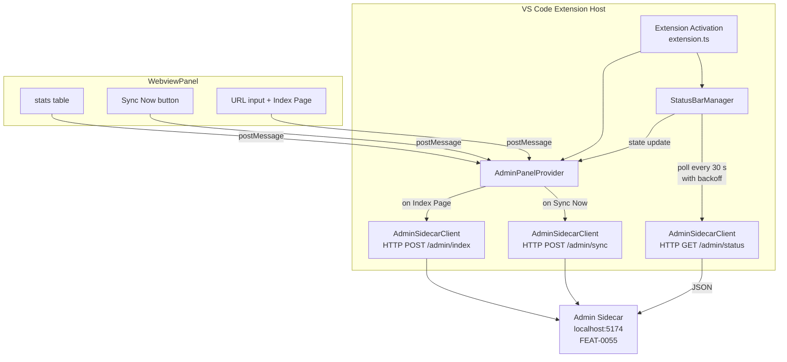

# Feature Spec: VS Code Extension — Admin Status Bar & WebviewPanel

**ID**: FEAT-0056
**Status**: Draft
**Author**: MarkZither
**Created**: 2026-05-05
**Last Updated**: 2026-05-05
**GitHub Issue**: [#80](https://github.com/MarkZither/bookstack-mcp-server-dotnet/issues/80)
**Related Features**: FEAT-0055 (Local Admin HTTP Sidecar), FEAT-0015 (VS Code Extension Packaging)
**Dependencies**: FEAT-0055, FEAT-0015

---

## Executive Summary

- **Objective**: Add a status bar item and interactive WebviewPanel to the VS Code extension that surfaces vector index state and provides manual sync/index controls by polling the FEAT-0055 admin sidecar.
- **Primary user**: Developers and knowledge workers who have the BookStack MCP VS Code extension installed and run the MCP server locally.
- **Value delivered**: Immediate visibility into the vector index state and one-click access to sync and index operations — no CLI commands required.
- **Scope**: `bookstack.adminPort` VS Code setting; status bar item with idle, syncing, unreachable, and error states; 30-second polling with exponential backoff; WebviewPanel with stats table, Sync Now button, and single-page URL input; message-passing between webview and extension host.
- **Primary success criterion**: A user can see the current index page count in the VS Code status bar within 30 seconds of the admin sidecar starting, and can trigger a full sync from the WebviewPanel without leaving VS Code.

---

## Problem Statement

After the vector index (FEAT-0005) and the local admin sidecar (FEAT-0055) are in place, users have no way to see index state or trigger index operations without running CLI commands or inspecting HTTP responses manually. The VS Code extension is already the primary distribution channel (FEAT-0015); adding a status bar item and a WebviewPanel turns the extension into a complete index management surface while the user stays in their editor.

## Goals

1. Show live vector index state (page count, sync status) in the VS Code status bar at all times while the extension is active.
2. Give users a one-click way to open a WebviewPanel that displays detailed stats and exposes manual sync and single-page index actions.
3. Recover gracefully from sidecar unavailability — the status bar must never crash the extension host.
4. Keep the admin port configurable through a VS Code setting so users with port conflicts can override the default.

## Non-Goals

- Kestrel second-listener setup, REST endpoint contracts, or `BOOKSTACK_ADMIN_PORT` env var (FEAT-0055).
- Authenticating to the admin sidecar with a pre-shared token (future phase, aligned with FEAT-0055 roadmap).
- Displaying anything other than index-related information in the WebviewPanel (e.g., BookStack content browsing).
- Starting or stopping the admin sidecar from within the extension.
- A dedicated output channel or progress notification for sync; the status bar and WebviewPanel are the sole feedback surfaces.

---

## Requirements

### Functional Requirements

1. The extension MUST contribute a `bookstack.adminPort` setting of type `number`, default `5174`, with a description indicating it must match the value of `BOOKSTACK_ADMIN_PORT` set on the MCP server process.
2. The extension MUST create a status bar item in the right-aligned section on activation, with priority such that it is visible but does not interfere with language/git indicators.
3. The status bar item MUST display `$(database) BookStack: {n} pages` (where `{n}` is `totalPages` from `GET /admin/status`) when the sidecar is reachable and no sync is in progress.
4. The status bar item MUST display `$(sync~spin) BookStack: syncing…` when a sync operation is known to be in progress (i.e., after the user clicks "Sync Now" and before the next successful poll confirms `pendingCount` has returned to 0).
5. The status bar item MUST display `$(database) BookStack: N/A` when `GET /admin/status` returns a non-2xx response or when the sidecar is unreachable (connection refused, timeout, or DNS error).
6. The status bar item MUST display `$(warning) BookStack: error` when the response from `GET /admin/status` is 2xx but the body cannot be parsed as expected JSON.
7. The extension MUST poll `GET /admin/status` every 30 seconds while the extension is active.
8. On consecutive polling failures, the extension MUST apply exponential backoff, doubling the interval starting at 30 seconds up to a maximum of 300 seconds (5 minutes), then continue at that maximum until a successful response is received, at which point the interval MUST reset to 30 seconds.
9. Clicking the status bar item MUST open the BookStack Admin WebviewPanel; if the panel already exists, it MUST be brought to focus rather than opening a second panel.
10. The WebviewPanel MUST display a stats table with: **Total Pages**, **Last Sync**, and **Pending** rows, populated from the most recent `GET /admin/status` response.
11. The WebviewPanel MUST display a "Sync Now" button that, when clicked, sends `POST /admin/sync` to the sidecar.
12. The WebviewPanel MUST display a URL input field (labelled "Page URL") and an "Index Page" button that, when clicked, sends `POST /admin/index` with `{"url": "<value>"}`.
13. After "Sync Now" is clicked, the WebviewPanel MUST show an inline status message `Sync started` and the status bar item MUST switch to the `syncing` state immediately (before the next poll).
14. After "Index Page" is clicked, the WebviewPanel MUST show an inline status message `Indexing started` on success or a descriptive inline error message on failure (e.g., `Error: invalid URL`).
15. The WebviewPanel MUST refresh its stats table on every successful poll while the panel is visible.
16. When the sidecar is unreachable, the WebviewPanel MUST display a `$(warning) Admin sidecar unreachable. Check that the MCP server is running and bookstack.adminPort is correct.` message in place of the stats table, and the Sync Now and Index Page controls MUST be disabled.
17. The extension MUST dispose the status bar item and stop polling when deactivated.

### Non-Functional Requirements

1. The polling loop MUST NOT block the VS Code extension host thread; all HTTP calls MUST be made asynchronously.
2. The HTTP call to `GET /admin/status` MUST time out after 5 seconds; a timeout MUST be treated the same as a connection error (triggers backoff, shows `N/A`).
3. The WebviewPanel HTML MUST use a strict Content Security Policy that allows only inline styles and the VS Code webview `nonce` script source; no external network requests from the webview are permitted.
4. No API tokens, secrets, or credential values from other BookStack settings MUST be passed to the admin sidecar or included in WebviewPanel messages.
5. Status bar updates MUST complete within 100 ms of a poll response being received.

---

## Design

### Component Diagram



### VS Code Setting

| Setting | Type | Default | Description |
|---|---|---|---|
| `bookstack.adminPort` | `number` | `5174` | Port of the local admin sidecar. Must match `BOOKSTACK_ADMIN_PORT` on the MCP server process. |

### Status Bar States

| State | Display text | Icon | Condition |
|---|---|---|---|
| Idle | `BookStack: {n} pages` | `$(database)` | Sidecar reachable, no sync in progress |
| Syncing | `BookStack: syncing…` | `$(sync~spin)` | Sync triggered; pending count > 0 or sync not yet confirmed complete |
| Unreachable | `BookStack: N/A` | `$(database)` | Connection refused, timeout, or non-2xx response |
| Error | `BookStack: error` | `$(warning)` | 2xx response with unparseable body |

### WebviewPanel Layout

```
┌─────────────────────────────────────────┐
│  BookStack Admin                        │
├─────────────────────────────────────────┤
│  Total Pages   │  1,234                 │
│  Last Sync     │  2026-05-05 14:32 UTC  │
│  Pending       │  0                     │
├─────────────────────────────────────────┤
│  [Sync Now]                             │
├─────────────────────────────────────────┤
│  Page URL: [___________________________]│
│  [Index Page]                           │
├─────────────────────────────────────────┤
│  (inline status / error messages here)  │
└─────────────────────────────────────────┘
```

### Webview ↔ Extension Host Message Protocol

Messages from the webview to the extension host use `vscode.postMessage`:

| `command` value | Additional fields | Description |
|---|---|---|
| `syncNow` | — | User clicked "Sync Now" |
| `indexPage` | `url: string` | User clicked "Index Page" |

Messages from the extension host to the webview use `panel.webview.postMessage`:

| `command` value | Additional fields | Description |
|---|---|---|
| `updateStats` | `totalPages`, `lastSyncTime`, `pendingCount` | Fresh poll result |
| `syncStarted` | — | `POST /admin/sync` returned 202 |
| `syncError` | `message: string` | `POST /admin/sync` failed |
| `indexStarted` | — | `POST /admin/index` returned 202 |
| `indexError` | `message: string` | `POST /admin/index` failed (includes sidecar-provided error text) |
| `sidecarUnreachable` | — | Poll or action call failed with network error |

### Polling & Backoff Algorithm

```
interval = 30 s
maxInterval = 300 s

loop:
  result = GET /admin/status (timeout 5 s)
  if success:
    interval = 30 s          // reset
    update status bar + panel
  else:
    interval = min(interval * 2, maxInterval)
    set status bar to N/A or error
  wait(interval)
```

---

## Acceptance Criteria

- [ ] Given the extension is active and the admin sidecar is running on the configured port, when 30 seconds elapse, then the status bar item displays `$(database) BookStack: {n} pages` with the correct page count from the sidecar response.
- [ ] Given the status bar item is visible, when the user clicks it, then the BookStack Admin WebviewPanel opens and shows the stats table populated with the latest poll data.
- [ ] Given the WebviewPanel is open, when the user clicks "Sync Now", then `POST /admin/sync` is called, the status bar switches to `$(sync~spin) BookStack: syncing…`, and the panel shows `Sync started`.
- [ ] Given the WebviewPanel is open, when the user enters a valid URL and clicks "Index Page", then `POST /admin/index` is called and the panel shows `Indexing started`.
- [ ] Given the WebviewPanel is open, when the user enters an invalid URL and clicks "Index Page", then the panel shows a descriptive error message and no request is sent to the sidecar.
- [ ] Given the admin sidecar is not running, when the extension polls, then the status bar displays `$(database) BookStack: N/A` and the WebviewPanel (if open) shows the unreachable warning and disables the action controls.
- [ ] Given consecutive poll failures, when failures continue, then the polling interval doubles on each failure up to a maximum of 300 seconds, and resets to 30 seconds on the next success.
- [ ] Given the poll returns a 2xx response with a malformed JSON body, when the extension processes the response, then the status bar shows `$(warning) BookStack: error`.
- [ ] Given a second click on the status bar item while the WebviewPanel is already open, when the click is processed, then the existing panel is focused and no second panel is opened.
- [ ] Given the extension is deactivated, when deactivation completes, then the polling loop has stopped and the status bar item has been disposed.

---

## Security Considerations

- The WebviewPanel MUST set a strict Content Security Policy using a per-load `nonce` for any inline scripts. No `unsafe-inline` script sources are permitted.
- The webview MUST NOT make direct HTTP calls to the admin sidecar; all network calls MUST be made from the extension host and results forwarded via `postMessage`.
- No BookStack API token, token secret, or other credential value MUST be included in any `postMessage` payload sent to or from the webview.
- The `bookstack.adminPort` value MUST be validated as an integer in the range 1–65535 before use; an out-of-range or non-integer value MUST surface a VS Code warning and fall back to the default port `5174`.
- Because the admin sidecar has no authentication in Phase 1 (see FEAT-0055), the extension MUST clearly document that the admin sidecar should only be used in trusted local development environments.

---

## Open Questions

- [ ] Should the WebviewPanel auto-open on extension activation when the sidecar is already reachable, or only on explicit status bar click? (Assumed: explicit click only — auto-open may be disruptive.)
