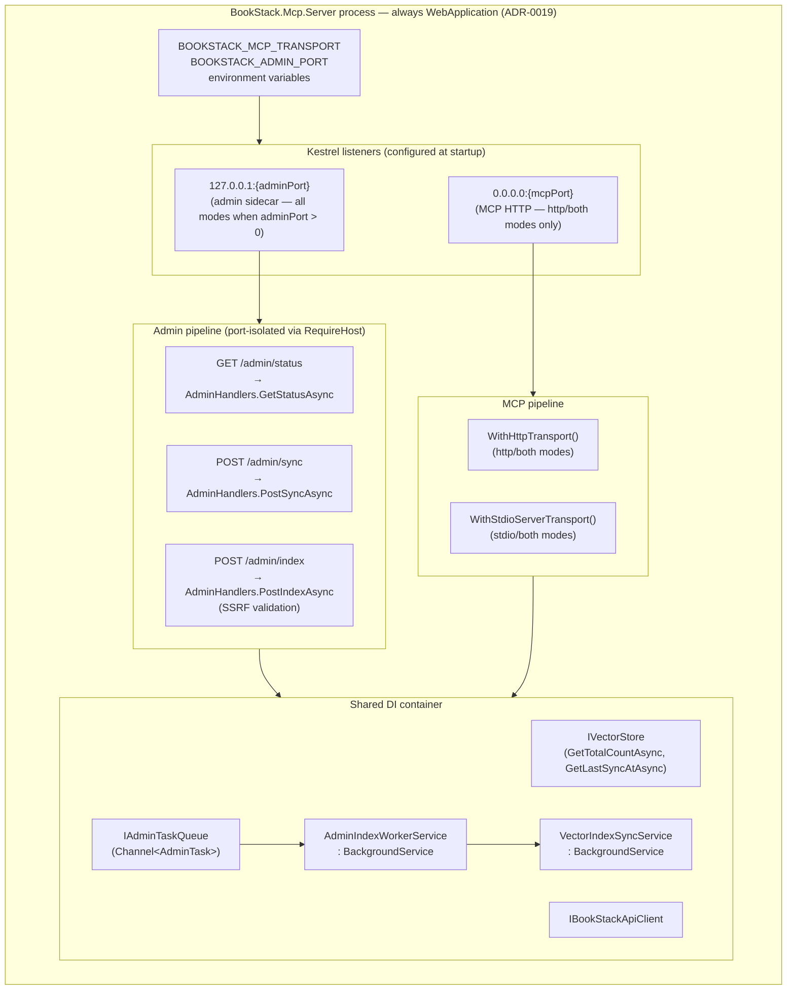
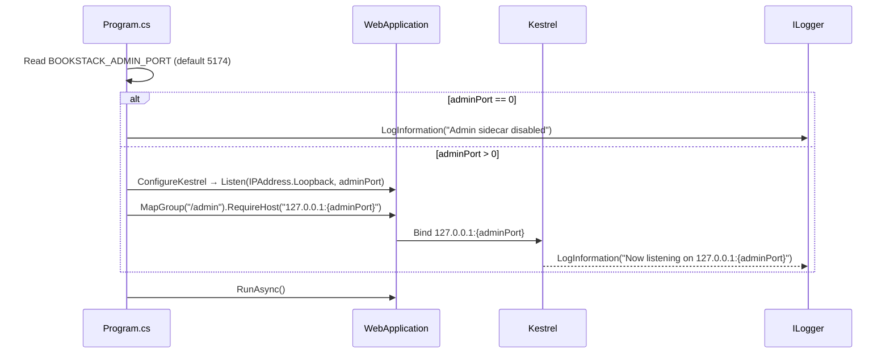
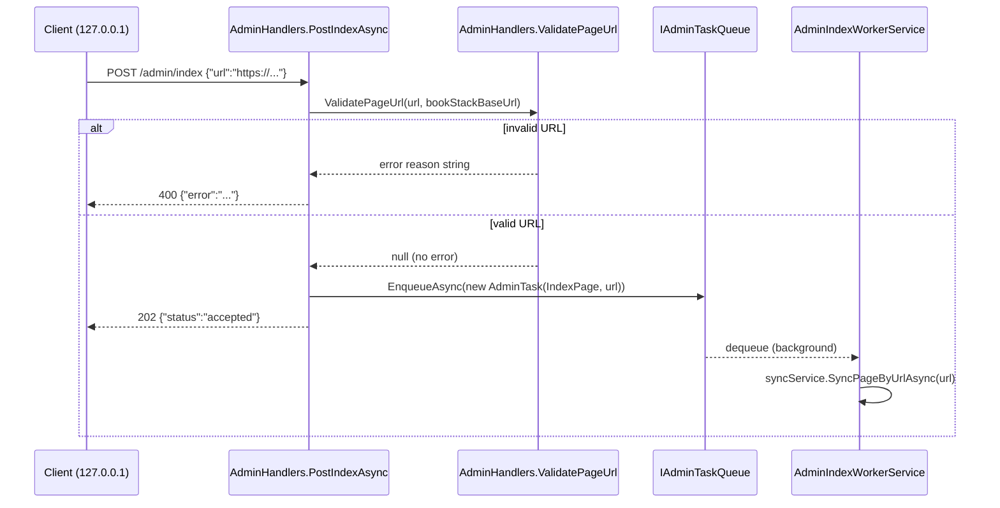

# Plan: Local Admin HTTP Sidecar (FEAT-0055)

**Feature**: Local Admin HTTP Sidecar
**Spec**: [docs/features/local-admin-sidecar/spec.md](spec.md)
**GitHub Issue**: [#80](https://github.com/MarkZither/bookstack-mcp-server-dotnet/issues/80)
**Status**: Ready for Implementation
**Date**: 2026-05-05

---

## Referenced ADRs

| ADR | Title | Decision |
|-----|-------|----------|
| [ADR-0009](../../architecture/decisions/ADR-0009-dual-transport-entry-point.md) | Dual-Transport Entry-Point Strategy | Single binary; `BOOKSTACK_MCP_TRANSPORT` selects transport |
| [ADR-0013](../../architecture/decisions/ADR-0013-both-mode-hosting-model.md) | Both-Mode Hosting Model | stdio as transport within `WebApplication`; shared DI container |
| [ADR-0015](../../architecture/decisions/ADR-0015-vector-store-abstraction.md) | Vector Store Abstraction | `IVectorStore` for all vector index operations |
| [ADR-0019](../../architecture/decisions/ADR-0019-admin-sidecar-kestrel-second-listener.md) | Admin Sidecar Kestrel Second Listener | Always-`WebApplication`; explicit Kestrel `Listen`; admin on `127.0.0.1:adminPort` |

---

## Data Model Changes

`IVectorStore` (FEAT-0005) is missing one method required by `GET /admin/status`. The following
addition must be made to `IVectorStore` and implemented in all three providers
(`Sqlite`, `Postgres`, `SqlServer`):

```csharp
/// <summary>Returns the total number of page entries currently in the vector index.</summary>
Task<int> GetTotalCountAsync(CancellationToken cancellationToken = default);
```

No new EF Core entities, database tables, or migrations are required. `pendingCount` in Phase 1
is served by an in-memory `Channel<AdminTask>` queue (see Phase 3); it persists only for the
lifetime of the process and resets to `0` on restart.

---

## API Contract (Environment Variables)

| Variable | Required | Default | Description |
|---|---|---|---|
| `BOOKSTACK_ADMIN_PORT` | No | `5174` | Port for the local admin sidecar. Set to `0` to disable. |

`BOOKSTACK_ADMIN_PORT` is read at startup; changes require a process restart. Port numbers are
non-sensitive and may be logged at `Information` level.

### Endpoint Contracts

#### `GET /admin/status` → 200

```json
{
  "totalPages": 142,
  "lastSyncTime": "2026-05-05T08:30:00Z",
  "pendingCount": 3
}
```

#### `POST /admin/sync` → 202

```json
{ "status": "accepted" }
```

#### `POST /admin/index` → 202 or 400

Request: `{ "url": "https://bookstack.example.com/books/b/pages/p" }`

Success (202): `{ "status": "accepted" }`

Failure (400): `{ "error": "<reason>" }`

---

## Component Diagram



---

## Sequence Diagrams

### Admin sidecar startup



### POST /admin/index — SSRF validation path



---

## Implementation Approach

### Phase 1 — stdio mode migration to WebApplication

**Files changed**: `src/BookStack.Mcp.Server/Program.cs`

Per ADR-0019, the `stdio` branch is migrated from `Host.CreateApplicationBuilder` to
`WebApplication.CreateBuilder` when `adminPort > 0`, so that a second Kestrel listener can be
added for the admin sidecar. When `adminPort == 0` the existing `IHost` path is retained
unchanged (headless/CI case).

1. Read `BOOKSTACK_ADMIN_PORT` before the transport branch:

```csharp
var adminPort = int.TryParse(
    Environment.GetEnvironmentVariable("BOOKSTACK_ADMIN_PORT"), out var ap) ? ap : 5174;
```

2. Update the `stdio` branch to branch on `adminPort`:

```csharp
if (transport == "stdio")
{
    if (adminPort == 0)
    {
        // Existing Host.CreateApplicationBuilder path — unchanged
        // Log that admin sidecar is disabled and continue
    }
    else
    {
        var builder = WebApplication.CreateBuilder(args);
        builder.Logging.AddConsole(o => o.LogToStandardErrorThreshold = LogLevel.Trace);
        builder.Configuration.AddInMemoryCollection(MapBookStackEnvVars());
        builder.Services.AddBookStackApiClient(builder.Configuration);
        builder.Services.AddVectorSearch(builder.Configuration);
        builder.Services
            .AddMcpServer()
            .WithStdioServerTransport()
            .WithToolsFromAssembly(Assembly.GetExecutingAssembly())
            .WithResourcesFromAssembly(Assembly.GetExecutingAssembly());

        // Admin DI registrations (Phase 3)

        // Kestrel: admin listener only — no MCP HTTP listener in stdio mode
        builder.WebHost.ConfigureKestrel(opts =>
            opts.Listen(IPAddress.Loopback, adminPort));

        var app = builder.Build();

        // Admin routes (Phase 4)

        await app.RunAsync().ConfigureAwait(false);
    }
}
```

### Phase 2 — Admin sidecar Kestrel configuration (http/both modes)

**Files changed**: `src/BookStack.Mcp.Server/Program.cs`

In the `else` branch (http/both), replace the `app.RunAsync(url)` conditional with explicit
Kestrel `Listen` configuration that adds the admin port alongside the MCP HTTP port:

```csharp
builder.WebHost.ConfigureKestrel(opts =>
{
    if (adminPort > 0)
        opts.Listen(IPAddress.Loopback, adminPort);

    // MCP HTTP listener; ASPNETCORE_URLS is superseded when Listen is called explicitly
    var aspnetUrls = Environment.GetEnvironmentVariable("ASPNETCORE_URLS");
    if (string.IsNullOrEmpty(aspnetUrls))
        opts.ListenAnyIP(port); // port = BOOKSTACK_MCP_HTTP_PORT, default 3000
    else
    {
        // Parse ASPNETCORE_URLS and add each address as an explicit listener
        foreach (var urlString in aspnetUrls.Split(';', StringSplitOptions.RemoveEmptyEntries))
        {
            if (Uri.TryCreate(urlString.Trim(), UriKind.Absolute, out var listenUri))
                opts.Listen(System.Net.IPAddress.Parse(
                    listenUri.Host == "*" || listenUri.Host == "+" ? "0.0.0.0" : listenUri.Host),
                    listenUri.Port);
        }
    }
});
```

Remove the `if (string.IsNullOrEmpty(ASPNETCORE_URLS)) app.RunAsync(url)` conditional; replace
with `await app.RunAsync().ConfigureAwait(false)`.

Log the admin port state after `app` is built:

```csharp
if (adminPort > 0)
    app.Logger.LogInformation(
        "Admin sidecar listening on http://127.0.0.1:{AdminPort}", adminPort);
else
    app.Logger.LogInformation(
        "Admin sidecar is disabled (BOOKSTACK_ADMIN_PORT=0).");
```

### Phase 3 — Admin service abstractions

**Files created**:

- `src/BookStack.Mcp.Server/Admin/IAdminTaskQueue.cs`
- `src/BookStack.Mcp.Server/Admin/AdminTaskQueue.cs`
- `src/BookStack.Mcp.Server/Admin/AdminTask.cs`
- `src/BookStack.Mcp.Server/Admin/AdminIndexWorkerService.cs`

`IAdminTaskQueue` provides a thread-safe channel for dispatching background admin operations:

```csharp
namespace BookStack.Mcp.Server.Admin;

internal interface IAdminTaskQueue
{
    int PendingCount { get; }
    ValueTask EnqueueAsync(AdminTask task, CancellationToken cancellationToken = default);
    ValueTask<AdminTask> DequeueAsync(CancellationToken cancellationToken);
}

internal sealed record AdminTask(AdminTaskKind Kind, string? PageUrl = null);

internal enum AdminTaskKind { FullSync, IndexPage }
```

`AdminTaskQueue` backed by `System.Threading.Channels.Channel<AdminTask>`:

```csharp
namespace BookStack.Mcp.Server.Admin;

internal sealed class AdminTaskQueue : IAdminTaskQueue
{
    private readonly Channel<AdminTask> _channel =
        Channel.CreateUnbounded<AdminTask>(new UnboundedChannelOptions { SingleReader = true });

    public int PendingCount => _channel.Reader.Count;

    public ValueTask EnqueueAsync(AdminTask task, CancellationToken cancellationToken = default)
        => _channel.Writer.WriteAsync(task, cancellationToken);

    public ValueTask<AdminTask> DequeueAsync(CancellationToken cancellationToken)
        => _channel.Reader.ReadAsync(cancellationToken);
}
```

`AdminIndexWorkerService` drains the queue and delegates to `VectorIndexSyncService`:

```csharp
namespace BookStack.Mcp.Server.Admin;

internal sealed class AdminIndexWorkerService(
    IAdminTaskQueue queue,
    VectorIndexSyncService syncService,
    ILogger<AdminIndexWorkerService> logger) : BackgroundService
{
    protected override async Task ExecuteAsync(CancellationToken stoppingToken)
    {
        while (!stoppingToken.IsCancellationRequested)
        {
            AdminTask task;
            try
            {
                task = await queue.DequeueAsync(stoppingToken).ConfigureAwait(false);
            }
            catch (OperationCanceledException)
            {
                break;
            }

            try
            {
                switch (task.Kind)
                {
                    case AdminTaskKind.FullSync:
                        await syncService.RunFullSyncAsync(stoppingToken).ConfigureAwait(false);
                        break;
                    case AdminTaskKind.IndexPage when task.PageUrl is not null:
                        await syncService.SyncPageByUrlAsync(task.PageUrl, stoppingToken)
                            .ConfigureAwait(false);
                        break;
                }
            }
            catch (OperationCanceledException) when (stoppingToken.IsCancellationRequested)
            {
                break;
            }
            catch (Exception ex)
            {
                logger.LogError(ex, "Admin task {Kind} failed.", task.Kind);
            }
        }
    }
}
```

> **Refactoring note**: `VectorIndexSyncService.RunSyncCycleAsync` must be renamed to
> `RunFullSyncAsync` and given `internal` visibility. `SyncPageByUrlAsync` is a new `internal`
> method that resolves a page by URL via the BookStack API client and calls `SyncPageAsync`.
> The existing scheduled loop in `VectorIndexSyncService.ExecuteAsync` continues to call
> `RunFullSyncAsync` on its configured interval.

**DI registration** — add to the admin-enabled startup path in `Program.cs` (both the new stdio
`WebApplication` branch and the existing http/both branch):

```csharp
builder.Services.AddSingleton<IAdminTaskQueue, AdminTaskQueue>();
builder.Services.AddHostedService<AdminIndexWorkerService>();
```

### Phase 4 — Admin endpoint handlers

**Files created**:

- `src/BookStack.Mcp.Server/Admin/AdminModels.cs`
- `src/BookStack.Mcp.Server/Admin/AdminHandlers.cs`

`AdminModels.cs`:

```csharp
namespace BookStack.Mcp.Server.Admin;

internal sealed record AdminStatusResponse(int TotalPages, string? LastSyncTime, int PendingCount);
internal sealed record AdminAcceptedResponse(string Status = "accepted");
internal sealed record AdminErrorResponse(string Error);
internal sealed record IndexPageRequest(string? Url);
```

`AdminHandlers.cs`:

```csharp
namespace BookStack.Mcp.Server.Admin;

internal static class AdminHandlers
{
    internal static async Task<IResult> GetStatusAsync(
        IVectorStore vectorStore,
        IAdminTaskQueue queue,
        CancellationToken ct)
    {
        var total = await vectorStore.GetTotalCountAsync(ct).ConfigureAwait(false);
        var lastSync = await vectorStore.GetLastSyncAtAsync(ct).ConfigureAwait(false);
        return Results.Ok(new AdminStatusResponse(
            TotalPages: total,
            LastSyncTime: lastSync?.ToString("O"),
            PendingCount: queue.PendingCount));
    }

    internal static async Task<IResult> PostSyncAsync(
        IAdminTaskQueue queue,
        CancellationToken ct)
    {
        await queue.EnqueueAsync(new AdminTask(AdminTaskKind.FullSync), ct).ConfigureAwait(false);
        return Results.Accepted(value: new AdminAcceptedResponse());
    }

    internal static async Task<IResult> PostIndexAsync(
        IndexPageRequest request,
        IAdminTaskQueue queue,
        IOptions<BookStackApiClientOptions> clientOptions,
        CancellationToken ct)
    {
        var validationError = ValidatePageUrl(request.Url, clientOptions.Value.BaseUrl);
        if (validationError is not null)
            return Results.BadRequest(new AdminErrorResponse(validationError));

        await queue.EnqueueAsync(
            new AdminTask(AdminTaskKind.IndexPage, request.Url),
            ct).ConfigureAwait(false);

        return Results.Accepted(value: new AdminAcceptedResponse());
    }

    /// <summary>
    /// Validates that <paramref name="url"/> is a well-formed absolute http/https URL
    /// whose host matches the configured BookStack base URL.
    /// Returns null on success; a human-readable error message on failure.
    /// </summary>
    internal static string? ValidatePageUrl(string? url, string? bookStackBaseUrl)
    {
        if (string.IsNullOrWhiteSpace(url))
            return "The 'url' field is required.";

        if (!Uri.TryCreate(url, UriKind.Absolute, out var uri))
            return "The provided URL is not a valid absolute URL.";

        if (uri.Scheme is not "http" and not "https")
            return "The provided URL scheme must be http or https.";

        if (string.IsNullOrWhiteSpace(bookStackBaseUrl)
            || !Uri.TryCreate(bookStackBaseUrl, UriKind.Absolute, out var baseUri))
            return "Server configuration error: BookStack base URL is not configured.";

        if (!uri.Host.Equals(baseUri.Host, StringComparison.OrdinalIgnoreCase))
            return "The provided URL does not belong to the configured BookStack instance.";

        return null;
    }
}
```

**Register admin routes in `Program.cs`** (called in both the new stdio `WebApplication` path
and the existing http/both path, after `app` is built):

```csharp
if (adminPort > 0)
{
    var admin = app.MapGroup("/admin")
        .RequireHost($"127.0.0.1:{adminPort}");

    admin.MapGet("/status", AdminHandlers.GetStatusAsync);
    admin.MapPost("/sync",  AdminHandlers.PostSyncAsync);
    admin.MapPost("/index", AdminHandlers.PostIndexAsync);
}
```

### Phase 5 — IVectorStore.GetTotalCountAsync

**Files changed**:

- `src/BookStack.Mcp.Server.Data.Abstractions/IVectorStore.cs` — add method signature
- `src/BookStack.Mcp.Server.Data.Sqlite/SqliteVectorStore.cs` — EF Core `CountAsync`
- `src/BookStack.Mcp.Server.Data.Postgres/PostgresVectorStore.cs` — EF Core `CountAsync`
- `src/BookStack.Mcp.Server.Data.SqlServer/SqlServerVectorStore.cs` — EF Core `CountAsync`

```csharp
// IVectorStore.cs addition
Task<int> GetTotalCountAsync(CancellationToken cancellationToken = default);

// Provider implementation (example — Sqlite)
public async Task<int> GetTotalCountAsync(CancellationToken cancellationToken = default)
    => await _context.VectorPages.CountAsync(cancellationToken).ConfigureAwait(false);
```

### Phase 6 — Integration tests

**Files created**:

- `tests/BookStack.Mcp.Server.Tests/Admin/AdminSidecarTestFactory.cs`
- `tests/BookStack.Mcp.Server.Tests/Admin/AdminStatusEndpointTests.cs`
- `tests/BookStack.Mcp.Server.Tests/Admin/AdminSyncEndpointTests.cs`
- `tests/BookStack.Mcp.Server.Tests/Admin/AdminIndexEndpointTests.cs`
- `tests/BookStack.Mcp.Server.Tests/Admin/AdminPortRoutingTests.cs`
- `tests/BookStack.Mcp.Server.Tests/Admin/AdminHandlersUrlValidationTests.cs`

`AdminSidecarTestFactory` uses `WebApplicationFactory<Program>` with `http` transport and a
fixed test admin port, injecting in-memory mocks for `IVectorStore` and `IBookStackApiClient`:

```csharp
internal sealed class AdminSidecarTestFactory : WebApplicationFactory<Program>
{
    internal const int TestAdminPort = 15174;

    protected override void ConfigureWebHost(IWebHostBuilder builder)
    {
        builder.UseEnvironment("Test");
        builder.UseSetting("BOOKSTACK_MCP_TRANSPORT", "http");
        builder.UseSetting("BOOKSTACK_ADMIN_PORT", TestAdminPort.ToString());
        builder.ConfigureServices(services =>
        {
            // Replace IVectorStore with an in-memory stub
            // Replace IBookStackApiClient with a no-op mock
        });
    }
}
```

**Test cases mapped to acceptance criteria**:

| Test | Acceptance Criterion | Expected |
|------|---------------------|----------|
| `Status_Returns200_WithCorrectSchema` | AC5 | `200` with `totalPages`, `lastSyncTime`, `pendingCount` |
| `Status_NeverSynced_ReturnsNullLastSyncTimeAndZeroTotal` | AC6 | `lastSyncTime` is `null`, `totalPages` is `0` |
| `Sync_Returns202_WithAcceptedStatus` | AC7 | `202` `{"status":"accepted"}` |
| `Index_WithValidUrl_Returns202` | AC8 | `202` `{"status":"accepted"}` |
| `Index_WithInvalidUrl_NotAbsolute_Returns400` | AC9 | `400` with `error` field |
| `Index_WithSchemeFile_Returns400` | AC9 | `400` with `error` field |
| `Index_WithUrlFromDifferentHost_Returns400` | AC9 | `400` with `error` field |
| `Index_WithMissingUrlField_Returns400` | AC10 | `400` with `error` field |
| `Index_WithEmptyBody_Returns400` | AC10 | `400` with `error` field |
| `AdminPort0_SidecarNotRegistered_Returns404` | AC4 | No admin routes; `404` on `/admin/status` |
| `AdminPort0_InformationLogConfirmsDisabled` | AC4 | `Information` log entry present |
| `AdminPort_CustomPort_BindsCorrectly` | AC12 | Responds on configured custom port |
| `AdminRoutes_NotAccessibleOnMcpPort` | Defence-in-depth | `404` on MCP port for `/admin/*` |
| `ValidatePageUrl_NullUrl_ReturnsError` | Unit | non-null error string |
| `ValidatePageUrl_RelativeUrl_ReturnsError` | Unit | non-null error string |
| `ValidatePageUrl_FileScheme_ReturnsError` | Unit | non-null error string |
| `ValidatePageUrl_MatchingHost_ReturnsNull` | Unit | `null` (no error) |

> **AC1–AC3** (all three transport modes start the sidecar) are structurally guaranteed by the
> unified `WebApplication` architecture (ADR-0019): all modes share the same Kestrel
> configuration code path when `adminPort > 0`. The `stdio`-mode WebApplication startup is
> additionally covered by a test using `BOOKSTACK_MCP_TRANSPORT=stdio` and a non-zero
> `BOOKSTACK_ADMIN_PORT`.

---

## Security Notes

- The admin listener is bound exclusively to `IPAddress.Loopback` (`127.0.0.1`) via Kestrel
  `opts.Listen(IPAddress.Loopback, adminPort)`. Binding to `0.0.0.0` or `::1` is prohibited.
- `RequireHost($"127.0.0.1:{adminPort}")` provides defence-in-depth: admin endpoints return `404`
  on requests arriving via the MCP port even if path prefixes match.
- All request bodies in `POST /admin/index` are deserialized before any downstream call. Malformed
  JSON returns HTTP 400 via ASP.NET Core's built-in `JsonException` handling; it must not
  produce an unhandled exception or a `500` response.
- SSRF mitigation in `AdminHandlers.ValidatePageUrl`: the `url` field must be an absolute
  `http`/`https` URI whose host matches the configured `BookStack:BaseUrl`. This rejects
  `file://`, `data:`, `javascript:`, and URLs targeting arbitrary internal or external hosts
  (OWASP A10 — SSRF).
- The `BookStackApiClientOptions.BaseUrl` value used in SSRF validation is loaded from
  `IOptions<BookStackApiClientOptions>` (server configuration); it is never taken from the
  request. A misconfigured empty `BaseUrl` must return an error response, not silently bypass
  host validation.
- Request body contents (including page URLs) must not be logged at `Debug` level or below without
  explicit operator configuration, as URLs may contain path segments that reveal internal
  information structure.
- Future `BOOKSTACK_ADMIN_TOKEN` implementation must use
  `CryptographicOperations.FixedTimeEquals` (same pattern as ADR-0012) to prevent timing attacks.
  Length equality must be checked before the fixed-time comparison.

---

## Out of Scope

- VS Code extension status bar and `bookstack.adminPort` configuration setting (FEAT-0056).
- `BOOKSTACK_ADMIN_TOKEN` pre-shared token authentication (future phase).
- TLS on the admin listener.
- Rate-limiting admin endpoints.
- `POST /admin/sync` job ID or polling for completion status (deferred — see open questions in spec).
- Persisting the `IAdminTaskQueue` across process restarts.

---

## Commands

### Build

```bash
dotnet build --configuration Release
```

### Tests

```bash
dotnet test --verbosity normal
```

### Lint / Formatting

```bash
dotnet format --verify-no-changes
```

### Local — stdio mode with admin sidecar

```bash
BOOKSTACK_MCP_TRANSPORT=stdio \
BOOKSTACK_ADMIN_PORT=5174 \
BOOKSTACK_BASE_URL=https://your-bookstack-instance \
BOOKSTACK_TOKEN_SECRET=your-token-id:your-token-secret \
dotnet run --project src/BookStack.Mcp.Server
```

### Local — http mode with admin sidecar

```bash
BOOKSTACK_MCP_TRANSPORT=http \
BOOKSTACK_MCP_HTTP_PORT=3000 \
BOOKSTACK_ADMIN_PORT=5174 \
BOOKSTACK_BASE_URL=https://your-bookstack-instance \
BOOKSTACK_TOKEN_SECRET=your-token-id:your-token-secret \
dotnet run --project src/BookStack.Mcp.Server
```

### Local — both mode with admin sidecar

```bash
BOOKSTACK_MCP_TRANSPORT=both \
BOOKSTACK_MCP_HTTP_PORT=3000 \
BOOKSTACK_ADMIN_PORT=5174 \
BOOKSTACK_BASE_URL=https://your-bookstack-instance \
BOOKSTACK_TOKEN_SECRET=your-token-id:your-token-secret \
dotnet run --project src/BookStack.Mcp.Server
```

### Disable admin sidecar (headless / CI)

```bash
BOOKSTACK_MCP_TRANSPORT=stdio \
BOOKSTACK_ADMIN_PORT=0 \
BOOKSTACK_BASE_URL=https://your-bookstack-instance \
BOOKSTACK_TOKEN_SECRET=your-token-id:your-token-secret \
dotnet run --project src/BookStack.Mcp.Server
```
