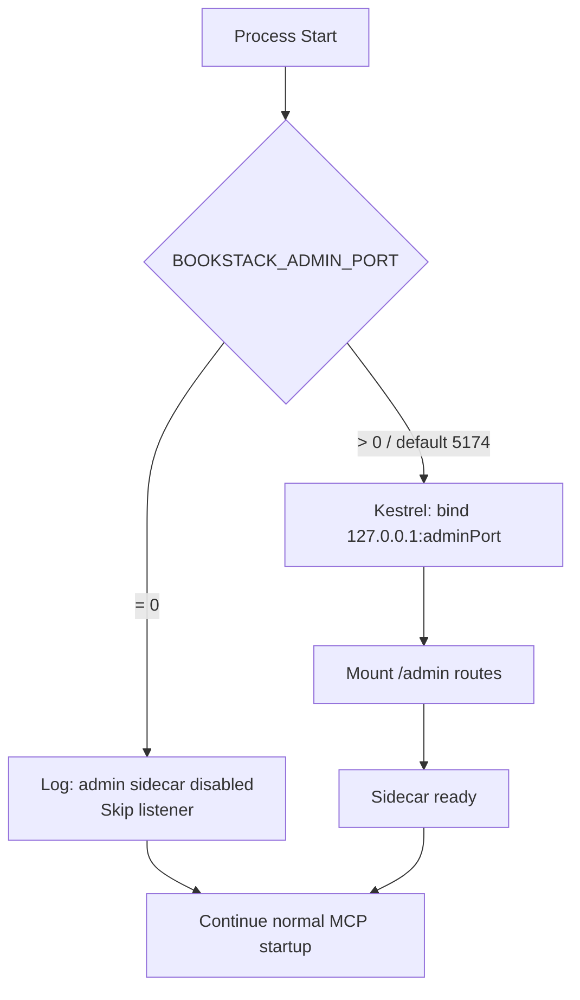

# Feature Spec: Local Admin HTTP Sidecar

**ID**: FEAT-0055
**Status**: Draft
**Author**: MarkZither
**Created**: 2026-05-05
**Last Updated**: 2026-05-05
**GitHub Issue**: [#80](https://github.com/MarkZither/bookstack-mcp-server-dotnet/issues/80)
**Related Features**: FEAT-0056 (VS Code extension status bar & WebviewPanel — separate spec)
**Dependencies**: FEAT-0005 (Vector Search)

---

## Executive Summary

- **Objective**: Expose a lightweight local-only REST admin API alongside the MCP server so that tooling can query and control the vector index without depending on the MCP transport mode.
- **Primary user**: Local tooling (VS Code extension, scripts) running on the same machine as the MCP server.
- **Value delivered**: Index state (total pages, last sync time, pending count) and manual sync/index actions are available regardless of whether the MCP server is running in `stdio`, `http`, or `both` transport mode.
- **Scope**: Kestrel second-listener configuration, three REST endpoints and their contracts, `BOOKSTACK_ADMIN_PORT` env var, disable-for-CI behaviour, and localhost-only security model. No VS Code extension UI.
- **Primary success criterion**: All three admin endpoints respond correctly when the MCP server is running in any transport mode, and the sidecar does not start when `BOOKSTACK_ADMIN_PORT=0`.

---

## Problem Statement

The VS Code extension (FEAT-0056) needs to display vector index status and allow the user to trigger a manual sync or index a single page. The MCP transport layer is not suitable for this: stdio mode has no HTTP surface at all, and requiring HTTP transport mode just to expose admin metadata would be an unnecessary constraint on server configuration. A dedicated, always-on local HTTP sidecar solves this cleanly without coupling admin access to transport mode.

## Goals

1. Provide a stable local HTTP endpoint that exposes index management operations regardless of MCP transport mode.
2. Allow the sidecar to be disabled entirely for headless and CI environments.
3. Keep the default port fixed so that future Entra redirect URL registration remains deterministic.
4. Validate all inputs at the sidecar boundary to prevent malformed requests reaching internal services.

## Non-Goals

- VS Code extension status bar item, WebviewPanel, or `bookstack.adminPort` setting (FEAT-0056).
- Sidecar access from remote hosts or across a network (localhost binding is the full security model for this phase).
- `BOOKSTACK_ADMIN_TOKEN` pre-shared token authentication (future phase).
- Entra ID / OAuth2 authentication for hosted HTTP mode (future phase).
- TLS on the admin listener.
- Rate-limiting the admin endpoints.

---

## Requirements

### Functional Requirements

1. The server MUST start a second Kestrel listener bound to `127.0.0.1:{BOOKSTACK_ADMIN_PORT}` when `BOOKSTACK_ADMIN_PORT` is set to a non-zero value (or defaults to `5174`).
2. The sidecar listener MUST start in all transport modes: `stdio`, `http`, and `both`.
3. When `BOOKSTACK_ADMIN_PORT=0`, the sidecar MUST NOT start, and the server MUST log an `Information`-level message indicating that the admin sidecar is disabled.
4. `GET /admin/status` MUST return HTTP 200 with a JSON body containing: `totalPages` (integer), `lastSyncTime` (ISO 8601 string or `null`), and `pendingCount` (integer).
5. `POST /admin/sync` MUST trigger a full re-index of all BookStack pages and return HTTP 202 with a JSON body containing `{"status":"accepted"}`.
6. `POST /admin/index` MUST accept a JSON body `{"url":"<page-url>"}`, validate that `url` is a well-formed absolute URL, trigger indexing of the identified page, and return HTTP 202 with `{"status":"accepted"}`.
7. `POST /admin/index` MUST return HTTP 400 with a descriptive `{"error":"..."}` body when `url` is missing, empty, not a well-formed absolute URL, or does not resolve to a known BookStack page.
8. The sidecar listener MUST NOT accept connections from any address other than `127.0.0.1` (loopback only); binding to `0.0.0.0` or `::1` is not permitted.
9. All admin endpoints MUST return `Content-Type: application/json`.
10. The server MUST NOT log the value of `BOOKSTACK_ADMIN_PORT` at `Debug` level or below when it contains a sensitive override; port numbers are non-sensitive and MAY be logged at `Information` level.

### Non-Functional Requirements

1. Each admin endpoint MUST respond within 500 ms for status queries under normal operating conditions.
2. `POST /admin/sync` and `POST /admin/index` MUST return HTTP 202 immediately (fire-and-forget dispatch); they MUST NOT block until the index operation completes.
3. All inputs to admin endpoints MUST be validated before reaching any internal service or data store.
4. The sidecar MUST use the same `ILogger<T>` infrastructure as the main server; no `Console.WriteLine` calls are permitted.
5. No synchronous blocking calls (`.Result`, `.Wait()`) are permitted in the sidecar middleware pipeline or endpoint handlers.

---

## Design

### Sidecar Startup Flow



### Endpoint Contracts

#### GET /admin/status

Returns the current state of the vector index.

**Response 200**

```json
{
  "totalPages": 142,
  "lastSyncTime": "2026-05-05T08:30:00Z",
  "pendingCount": 3
}
```

| Field | Type | Description |
|---|---|---|
| `totalPages` | `integer` | Total number of pages currently in the vector index |
| `lastSyncTime` | `string \| null` | ISO 8601 UTC timestamp of the last completed full sync, or `null` if never synced |
| `pendingCount` | `integer` | Number of pages queued for indexing but not yet processed |

---

#### POST /admin/sync

Triggers a full re-index. Returns immediately; indexing runs in the background.

**Request body**: none required.

**Response 202**

```json
{ "status": "accepted" }
```

---

#### POST /admin/index

Indexes a single BookStack page identified by its URL.

**Request body**

```json
{ "url": "https://bookstack.example.com/books/my-book/page/my-page" }
```

**Response 202** (valid, known page)

```json
{ "status": "accepted" }
```

**Response 400** (invalid or unresolvable URL)

```json
{ "error": "The provided URL is not a valid absolute URL." }
```

---

### Environment Variables

| Variable | Required | Default | Description |
|---|---|---|---|
| `BOOKSTACK_ADMIN_PORT` | No | `5174` | Port for the local admin sidecar. Set to `0` to disable. |

### Port Rationale

The default port `5174` is intentional and fixed. Dynamic port allocation would make future Entra redirect URL registration unmanageable in hosted HTTP deployments. Operators who need a different port can override via `BOOKSTACK_ADMIN_PORT`.

### Security Model (Phase 1)

The sidecar binds exclusively to `127.0.0.1`. No authentication is required in this phase because only processes running as the same user on the same machine can reach the endpoint. This is the intended model for local development and VS Code extension integration.

Future phases will add:

- **Phase 2**: `BOOKSTACK_ADMIN_TOKEN` pre-shared token enforced via `Authorization: Bearer` header.
- **Phase 3**: Entra ID authentication for hosted HTTP deployments.

---

## Acceptance Criteria

- [ ] Given `BOOKSTACK_ADMIN_PORT` is not set, when the server starts in `stdio` mode, then a Kestrel listener is bound on `127.0.0.1:5174` and `GET /admin/status` returns HTTP 200.
- [ ] Given `BOOKSTACK_ADMIN_PORT` is not set, when the server starts in `http` mode, then `GET /admin/status` returns HTTP 200 (sidecar coexists with the MCP HTTP listener).
- [ ] Given `BOOKSTACK_ADMIN_PORT` is not set, when the server starts in `both` mode, then `GET /admin/status` returns HTTP 200.
- [ ] Given `BOOKSTACK_ADMIN_PORT=0`, when the server starts, then no listener is bound on any admin port and an `Information`-level log entry confirms the sidecar is disabled.
- [ ] Given `BOOKSTACK_ADMIN_PORT=5174`, when `GET /admin/status` is called, then the response is HTTP 200 with a JSON body containing `totalPages`, `lastSyncTime`, and `pendingCount`.
- [ ] Given the vector index has never been synced, when `GET /admin/status` is called, then `lastSyncTime` is `null` and `totalPages` is `0`.
- [ ] Given `POST /admin/sync` is called, then the response is HTTP 202 with body `{"status":"accepted"}` and the full re-index is dispatched asynchronously.
- [ ] Given `POST /admin/index` with body `{"url":"https://bookstack.example.com/books/b/page/p"}`, when the URL is valid and the page exists, then the response is HTTP 202 with body `{"status":"accepted"}`.
- [ ] Given `POST /admin/index` with body `{"url":"not-a-url"}`, then the response is HTTP 400 with a JSON body containing an `error` field.
- [ ] Given `POST /admin/index` with an empty body or missing `url` field, then the response is HTTP 400 with a JSON body containing an `error` field.
- [ ] Given a client attempts to connect to the admin port from any address other than `127.0.0.1`, then the connection is refused (Kestrel binding enforces loopback-only).
- [ ] Given `BOOKSTACK_ADMIN_PORT=19999`, when the server starts, then the sidecar binds on port `19999` instead of `5174`.

---

## Security Considerations

- The sidecar MUST bind exclusively to `127.0.0.1`; binding to `0.0.0.0` or any external interface is prohibited.
- All request bodies MUST be parsed and validated before use; malformed JSON MUST result in HTTP 400, not an unhandled exception.
- The `url` parameter in `POST /admin/index` MUST be validated as a well-formed absolute URI before any downstream call. Relative paths, `file://` URIs, and private-network ranges other than the BookStack base URL MUST be rejected (OWASP A10 — SSRF mitigation).
- The server MUST NOT log request body contents (which may include internal page URLs) at `Debug` level or below without explicit operator configuration.
- Future token authentication MUST use a constant-time string comparison to prevent timing attacks.

---

## Open Questions

- [ ] Should `POST /admin/sync` return a job ID so callers can poll for completion, or is fire-and-forget (202) sufficient for the VS Code extension use case? [DEFERRED: decide during FEAT-0056 integration design]
