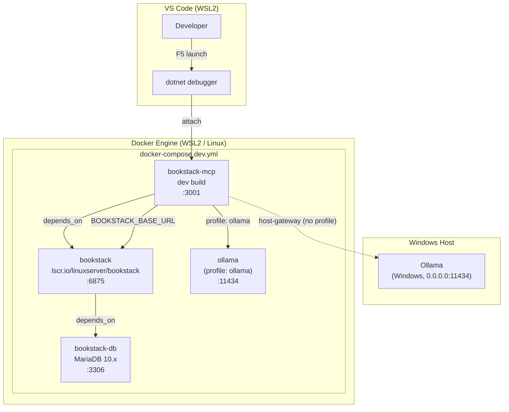

# Feature Spec: Local Developer Environment

**ID**: FEAT-0058
**Status**: Implemented
**Author**: GitHub Copilot
**Created**: 2026-05-08
**Last Updated**: 2026-05-08

---

## Executive Summary

- **Objective**: Provide a self-contained, reproducible local development environment so contributors can work productively without depending on
  any shared or demo BookStack instance.
- **Primary user**: Contributors to `bookstack-mcp-server-dotnet` cloning the repository for the first time.
- **Value delivered**: An F5-ready VS Code workflow backed by a locally running BookStack instance (MariaDB + BookStack containers) and an
  optional locally running Ollama instance, eliminating the 15-minute API-token expiry that blocks development against the public demo site.
- **Scope**: `docker-compose.dev.yml`, `.env.dev.example`, `.devcontainer/devcontainer.json`, VS Code `launch.json`/`tasks.json`,
  and a `docs/developer-guide.md`. Does not change any production runtime or CI pipeline.
- **Primary success criterion**: A new contributor can clone the repository, run a single setup command, press F5 in VS Code, and have the
  MCP server running against a local BookStack instance within 10 minutes.

---

## Problem Statement

All existing `docker-compose` variants in the repository assume a pre-existing, externally hosted BookStack instance and require the
developer to supply `BOOKSTACK_BASE_URL` and `BOOKSTACK_TOKEN_SECRET` from that instance. The only publicly available BookStack instance
suitable for experimentation is `demo.bookstackapp.com`, which resets all API tokens every 15 minutes. This makes iterative development
and testing impossible without constantly rotating credentials.

Additionally, no documented getting-started workflow exists for new contributors. There is no `.devcontainer` configuration, no VS Code
launch profile, and no guidance on how to generate a local BookStack API token, populate seed data, or connect an Ollama embedding service
running on the Windows host from inside a WSL2 development environment.

## Goals

1. Provide a `docker-compose.dev.yml` that starts a fully self-hosted BookStack stack (BookStack + MariaDB) alongside a development build
   of the MCP server, with all data persisted in named Docker volumes.
2. Support Ollama via a Docker Compose profile so that contributors can choose to run Ollama as a container or point the MCP server at an
   Ollama instance already running on the Windows host (accessible from WSL2).
3. Deliver a `.devcontainer/devcontainer.json` that uses the same Compose file, enabling VS Code Dev Containers to work without additional
   configuration.
4. Wire a VS Code `launch.json` and `tasks.json` so that pressing F5 starts the MCP server in debug mode against the local BookStack
   instance.
5. Document the complete getting-started workflow in `docs/developer-guide.md`, covering first-run BookStack setup, API token generation,
   and the WSL2 → Windows Ollama networking scenario.
6. Provide a `.env.dev.example` that contains all required and optional environment variables with comments, so contributors never have to
   guess what to set.

## Non-Goals

- Changing any existing `docker-compose.yml`, `docker-compose.sqlite.yml`, `docker-compose.postgres.yml`, or
  `docker-compose.postgres-external.yml` file.
- Modifying the production Dockerfile or any CI/CD workflow.
- Implementing .NET Aspire orchestration (deferred; see Open Questions).
- Providing a pre-populated BookStack database image with demo content.
- Automating BookStack first-run setup via scripted API calls (documented manually; automation is a separate feature).
- Supporting environments other than Linux/WSL2 and native Linux in this feature; macOS support is deferred.

## Requirements

### Functional Requirements

1. The repository MUST contain a `docker-compose.dev.yml` file that defines the following services:
   - `bookstack-db` — MariaDB 10.x, with a named volume for data persistence.
   - `bookstack` — the official `lscr.io/linuxserver/bookstack` image, depending on `bookstack-db`, with a named volume for uploads and
     a health check that waits for the web UI to become available.
   - `bookstack-mcp` — built from the repository's `Dockerfile` using the local source (not the published image), depending on `bookstack`.
2. All named volumes defined in `docker-compose.dev.yml` MUST be declared in the `volumes` block of that file so that data survives
   container restarts.
3. `docker-compose.dev.yml` MUST define a Docker Compose profile named `ollama` that, when activated, starts an `ollama` service with a
   named volume for model storage. When the profile is not activated, the `ollama` service MUST NOT start.
4. When the `ollama` profile is not activated, the MCP server MUST be configurable to point at an Ollama instance on the Docker host
   (i.e., `host-gateway` or a host IP supplied via an environment variable) through the `VectorSearch__Ollama__BaseUrl` environment
   variable.
5. The repository MUST contain a `.env.dev.example` file with commented-out placeholder values for every environment variable consumed by
   `docker-compose.dev.yml`, including BookStack database credentials, the MCP server auth token, Ollama base URL, and feature flags.
6. The repository MUST contain a `.devcontainer/devcontainer.json` that references `docker-compose.dev.yml` as its Compose file and
   sets `bookstack-mcp` as the target service, so that VS Code opens a Dev Container attached to the MCP server container.
7. The `.devcontainer/devcontainer.json` MUST specify the `ms-dotnettools.csdevkit` and `ms-dotnettools.csharp` extensions as required
   Dev Container extensions.
8. The repository MUST contain `.vscode/launch.json` and `.vscode/tasks.json` entries that:
   - Start `docker compose -f docker-compose.dev.yml up -d bookstack-db bookstack` as a pre-launch task.
   - Build and launch the MCP server with the .NET debugger attached, using environment variables sourced from `.env.dev`.
   - Allow the developer to press F5 from any C# file in VS Code to trigger the full sequence.
9. The repository MUST contain a `docs/developer-guide.md` with a step-by-step getting-started section that covers:
   - Prerequisites (Docker Desktop or Docker Engine, .NET 10 SDK, VS Code with recommended extensions).
   - Copying `.env.dev.example` to `.env.dev` and filling in values.
   - Starting the dev stack with `docker compose -f docker-compose.dev.yml up -d`.
   - Completing BookStack first-run setup via its web UI and generating a persistent API token.
   - Updating `.env.dev` with the API token and restarting the MCP server.
   - Using the F5 launch profile.
   - The WSL2 → Windows Ollama networking scenario (using `host-gateway` or the Windows host IP).
   - How to run `scripts/Seed-BookStack.ps1` to pre-populate the local BookStack instance with example content.
10. The repository MUST contain `scripts/Seed-BookStack.ps1`, a PowerShell (pwsh) script that:
    - Accepts a mandatory `-Topic` parameter and optional `-BookStackBaseUrl`, `-TokenId`, `-TokenSecret`, `-OllamaBaseUrl`,
      `-OllamaModel` parameters (all defaulting to environment variables so that no arguments are required when `.env.dev` is sourced).
    - Calls the Ollama `/api/generate` endpoint to produce a structured book outline (3–5 chapters, 2–4 pages each) as JSON.
    - Calls Ollama again for each page to generate markdown content.
    - Creates the book, chapters, and pages in BookStack using the BookStack REST API.
    - Supports a `-DryRun` switch that prints the generated structure without making BookStack API calls.
    - Works on both Windows (PowerShell 7+) and WSL2 (pwsh).

### Non-Functional Requirements

1. All named Docker volumes used by `docker-compose.dev.yml` MUST use a `dev_` prefix in their names to prevent collisions with
   production or integration test volumes on the same host.
2. The dev Compose file MUST NOT expose any service port that conflicts with the default ports of the existing production Compose files
   (`3000` for the MCP server, `11434` for Ollama) when both are running on the same host. The dev MCP server MUST default to port `3001`.
3. The `.env.dev.example` file MUST NOT contain any real credentials, tokens, or secrets — only placeholder values and explanatory
   comments.
4. The `docs/developer-guide.md` MUST pass `markdownlint` with the project's `.markdownlint.yaml` rules.
5. The Dev Container configuration MUST mount the repository root as a volume so that source code edits made in the Dev Container are
   immediately reflected on the host filesystem.

## Design

### Component Diagram



### Key Deliverables

| Deliverable | Path | Purpose |
| --- | --- | --- |
| Dev Compose file | `docker-compose.dev.yml` | Orchestrates BookStack + MariaDB + MCP server dev build |
| Env template | `.env.dev.example` | Documents all environment variables with safe placeholder values |
| Dev Container config | `.devcontainer/devcontainer.json` | VS Code Dev Container pointing at `bookstack-mcp` service |
| VS Code launch config | `.vscode/launch.json` | F5 debug launch for the MCP server |
| VS Code tasks | `.vscode/tasks.json` | Pre-launch task to start dependency containers |
| Developer guide | `docs/developer-guide.md` | Step-by-step getting-started and advanced configuration guide |
| Seed script | `scripts/Seed-BookStack.ps1` | PowerShell script that generates a book about any topic using an LLM and populates BookStack via its REST API |

### Environment Variable Reference

The following table lists the variables defined in `.env.dev.example`.

| Variable | Default (example) | Description |
| --- | --- | --- |
| `BOOKSTACK_BASE_URL` | `http://bookstack:6875` | BookStack base URL as seen from the MCP server container |
| `BOOKSTACK_TOKEN_ID` | `replace-me` | BookStack API token ID (generated in BookStack UI) |
| `BOOKSTACK_TOKEN_SECRET` | `replace-me` | BookStack API token secret |
| `BOOKSTACK_MCP_HTTP_AUTH_TOKEN` | `dev-token-replace-me` | Bearer token protecting the MCP HTTP endpoint |
| `BOOKSTACK_MCP_HTTP_PORT` | `3001` | Port the MCP server listens on (avoid collision with prod `3000`) |
| `DB_ROOT_PASSWORD` | `dev-root-password` | MariaDB root password |
| `DB_DATABASE` | `bookstack` | BookStack database name |
| `DB_USERNAME` | `bookstack` | MariaDB user for BookStack |
| `DB_PASSWORD` | `bookstack-dev-password` | MariaDB user password |
| `APP_URL` | `http://localhost:6875` | Public URL BookStack uses to generate links (host-visible) |
| `OLLAMA_BASE_URL` | `http://ollama:11434` | Ollama URL; override with host IP for WSL2 → Windows scenario |
| `VECTOR_SEARCH_ENABLED` | `false` | Set to `true` to enable semantic search |

### WSL2 → Windows Ollama Networking

When running VS Code with WSL2 (Remote WSL extension) and Ollama on the Windows host listening on `0.0.0.0:11434`, the Windows host is
reachable from inside a Docker container via the special DNS name `host-gateway` (added to the container's `/etc/hosts`). The dev Compose
file MUST add `host-gateway:host-gateway` to the `extra_hosts` block of the `bookstack-mcp` service. The developer then sets
`OLLAMA_BASE_URL=http://host-gateway:11434` in `.env.dev` and leaves the `ollama` profile inactive.

### Docker Compose Profile Strategy

```
# Run with embedded Ollama container:
docker compose -f docker-compose.dev.yml --profile ollama up -d

# Run with host Ollama (WSL2 → Windows):
# Set OLLAMA_BASE_URL=http://host-gateway:11434 in .env.dev
docker compose -f docker-compose.dev.yml up -d
```

The `ollama` service definition in `docker-compose.dev.yml` uses `profiles: [ollama]` so that it is never started unless explicitly
requested. This keeps the default startup fast and avoids pulling the Ollama image unnecessarily.

## Acceptance Criteria

- [ ] Given a clean clone of the repository on a Linux or WSL2 host with Docker Engine and the .NET 10 SDK installed, when the developer
  copies `.env.dev.example` to `.env.dev`, fills in the BookStack API token after first-run setup, and runs
  `docker compose -f docker-compose.dev.yml up -d`, then all three services (`bookstack-db`, `bookstack`, `bookstack-mcp`) start without
  errors and the MCP health check at `http://localhost:3001/health` returns HTTP 200.
- [ ] Given the dev stack is running, when the developer opens the repository in VS Code (native Linux or Remote WSL), and presses F5,
  then the MCP server process starts with the .NET debugger attached and breakpoints in C# source files are hit.
- [ ] Given the repository is opened in VS Code with the Dev Containers extension, when the developer selects "Reopen in Container",
  then VS Code opens a Dev Container attached to the `bookstack-mcp` service and the C# Dev Kit extension is active.
- [ ] Given `docker-compose.dev.yml` is running without the `ollama` profile, when `OLLAMA_BASE_URL` is set to
  `http://host-gateway:11434` in `.env.dev`, then the MCP server can reach an Ollama instance running on the Windows host and the
  health check reports Ollama connectivity as healthy.
- [ ] Given `docker-compose.dev.yml` is started with `--profile ollama`, when the developer runs
  `docker compose -f docker-compose.dev.yml exec ollama ollama pull nomic-embed-text`, then the model is pulled and stored in the
  `dev_ollama_data` named volume, surviving a container restart.
- [ ] Given the `.env.dev.example` file is reviewed, when every variable is compared against the variables consumed by
  `docker-compose.dev.yml`, then no variable used in the Compose file is absent from the example file.
- [ ] Given the `docs/developer-guide.md` is followed verbatim by a contributor who has never cloned the repository before, when they
  complete the BookStack first-run setup and generate an API token, then the MCP server successfully proxies a
  `list-books` tool call to BookStack and returns a valid response.
- [ ] Given the BookStack container is stopped and restarted, when it comes back up, when the developer inspects BookStack via the UI,
  then all previously created books, pages, and API tokens are present (data persisted in the `dev_bookstack_data` volume).
- [ ] Given the `.env.dev.example` file, when it is scanned for real credentials, secrets, or tokens, then no actual credentials are
  found — only clearly labelled placeholder values.
- [ ] Given the dev BookStack stack is running and API credentials are set in the environment, when the developer runs
  `./scripts/Seed-BookStack.ps1 -Topic "Docker Networking"`, then a book with at least 3 chapters and 6 pages is created in BookStack
  and visible in the UI within 5 minutes.
- [ ] Given `-DryRun` is passed to `Seed-BookStack.ps1`, when the script runs, then it prints the would-be structure to stdout and
  makes no BookStack API calls.

## Security Considerations

- The `.env.dev` file MUST be added to `.gitignore` to prevent accidental commitment of local credentials and API tokens.
- `.env.dev.example` MUST contain only placeholder values (e.g., `replace-me`), never real tokens, passwords, or secrets.
- The `BOOKSTACK_MCP_HTTP_AUTH_TOKEN` default in `.env.dev.example` MUST be a clearly labelled placeholder that communicates the
  developer should replace it; it MUST NOT be a well-known or guessable value even for local use.
- The dev Compose file MUST NOT publish MariaDB port `3306` to the host by default, limiting database exposure to the Docker bridge
  network. If a developer needs direct DB access, this MUST be opt-in via a commented-out port mapping.
- Documentation MUST warn contributors that the `APP_URL` and port bindings in `docker-compose.dev.yml` are intended for loopback access
  only and MUST NOT be used as-is in any environment reachable from a public network.

## Open Questions

- [ ] **Aspire integration**: Should the dev environment be orchestrated with .NET Aspire instead of raw Docker Compose? Aspire would
  provide a developer dashboard (service health, structured logs, traces) and would integrate naturally with the F5 launch experience,
  but adds a dependency on the Aspire workload and increases onboarding complexity for contributors unfamiliar with it. Deferred to a
  follow-up feature after the basic dev environment is validated. [DEFERRED: evaluate after FEAT-0058 is implemented]
- [x] **Seed data automation**: `scripts/Seed-BookStack.ps1` — a PowerShell script that accepts a `-Topic` parameter, calls Ollama to
  generate a book outline and page content, then creates the book/chapters/pages in BookStack via its REST API. Supports `-DryRun`,
  reads credentials from environment variables or parameters, and handles the WSL2 → Windows Ollama scenario via `-OllamaBaseUrl`.
  [IMPLEMENTED in FEAT-0058]
- [ ] **macOS support**: The WSL2 host-gateway approach is Linux/WSL2-specific. The Docker Desktop for Mac equivalent uses
  `host.docker.internal`. The developer guide should be extended to cover macOS once the primary Linux/WSL2 path is validated.
  [DEFERRED: post-FEAT-0058]

## Out of Scope

- Modifying or deprecating any existing `docker-compose.yml`, `docker-compose.sqlite.yml`, `docker-compose.postgres.yml`, or
  `docker-compose.postgres-external.yml` file.
- Changes to the production `Dockerfile` or any GitHub Actions CI workflow.
- Implementing .NET Aspire orchestration.
- Providing a pre-populated BookStack database dump or container image.
- Automating BookStack first-run configuration via scripted API calls.
- macOS-specific developer environment configuration.
