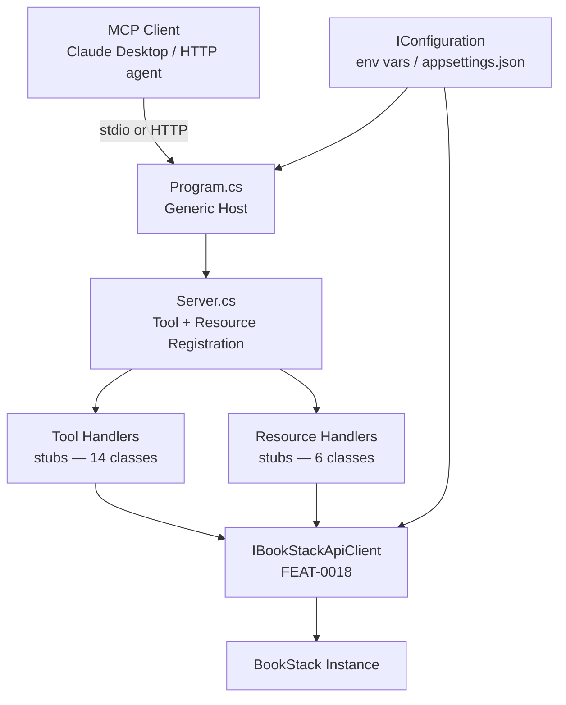
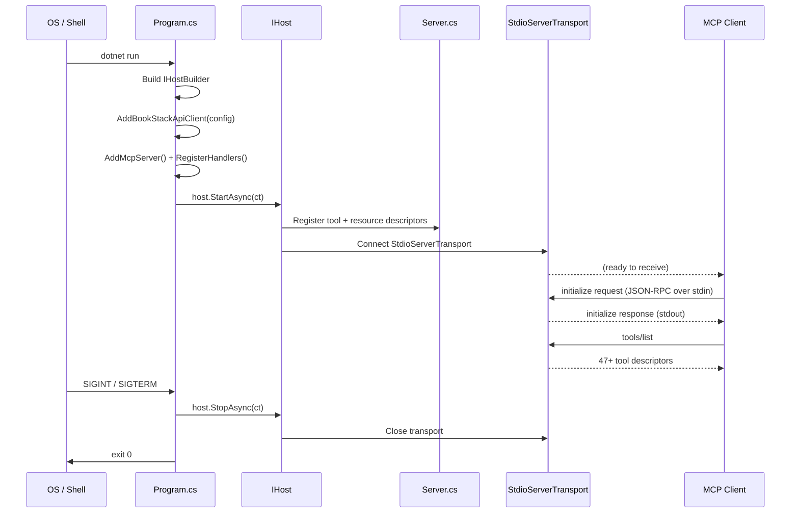
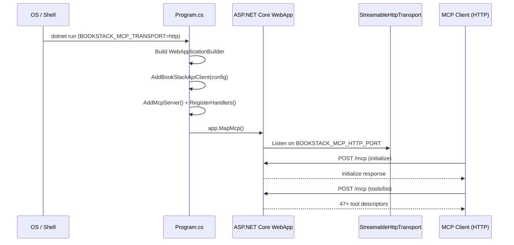

# Feature Spec: MCP Server Infrastructure — stdio + Streamable HTTP Transports

**ID**: FEAT-0008
**Status**: Draft
**Author**: GitHub Copilot
**Created**: 2026-04-20
**Last Updated**: 2026-04-20
**GitHub Issue**: [#8 — Feature: MCP stdio Transport](https://github.com/MarkZither/bookstack-mcp-server-dotnet/issues/8)
**Parent Epic**: [#1 — Core MCP Server](https://github.com/MarkZither/bookstack-mcp-server-dotnet/issues/1)
**Related ADRs**:
[ADR-0001](../../architecture/decisions/ADR-0001-mcp-sdk-selection.md),
[ADR-0002](../../architecture/decisions/ADR-0002-solution-structure.md),
[ADR-0005](../../architecture/decisions/ADR-0005-ihttpclientfactory-typed-client.md)

---

## Executive Summary

- **Objective**: Wire up the MCP server entry point with full dependency injection composition, stub tool and resource registration, and dual-transport support (stdio and Streamable HTTP), giving all downstream tool and resource implementations a runnable host.
- **Primary user**: MCP clients — Claude Desktop (via stdio) and web/network agents (via Streamable HTTP).
- **Value delivered**: A connectable MCP server that completes the `initialize` handshake, returns all registered tool and resource descriptors from `tools/list` and `resources/list`, and shuts down gracefully — unblocking all subsequent tool and resource feature implementations (#7, #9, #16, #6, #12, #10).
- **Scope**: `Program.cs` composition root, `Server.cs` tool/resource registration, transport selection logic, DI wiring, stub handler scaffolding, graceful shutdown, and startup error handling. No actual tool or resource business logic is in scope.
- **Primary success criterion**: `dotnet run` completes the MCP `initialize` handshake over stdio and `tools/list` returns all registered stub tool descriptors without error.

---

## Problem Statement

The repository has a compilable solution (FEAT-0014) and a fully implemented BookStack API client (FEAT-0018), but no `Program.cs` composition root that wires these together and exposes them over the Model Context Protocol (MCP). Without a running server entry point and tool/resource registration, no MCP client can connect, and all downstream implementations (#7, #9, #16, #6, #12, #10) have no host to attach to. The critical path is blocked until this feature is complete.

## Goals

1. Provide a `Program.cs` composition root using the .NET Generic Host that configures the dependency injection (DI) container, selects the active transport, and starts the MCP server.
2. Provide a `Server.cs` (or equivalent) that registers all tool and resource handler stubs with the `ModelContextProtocol` SDK, so that `tools/list` and `resources/list` return complete descriptors immediately.
3. Support two transports — `stdio` (default, required for Claude Desktop and most MCP clients) and Streamable HTTP (for web/network scenarios) — selected via the `BOOKSTACK_MCP_TRANSPORT` environment variable.
4. Handle SIGTERM and SIGINT for graceful shutdown so that in-flight requests complete before the process exits.
5. Ensure all structured diagnostic output goes to stderr (never stdout), preventing MCP JSON-RPC frame corruption on the stdio transport.

## Non-Goals

- Implementing any MCP tool or resource business logic (deferred to #7, #9, #16, #6, #12, #10).
- Configuring Transport Layer Security (TLS) or HTTPS for the Streamable HTTP transport.
- Implementing request authentication or authorization for the HTTP transport endpoint.
- Docker image or container packaging.
- MCP prompts support.
- Implementing a health-check HTTP endpoint.

## Requirements

### Functional Requirements

1. `Program.cs` MUST use `IHostBuilder` / `IHost` from `Microsoft.Extensions.Hosting` as the sole composition root; no top-level `new` operators for injected services.
2. `Program.cs` MUST call the `AddBookStackApiClient(IConfiguration)` extension method (from FEAT-0018) to register `IBookStackApiClient` and its delegating handlers.
3. `Program.cs` MUST register the MCP server using the `ModelContextProtocol` SDK's `IServiceCollection` extension methods, with the server name set to `bookstack-mcp-server-dotnet` and the version read from the entry assembly.
4. The transport MUST be selected at startup from the `BOOKSTACK_MCP_TRANSPORT` environment variable; valid values are `stdio` (default when the variable is absent or empty) and `http`.
5. When `BOOKSTACK_MCP_TRANSPORT` is `stdio` or unset, the server MUST start using `StdioServerTransport` and route all `ILogger` output to stderr so that stdout carries only MCP JSON-RPC frames.
6. When `BOOKSTACK_MCP_TRANSPORT` is `http`, the server MUST start Streamable HTTP transport via `ModelContextProtocol.AspNetCore` and listen on the port specified by `BOOKSTACK_MCP_HTTP_PORT` (default `3000`).
7. An invalid `BOOKSTACK_MCP_TRANSPORT` value (any value other than `stdio` or `http`) MUST produce a structured error log and terminate the process with a non-zero exit code before the MCP handshake begins.
8. `Server.cs` MUST register stub tool handler classes for all BookStack tool categories: books, chapters, pages, shelves, users, roles, attachments, images, search, recycle bin, content permissions, audit log, system info, and server info.
9. `Server.cs` MUST register stub resource handler classes for all BookStack resource categories: books, chapters, pages, shelves, users, and search.
10. `Program.cs` MUST wire SIGTERM and SIGINT to the `IHostApplicationLifetime.StopApplication()` method so that the Generic Host triggers graceful shutdown on either signal.
11. All unhandled exceptions reaching the top-level `try`/`catch` in `Program.cs` MUST be logged via `ILogger<Program>` at `Critical` level and cause the process to exit with a non-zero exit code.
12. Missing or invalid required configuration (`BookStack:TokenId`, `BookStack:TokenSecret`) MUST be detected at startup via `IOptionsMonitor<BookStackApiClientOptions>` validation and produce a clear structured error before the MCP handshake begins.
13. All log output MUST use `ILogger<T>` structured logging; `Console.WriteLine` and `Console.Error.WriteLine` are prohibited in all production code paths.

### Non-Functional Requirements

1. Server startup — from `dotnet run` invocation to completion of the MCP `initialize` handshake — MUST complete within five seconds under normal conditions on the CI runner.
2. The server MUST NOT write any non-MCP content to stdout when running in `stdio` mode; this is a protocol correctness requirement, not a quality-of-life concern.
3. The DI container MUST be the sole mechanism for service resolution; `ServiceLocator` patterns and manual `new` construction of DI-registered services are prohibited.
4. The solution MUST compile and run on .NET 10 (`net10.0`) without platform-specific conditional compilation directives.
5. All async methods MUST accept a `CancellationToken` parameter and propagate it to every awaitable call.

## Design

### File Layout

```
src/BookStack.Mcp.Server/
  Program.cs                          # Composition root — DI, transport selection, host start
  Server.cs                           # Tool and resource registration with MCP SDK
  tools/
    books/BookToolHandler.cs          # Stub — [McpServerTool] decorated class
    chapters/ChapterToolHandler.cs    # Stub
    pages/PageToolHandler.cs          # Stub
    shelves/ShelfToolHandler.cs       # Stub
    users/UserToolHandler.cs          # Stub
    roles/RoleToolHandler.cs          # Stub
    attachments/AttachmentToolHandler.cs  # Stub
    images/ImageToolHandler.cs        # Stub
    search/SearchToolHandler.cs       # Stub
    recyclebin/RecycleBinToolHandler.cs   # Stub
    permissions/PermissionToolHandler.cs  # Stub
    audit/AuditToolHandler.cs         # Stub
    system/SystemToolHandler.cs       # Stub
    server-info/ServerInfoToolHandler.cs  # Stub
  resources/
    books/BookResourceHandler.cs      # Stub — [McpServerResource] decorated class
    chapters/ChapterResourceHandler.cs    # Stub
    pages/PageResourceHandler.cs      # Stub
    shelves/ShelfResourceHandler.cs   # Stub
    users/UserResourceHandler.cs      # Stub
    search/SearchResourceHandler.cs   # Stub
```

### Component Diagram



### Startup Sequence — stdio Transport



### Startup Sequence — Streamable HTTP Transport



### Configuration Reference

| `IConfiguration` key              | Environment variable          | Required | Default   | Description                        |
|-----------------------------------|-------------------------------|----------|-----------|------------------------------------|
| `BookStack:BaseUrl`               | `BOOKSTACK_BASE_URL`          | No       | `http://localhost:8080` | BookStack instance URL  |
| `BookStack:TokenId`               | `BOOKSTACK_TOKEN_ID`          | Yes      | —         | API token ID                       |
| `BookStack:TokenSecret`           | `BOOKSTACK_TOKEN_SECRET`      | Yes      | —         | API token secret                   |
| `BookStack:TimeoutSeconds`        | `BOOKSTACK_TIMEOUT_SECONDS`   | No       | `30`      | HTTP request timeout (seconds)     |
| *(no IConfiguration key)*        | `BOOKSTACK_MCP_TRANSPORT`     | No       | `stdio`   | Transport: `stdio` or `http`       |
| *(no IConfiguration key)*        | `BOOKSTACK_MCP_HTTP_PORT`     | No       | `3000`    | HTTP listen port (http transport)  |

> **Note**: `BOOKSTACK_MCP_TRANSPORT` and `BOOKSTACK_MCP_HTTP_PORT` are read directly via
> `Environment.GetEnvironmentVariable` in `Program.cs`; they control host construction and
> cannot be bound through `IConfiguration` at the point they are needed.

### Key Code Shapes

```csharp
// Program.cs — transport selection and host construction

var transport = Environment.GetEnvironmentVariable("BOOKSTACK_MCP_TRANSPORT") ?? "stdio";

if (transport is not ("stdio" or "http"))
{
    // Log structured error and exit before host is built
    Console.Error.WriteLine($"Invalid BOOKSTACK_MCP_TRANSPORT value: '{transport}'. Valid values: stdio, http.");
    return 1;
}

if (transport == "stdio")
{
    var host = Host.CreateDefaultBuilder(args)
        .ConfigureLogging(logging => logging.AddConsole(o => o.LogToStandardErrorThreshold = LogLevel.Trace))
        .ConfigureServices((ctx, services) =>
        {
            services.AddBookStackApiClient(ctx.Configuration);
            services.AddMcpServer().WithStdioServerTransport().WithTools().WithResources();
        })
        .Build();

    await host.RunAsync(cts.Token);
}
else
{
    var port = int.TryParse(Environment.GetEnvironmentVariable("BOOKSTACK_MCP_HTTP_PORT"), out var p) ? p : 3000;
    var builder = WebApplication.CreateBuilder(args);
    builder.Services.AddBookStackApiClient(builder.Configuration);
    builder.Services.AddMcpServer().WithHttpTransport().WithTools().WithResources();
    var app = builder.Build();
    app.MapMcp();
    await app.RunAsync($"http://0.0.0.0:{port}");
}
```

```csharp
// Stub tool handler — books/BookToolHandler.cs
// Actual implementation is delivered in Issue #7

[McpServerToolType]
internal sealed class BookToolHandler(IBookStackApiClient client, ILogger<BookToolHandler> logger)
{
    [McpServerTool(Name = "list_books", Description = "List all books in BookStack")]
    public Task<string> ListBooksAsync(CancellationToken ct)
        => throw new NotImplementedException("Implemented in Issue #7");

    [McpServerTool(Name = "get_book", Description = "Get a book by ID")]
    public Task<string> GetBookAsync(int id, CancellationToken ct)
        => throw new NotImplementedException("Implemented in Issue #7");

    // ... additional stubs
}
```

## Acceptance Criteria

- [ ] Given no `BOOKSTACK_MCP_TRANSPORT` environment variable, when `dotnet run` is executed with valid configuration, then the MCP `initialize` handshake completes over stdio within five seconds.
- [ ] Given `BOOKSTACK_MCP_TRANSPORT=stdio`, when a `tools/list` request is sent, then the response lists descriptors for all 47+ registered stub tools without error.
- [ ] Given `BOOKSTACK_MCP_TRANSPORT=stdio`, when a `resources/list` request is sent, then the response lists descriptors for all registered stub resources without error.
- [ ] Given `BOOKSTACK_MCP_TRANSPORT=http` and `BOOKSTACK_MCP_HTTP_PORT=4000`, when the server starts, then it accepts MCP requests over HTTP on port 4000 and responds correctly to `initialize`.
- [ ] Given valid configuration and `BOOKSTACK_MCP_TRANSPORT=stdio`, when SIGINT is received, then all in-flight requests complete and the process exits with code 0.
- [ ] Given valid configuration and `BOOKSTACK_MCP_TRANSPORT=stdio`, when SIGTERM is received, then all in-flight requests complete and the process exits with code 0.
- [ ] Given `BOOKSTACK_TOKEN_ID` is missing from configuration, when the server starts, then a structured error is logged via `ILogger` and the process exits with a non-zero exit code before the MCP handshake begins.
- [ ] Given `BOOKSTACK_MCP_TRANSPORT=invalid`, when the server starts, then a structured error is logged and the process exits with a non-zero exit code.
- [ ] Given the server is running, when an unhandled exception propagates to `Program.cs`, then it is logged at `Critical` level via `ILogger` and the process exits with a non-zero exit code.
- [ ] Given `BOOKSTACK_MCP_TRANSPORT=stdio`, when the server is running, then no non-MCP content appears on stdout at any point.
- [ ] Given a running server, when an integration test calls `tools/list`, then the response is deserializable and contains at least one tool descriptor per registered tool handler category.

## Security Considerations

- `BookStack:TokenId` and `BookStack:TokenSecret` MUST NOT be written to any log output at any level (OWASP A02 — Cryptographic Failures); only `BookStack:BaseUrl` may appear in startup diagnostics.
- The Streamable HTTP endpoint MUST NOT expose diagnostic or configuration details in error responses returned to HTTP clients.
- Environment variables are the only supported mechanism for supplying secrets; `appsettings.json` is not to be used for token values in production.
- All tool argument validation is the responsibility of each individual tool handler (deferred to #7, #9, #16, #6, #12, #10); the server infrastructure does not need to validate tool call payloads beyond what the MCP SDK enforces.

## Open Questions

- None. All transport, DI, and registration decisions are covered by ADR-0001.

## Out of Scope

- Actual tool and resource handler implementations (deferred to #7, #9, #16, #6, #12, #10).
- TLS / HTTPS configuration for the Streamable HTTP transport.
- Per-request authentication for the HTTP transport endpoint.
- Docker image or container packaging.
- MCP prompts support.
