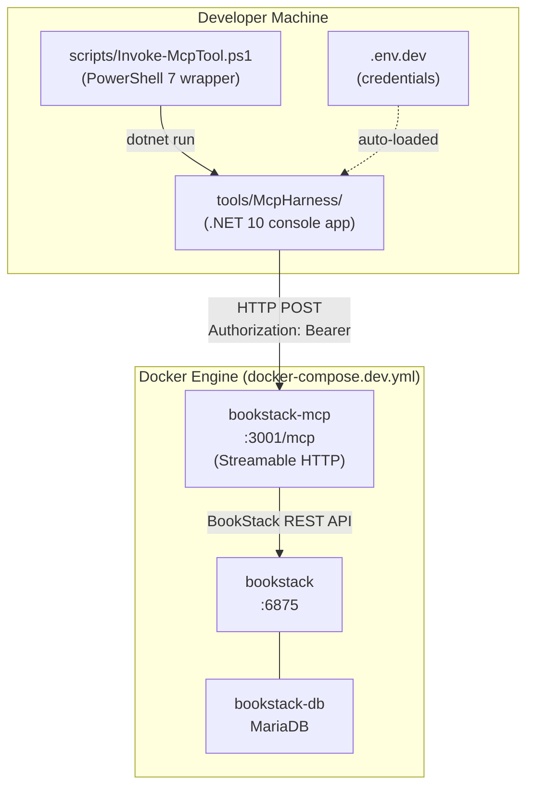
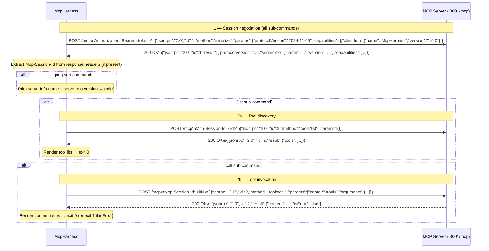

# Feature Spec: MCP Server Test Harness

**ID**: FEAT-0059
**Status**: Draft
**Author**: GitHub Copilot
**Created**: 2026-05-08
**Last Updated**: 2026-05-08
**Related features**: [FEAT-0058 — Local Developer Environment](../local-dev-environment/spec.md)

---

## Executive Summary

- **Objective**: Provide a standalone developer tool that can invoke any MCP tool on a locally running MCP server without requiring the VS
  Code extension, so that developers can interactively verify the correctness and quality of tool responses against a real BookStack
  instance.
- **Primary user**: Contributors to `bookstack-mcp-server-dotnet` who want to quickly exercise and inspect MCP tool output during
  development without setting up a full MCP client.
- **Value delivered**: A single command (`dotnet run -- call list-books`) replaces a multi-step cURL sequence, renders responses in a
  readable format, and makes it immediately visible when a tool returns malformed, empty, or incorrect content.
- **Scope**: A .NET 10 console app at `tools/McpHarness/`, a thin PowerShell wrapper at `scripts/Invoke-McpTool.ps1`, and supporting
  documentation. The harness targets the dev stack from FEAT-0058 (`http://localhost:3001/mcp`) but works with any reachable MCP
  Streamable HTTP endpoint.
- **Primary success criterion**: A developer can run `dotnet run --project tools/McpHarness -- call list-books` against a running dev
  stack and see a pretty-printed list of books from their local BookStack instance within 5 seconds of startup.

---

## Problem Statement

The MCP server exposes 47+ tools over a Streamable HTTP transport. During development, verifying that a tool returns the correct response
requires either spinning up a full MCP client (the VS Code extension + an LLM session), or hand-crafting a multi-step cURL sequence
that includes `initialize`, optional `tools/list`, and finally `tools/call`. Neither option is developer-friendly: the extension
approach is slow and indirect (the LLM reformulates the query), and the cURL approach is verbose and error-prone.

There is currently no way for a developer to quickly answer: "Does `list-books` return the books I seeded? Does `create-page` set the
correct chapter? What exactly does the MCP server return for `search-content` given this query?" Without fast, direct feedback, catching
regressions and verifying new tool implementations requires guesswork or end-to-end extension testing.

## Goals

1. Provide a `ping` mode that sends `initialize` and prints the server name and version, confirming the dev stack is reachable.
2. Provide a `list` mode that calls `tools/list` and prints all available tools with their descriptions and parameter schemas in a
   human-readable format.
3. Provide a `call` mode that invokes a named tool with supplied arguments and pretty-prints the full response, making it trivial to
   inspect tool output.
4. Provide an `interactive` mode (stretch goal) that presents a REPL loop: show the tool list, prompt for a tool name and arguments,
   display the result, and repeat until the developer exits.
5. Support reading configuration (server URL, auth token) from a `.env.dev` file automatically, so the developer does not have to pass
   credentials on every invocation.
6. Provide a PowerShell wrapper `scripts/Invoke-McpTool.ps1` that builds and runs the harness with defaults pre-wired to the local dev
   stack, reducing the invocation to a single line.

## Non-Goals

- Load testing or stress testing the MCP server.
- Implementing a full MCP client SDK — the harness is purpose-built for the `tools/*` subset of the MCP protocol only.
- Integrating into the CI test suite or automating assertion-based testing (a separate integration testing feature).
- Supporting MCP resources (`resources/list`, `resources/read`) in this iteration.
- Supporting the `stdio` MCP transport — only Streamable HTTP is in scope.
- Validating MCP protocol compliance beyond what is needed to invoke tools successfully.
- Running against any BookStack instance other than the local dev stack (though this works in practice if the URL and token are
  overridden).

## Requirements

### Functional Requirements

1. The repository MUST contain a `tools/McpHarness/McpHarness.csproj` console project targeting `net10.0`. This project MUST NOT be
   added to the main `BookStack.Mcp.Server.sln` solution file; it is a standalone developer utility.
2. The harness MUST support the following sub-commands, each described in subsequent requirements:
   - `ping`
   - `list`
   - `call <tool-name>`
   - `interactive` (stretch)
3. **`ping` sub-command**: The harness MUST send an `initialize` JSON-RPC request to the configured MCP endpoint, parse the response,
   and print the `serverInfo.name` and `serverInfo.version` fields. If the server is unreachable or returns an error, the harness MUST
   print a clear error message and exit with a non-zero exit code.
4. **`list` sub-command**: The harness MUST send a `tools/list` JSON-RPC request (after initializing the session) and print each tool
   in the response, formatted as:

   ```
   <tool-name>
     Description: <description>
     Parameters:
       <param-name> (<type>) [required] — <description>
       ...
   ```

   When `--output json` is specified, the harness MUST print the raw `tools/list` response body as formatted JSON instead.

5. **`call` sub-command**: The harness MUST accept a tool name as a positional argument and zero or more `--arg key=value` pairs as
   named arguments. It MUST construct the `tools/call` JSON-RPC request with the tool name and the supplied arguments, send it, and
   print the response.

   - When `--output pretty` (default), the harness MUST render each `content` item in the response using a human-readable format:
     text content is printed as plain text; JSON content is pretty-printed with indentation.
   - When `--output json`, the harness MUST print the raw response body as formatted JSON.
   - If the tool returns an `isError: true` response, the harness MUST print the error content and exit with a non-zero exit code.

6. **`interactive` sub-command** *(stretch)*: The harness MUST present a numbered list of available tools fetched via `tools/list`,
   prompt the developer to select a tool by number or name, prompt for each required parameter interactively, invoke the tool via
   `tools/call`, display the result, and then repeat from the tool selection prompt. The loop MUST exit when the developer types `exit`
   or `quit`, or presses Ctrl+C.

7. The harness MUST accept the following global options, applicable to all sub-commands:

   | Option | Default | Description |
   | --- | --- | --- |
   | `--server-url` | `http://localhost:3001/mcp` | Full URL of the MCP Streamable HTTP endpoint |
   | `--token` | `$BOOKSTACK_MCP_HTTP_AUTH_TOKEN` | Bearer token for the `Authorization` header |
   | `--output` | `pretty` | Output format: `pretty` or `json` |
   | `--verbose` | `false` | When set, print outgoing request and incoming response HTTP details |

8. The harness MUST read `.env.dev` automatically if the file exists in the current working directory or the repository root (searching
   upward from the working directory up to the repository root). Variables already set in the environment MUST take precedence over
   values in `.env.dev`. The file MUST be parsed as `KEY=VALUE` lines; lines starting with `#` MUST be treated as comments and ignored.
   The harness MUST NOT fail if `.env.dev` does not exist.

9. The harness MUST attach the `Authorization: Bearer <token>` header to every HTTP request sent to the MCP endpoint. If no token is
   configured (neither from the environment nor from `.env.dev` nor from `--token`), the harness MUST print a warning but still attempt
   the request, to support unauthenticated local configurations.

10. The repository MUST contain `scripts/Invoke-McpTool.ps1`, a PowerShell 7 script that:
    - Accepts `-SubCommand` (mandatory, e.g., `ping`, `list`, `call`), `-ToolName` (optional, used with `call`), and variadic
      `-ToolArgs` (optional, forwarded as `--arg` pairs).
    - Sources `.env.dev` from the repository root if present before invoking the harness.
    - Runs `dotnet run --project tools/McpHarness -- <sub-command> [--arg ...]` with the default server URL and token pre-wired to the
      dev stack values (`http://localhost:3001/mcp`, `$env:BOOKSTACK_MCP_HTTP_AUTH_TOKEN`).
    - Passes through all remaining arguments to the harness unchanged.

11. The repository MUST contain a `tools/McpHarness/README.md` that documents all sub-commands, all global options, and at least three
    worked examples showing real invocations with expected output snippets.

### Non-Functional Requirements

1. Cold start (first `dotnet run` after a clean build) MUST complete and print the first line of output within 15 seconds on a standard
   developer workstation.
2. Subsequent runs (warm JIT, no recompilation) MUST complete the `ping` sub-command within 3 seconds of process start on the same
   workstation.
3. The harness MUST NOT store or log the bearer token value in any output, log file, or verbose trace — it MUST be redacted as
   `[REDACTED]` in all printed output, including `--verbose` mode.
4. The harness MUST gracefully handle HTTP timeouts (default 30 s), network errors, and malformed JSON-RPC responses, printing a
   human-readable error and exiting with a non-zero exit code rather than throwing an unhandled exception.
5. The harness MUST target `net10.0` and use only BCL and in-box `System.Net.Http` / `System.Text.Json` — no third-party NuGet packages
   beyond `System.CommandLine` (for argument parsing) are permitted. This keeps the tool dependency-free and ensures it builds on a
   clean SDK install.
6. `tools/McpHarness/README.md` MUST pass `markdownlint` with the project's `.markdownlint.yaml` rules.

## Design

### Component Diagram



### Project Layout

```
tools/
  McpHarness/
    McpHarness.csproj         # net10.0 console; NOT in BookStack.Mcp.Server.sln
    Program.cs                # Entry point; System.CommandLine root command
    McpClient.cs              # HttpClient wrapper — initialize / tools/list / tools/call
    EnvFileReader.cs          # .env.dev loader
    OutputFormatter.cs        # pretty / json renderers
    README.md                 # Usage documentation
scripts/
  Invoke-McpTool.ps1          # PowerShell thin wrapper
```

### MCP Protocol Interaction

The harness communicates with the MCP Streamable HTTP endpoint using JSON-RPC 2.0. Every invocation follows the sequence below.



**Session ID handling**: The MCP Streamable HTTP transport may return an `Mcp-Session-Id` header in the `initialize` response. The
harness MUST include this header on all subsequent requests within the same invocation. If the server does not return the header, the
harness MUST proceed without it.

**Request ID sequencing**: The harness MUST use a monotonically incrementing integer for `id` starting at 1. The `initialize` request
MUST always use `id: 1`.

**Protocol version**: The harness MUST send `"protocolVersion": "2024-11-05"` in the `initialize` request, matching the version
negotiated by the production MCP server.

### Key Deliverables

| Deliverable | Path | Purpose |
| --- | --- | --- |
| Console app project | `tools/McpHarness/McpHarness.csproj` | Standalone .NET 10 tool; not in main solution |
| Entry point | `tools/McpHarness/Program.cs` | `System.CommandLine` root command wiring |
| MCP client | `tools/McpHarness/McpClient.cs` | `HttpClient`-based JSON-RPC implementation |
| Env file reader | `tools/McpHarness/EnvFileReader.cs` | `.env.dev` parser |
| Output formatter | `tools/McpHarness/OutputFormatter.cs` | Pretty and JSON output renderers |
| Harness README | `tools/McpHarness/README.md` | Usage documentation with examples |
| PowerShell wrapper | `scripts/Invoke-McpTool.ps1` | One-liner invocation for the dev stack |

### Worked Examples

The following examples illustrate expected harness behaviour and are reproduced in `tools/McpHarness/README.md`.

**Smoke test the dev stack:**

```bash
dotnet run --project tools/McpHarness -- ping
# MCP Server: bookstack-mcp-server-dotnet v1.0.0
```

**List all available tools:**

```bash
dotnet run --project tools/McpHarness -- list
# list-books
#   Description: List all books in BookStack
#   Parameters:
#     (none)
#
# get-book
#   Description: Get a single book by ID
#   Parameters:
#     id (integer) [required] — The ID of the book to retrieve
# ...
```

**Invoke a tool with arguments:**

```bash
dotnet run --project tools/McpHarness -- call get-book --arg id=1
# Title: "Getting Started"
# Slug: getting-started
# Description: ...
# Created: 2026-05-01T10:00:00Z
# Updated: 2026-05-08T09:30:00Z
```

**Output raw JSON for scripting:**

```bash
dotnet run --project tools/McpHarness -- call list-books --output json
# {
#   "jsonrpc": "2.0",
#   "id": 2,
#   "result": {
#     "content": [ ... ],
#     "isError": false
#   }
# }
```

**Using the PowerShell wrapper:**

```powershell
./scripts/Invoke-McpTool.ps1 -SubCommand call -ToolName list-books
./scripts/Invoke-McpTool.ps1 -SubCommand call -ToolName get-book -ToolArgs "id=1"
```

## Acceptance Criteria

- [ ] Given the dev stack from FEAT-0058 is running (`docker compose -f docker-compose.dev.yml up -d`) and `.env.dev` contains a valid
  `BOOKSTACK_MCP_HTTP_AUTH_TOKEN`, when the developer runs
  `dotnet run --project tools/McpHarness -- ping`, then the output contains the MCP server name and version and the process exits with
  code 0.
- [ ] Given the dev stack is running, when the developer runs `dotnet run --project tools/McpHarness -- list`, then the output lists at
  least 10 tools with names and descriptions, and the process exits with code 0.
- [ ] Given the dev stack is running and BookStack contains at least one book, when the developer runs
  `dotnet run --project tools/McpHarness -- call list-books`, then the output contains the title of that book and the process exits
  with code 0.
- [ ] Given the developer runs `dotnet run --project tools/McpHarness -- call get-book --arg id=1`, when the book with ID 1 exists in
  BookStack, then the output shows the book's title and slug in a human-readable format.
- [ ] Given the developer runs `dotnet run --project tools/McpHarness -- call list-books --output json`, then the output is valid,
  formatted JSON containing the raw JSON-RPC response body and the process exits with code 0.
- [ ] Given the developer runs `dotnet run --project tools/McpHarness -- call get-book --arg id=99999` and no book with that ID exists
  in BookStack, when the MCP server returns an `isError: true` response, then the harness prints the error content and exits with a
  non-zero exit code.
- [ ] Given the developer runs the harness with `--verbose`, then the output includes the HTTP method, URL, status code, and all request
  headers — with the `Authorization` header value replaced by `[REDACTED]`.
- [ ] Given `.env.dev` exists in the repository root and contains `BOOKSTACK_MCP_HTTP_AUTH_TOKEN=dev-token`, when the developer runs
  the harness without `--token`, then the harness reads the token from `.env.dev` and attaches it to requests without prompting.
- [ ] Given `.env.dev` does not exist and no token is set in the environment, when the developer runs the harness, then a warning is
  printed but the harness still attempts the request rather than failing immediately.
- [ ] Given the MCP server is not running (connection refused), when the developer runs
  `dotnet run --project tools/McpHarness -- ping`, then a human-readable error message is printed and the process exits with a
  non-zero exit code rather than throwing an unhandled exception stack trace.
- [ ] Given the developer runs `./scripts/Invoke-McpTool.ps1 -SubCommand ping` from the repository root on PowerShell 7, then the
  script sources `.env.dev`, builds the harness, and prints the server name and version.
- [ ] Given `tools/McpHarness/README.md` is linted with `markdownlint` using the project's `.markdownlint.yaml` rules, then zero
  violations are reported.

## Security Considerations

- The bearer token MUST be redacted in all output and verbose traces. The string `[REDACTED]` MUST replace the token value everywhere
  it would otherwise appear, including in HTTP header dumps.
- The harness MUST NOT write the token or any credential to disk (e.g., as a cache or log file).
- `.env.dev` is already listed in `.gitignore` by FEAT-0058. The harness README MUST warn developers not to commit `.env.dev` or pass
  live tokens on the command line in shared terminal sessions.
- The harness performs no certificate validation relaxation; it uses the default `HttpClient` trust chain. Developers wishing to use
  HTTPS with a self-signed certificate MUST add the certificate to their system trust store rather than disabling validation in the
  harness.
- The `--token` command-line argument is visible in the process list (`ps aux`). The README MUST recommend using `.env.dev` or the
  environment variable rather than passing the token on the command line.

## Open Questions

- [ ] **`interactive` mode scope**: Should the stretch `interactive` sub-command support inline JSON argument entry (e.g., pasting a raw
  JSON object) in addition to `key=value` pairs, to make it easier to pass complex nested arguments? Deferred to implementation.
  [DEFERRED: evaluate during implementation of interactive mode]
- [ ] **Session keep-alive**: The MCP Streamable HTTP spec allows long-lived sessions. Should the `interactive` sub-command reuse a
  single session across multiple tool calls, or re-initialize on each invocation? Reuse is more efficient but adds state management
  complexity. [DEFERRED: default to reuse within a single interactive session; re-initialize on each non-interactive invocation]
- [ ] **`tools/McpHarness` in `.sln`**: Should the harness project be added to the main solution as a solution folder item (for IDE
  discoverability) without being part of the build/test pipeline? Currently excluded to keep CI clean. [DEFERRED: revisit if
  contributors report difficulty opening the project in the IDE]
