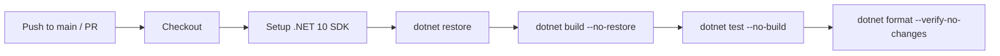

# Feature Spec: .NET 10 Solution Scaffold & CI/CD

**ID**: FEAT-0014
**Status**: Draft
**Author**: GitHub Copilot
**Created**: 2026-04-20
**Last Updated**: 2026-04-20
**GitHub Issue**: [#14 — .NET 10 Solution Scaffold & CI/CD](https://github.com/pnocera/bookstack-mcp-server-dotnet/issues/14)
**Parent Epic**: [#1 — Core MCP Server](https://github.com/pnocera/bookstack-mcp-server-dotnet/issues/1)
**Related ADRs**: [ADR-0002](../../architecture/decisions/ADR-0002-solution-structure.md), [ADR-0003](../../architecture/decisions/ADR-0003-cicd-github-actions.md), [ADR-0004](../../architecture/decisions/ADR-0004-test-framework.md)

---

## Executive Summary

- **Objective**: Establish the foundational .NET 10 solution structure and automated CI/CD pipeline that all subsequent features depend on.
- **Primary user**: Contributors and maintainers of `bookstack-mcp-server-dotnet`.
- **Value delivered**: A clean, buildable, testable repository skeleton with enforced code formatting, enabling all subsequent features to be developed and verified in isolation.
- **Scope**: Solution file, server console project, EF Core data layer projects (Abstractions, SqlServer, Postgres, Sqlite), TUnit test project, GitHub Actions CI workflow, `.editorconfig`, and README quickstart. No functional MCP tools or BookStack API integration.
- **Primary success criterion**: `dotnet build`, `dotnet test`, and `dotnet format --verify-no-changes` all pass on a clean clone against the `main` branch.

---

## Problem Statement

The repository currently contains no .NET solution or project files. Before any MCP tool, API client, or resource handler can be implemented, a correctly structured .NET 10 solution must exist that compiles cleanly, runs an empty test suite without failures, and enforces consistent code formatting via CI. Without this scaffold, contributors cannot work in parallel and there is no automated quality gate to protect the `main` branch.

## Goals

1. Provide a compilable .NET 10 solution with the correct project layout as defined in the project structure conventions.
2. Establish a TUnit test project wired to the CI pipeline so that all future unit tests run automatically on every push and pull request.
3. Enforce consistent code formatting via `.editorconfig` and `dotnet format` in CI, making formatting violations a build blocker before code is merged.
4. Give new contributors a frictionless onboarding path via a README quickstart with a live CI build badge.

## Non-Goals

- Implementing any MCP tool, resource handler, or BookStack API call.
- Configuring deployment, release, or NuGet publishing pipelines.
- Setting up semantic search, vector indexing, or any external service integration.
- Configuring Docker image builds or container registry pushes.
- Establishing branch protection rules or CODEOWNERS configuration.

## Requirements

### Functional Requirements

1. The solution MUST include a `BookStack.Mcp.Server` console project targeting `net10.0`, located at `src/BookStack.Mcp.Server/`.
2. The solution MUST include a `BookStack.Mcp.Server.Tests` TUnit test project targeting `net10.0`, located at `tests/BookStack.Mcp.Server.Tests/`.
3. A `BookStack.Mcp.Server.sln` solution file at the repository root MUST reference all projects (server, four data layer projects, and tests).
4. The solution MUST include the following data layer projects, all targeting `net10.0`:
   - `src/BookStack.Mcp.Server.Data.Abstractions/` — shared interfaces and EF Core entity models
   - `src/BookStack.Mcp.Server.Data.SqlServer/` — SQL Server EF Core provider
   - `src/BookStack.Mcp.Server.Data.Postgres/` — PostgreSQL EF Core provider
   - `src/BookStack.Mcp.Server.Data.Sqlite/` — SQLite EF Core provider
5. The GitHub Actions CI workflow MUST trigger on every push to `main` and on every pull request targeting `main`.
   6. The CI workflow MUST execute `dotnet restore`, `dotnet build --no-restore`, `dotnet test --no-build`, and `dotnet format --verify-no-changes` in sequence, failing the pipeline on any error.
7. The `.editorconfig` at the repository root MUST encode the project's formatting rules as defined in `.github/docs/coding-guidelines.md`.
   8. The README MUST display a CI build status badge linked to the GitHub Actions workflow run.
   9. The README MUST include a quickstart section covering the steps to clone, build, and test the solution locally.

### Non-Functional Requirements

1. `dotnet build` MUST complete in under 60 seconds on a standard GitHub-hosted `ubuntu-latest` runner with no pre-cached packages.
2. `dotnet test` MUST produce zero failures on a clean clone with no pre-installed dependencies beyond the .NET 10 SDK.
3. `dotnet format --verify-no-changes` MUST be the authoritative formatting lint check in CI; no additional linter is required at this stage.

## Design

### Repository Layout

```
BookStack.Mcp.Server.sln
.editorconfig
README.md
src/
  BookStack.Mcp.Server/
    BookStack.Mcp.Server.csproj         # Console app — net10.0
    Program.cs                          # Minimal entry-point stub
  BookStack.Mcp.Server.Data.Abstractions/
    BookStack.Mcp.Server.Data.Abstractions.csproj
  BookStack.Mcp.Server.Data.SqlServer/
    BookStack.Mcp.Server.Data.SqlServer.csproj
  BookStack.Mcp.Server.Data.Postgres/
    BookStack.Mcp.Server.Data.Postgres.csproj
  BookStack.Mcp.Server.Data.Sqlite/
    BookStack.Mcp.Server.Data.Sqlite.csproj
tests/
  BookStack.Mcp.Server.Tests/
    BookStack.Mcp.Server.Tests.csproj   # TUnit test project — net10.0
    PlaceholderTest.cs                  # Single passing smoke test
.github/
  workflows/
    ci.yml                              # Build · Test · Format
```

### CI Pipeline



Each stage runs only if the previous stage passes, giving fast, actionable failure messages.

## Acceptance Criteria

- [ ] Given a clean clone of the repository with no cached packages, when `dotnet build` is run from the repo root, then the solution compiles with zero errors and zero warnings.
- [ ] Given a clean clone of the repository, when `dotnet test` is run from the repo root, then all tests pass with zero failures and the test run reports at least one test executed.
- [ ] Given a push to `main` or an open pull request targeting `main`, when the GitHub Actions CI workflow runs, then all four pipeline stages (restore, build, test, format) complete successfully and the workflow reports a green status.
- [ ] Given any C# source file that violates the `.editorconfig` formatting rules, when `dotnet format --verify-no-changes` runs in CI, then the pipeline stage fails and the output identifies the offending file and diff.
- [ ] Given the repository README viewed on GitHub, when the build badge is rendered, then it displays the current CI status and links to the latest workflow run.
- [ ] Given the README quickstart section, when a new contributor follows the steps verbatim on a machine with only the .NET 10 SDK installed, then `dotnet build` and `dotnet test` both succeed without additional configuration.

## Security Considerations

- The CI workflow MUST NOT log or expose any secrets; no BookStack API tokens or credentials are required or referenced at this stage.
- GitHub Actions job permissions MUST be scoped to the minimum required: `contents: read` is sufficient for build, test, and format jobs.
- All third-party GitHub Actions (e.g., `actions/checkout`, `actions/setup-dotnet`) MUST be pinned to a specific commit SHA to prevent supply-chain substitution attacks.
- No user-supplied input is processed at this stage; the attack surface is limited to the build toolchain itself.

## Open Questions

- None — scope is fully defined by issue #14 and no novel dependencies exist.

## Out of Scope

- NuGet package publishing or version-tagging automation — deferred to a future release pipeline feature.
- Docker image build and container registry push — deferred until the server reaches a distributable state.
- Branch protection rules and CODEOWNERS configuration — deferred to a separate repository governance task.
- Performance benchmarking or load-testing infrastructure — deferred to a future non-functional requirements feature.
