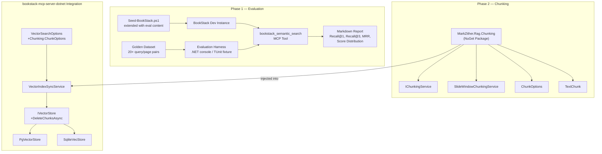

# Feature Spec: Semantic Search Quality — Golden-Dataset Evaluation and Chunking Strategy

**ID**: FEAT-0060
**Status**: Review
**Author**: Mark
**Created**: 2026-05-12
**Last Updated**: 2026-05-12
**Related ADRs**: [ADR-0015](../../architecture/decisions/ADR-0015-vector-store-abstraction.md),
[ADR-0016](../../architecture/decisions/ADR-0016-embedding-provider-abstraction.md)

---

## Problem Statement

The vector search implementation (FEAT-0005) embeds each BookStack page as a single vector, passing
the full raw HTML of the page to the embedding model (`nomic-embed-text`, 8 192-token context window).
This "whole-page, single-chunk" strategy has three known failure modes that grow worse as a wiki
matures:

1. **Token truncation** — pages longer than ≈6 000 words are silently truncated at the model boundary;
   content beyond that point never influences retrieval.
2. **Semantic dilution** — a single embedding for a page covering 10 unrelated sub-topics averages
   the semantics of all of them; no individual sub-topic ever ranks highly against a specific query.
3. **HTML noise** — raw HTML tags (`<p>`, `<code>`, `<table>`) consume tokens and push the embedding
   toward the markup vocabulary rather than the semantic content.

Before investing in a chunking solution, the team must measure whether these failure modes actually
matter for the current BookStack instance. Only a quantitative evaluation against a golden dataset
provides the evidence needed to make an informed decision about whether and how to change the
indexing strategy.

This feature therefore has two phases gated by a quality checkpoint:

- **Phase 1** — Build and run the golden-dataset evaluation harness; measure `Recall@K`, `MRR`, and
  score distribution against the current single-chunk strategy.
- **Phase 2** — If the evaluation reveals quality below acceptable thresholds, implement sliding-window
  chunking extracted into a shared NuGet package (`MarkZither.Rag.Chunking`) that benefits both this
  project and [DeepWikiOpenDotnet](https://github.com/MarkZither/DeepWikiOpenDotnet). Phase 2 is only
  started after Phase 1 measurements have been reviewed.

---

## Goals

1. Establish a repeatable, automated measurement of `bookstack_semantic_search` retrieval quality
   (`Recall@1`, `Recall@3`, `MRR`) against a seeded BookStack instance.
2. Define pass/fail thresholds that determine whether chunking is required.
3. If thresholds are not met: implement sliding-window token-aware chunking and HTML-stripping as a
   configurable, replaceable preprocessing step.
4. Extract the chunking logic into a reusable NuGet package (`MarkZither.Rag.Chunking`) so the same
   algorithm improvements benefit both this project and DeepWikiOpenDotnet.
5. Re-run the evaluation after each change to prove the improvement.

---

## Non-Goals

- Hybrid keyword + vector re-ranking — tracked separately.
- Semantic chunking (splitting on `<h2>`/`<h3>` headings) — considered as a future variant if
  sliding-window chunking does not meet the thresholds.
- Changing the embedding provider — `nomic-embed-text` via Ollama remains the default.
- SQL Server vector store support — not targeted by this feature.
- Automated nightly quality regression — out of scope for this iteration; evaluation is run manually
  or in CI against the seeded environment.
- Multi-modal content (images, attachments) — pages only.
- DrawIO diagram content — see design note below; diagrams are explicitly excluded from
  embedded text but their surrounding caption/title text is preserved where present.
- Markdown-native chunking (e.g. splitting on ATX headings) — the same sliding-window algorithm
  is applied regardless of editor type; Markdown-specific splitting is a future optimisation.

---

## Requirements

### Phase 1 — Golden-Dataset Evaluation

#### Functional Requirements

1. The system MUST provide a golden dataset of at least 20 (query, expected_page_slug) pairs covering
   diverse BookStack page types: short summary pages, long procedural pages, code-heavy pages, and
   multi-topic overview pages. The dataset MUST include:
   - At least 3 pages authored in the **WYSIWYG editor** (`Editor = "wysiwyg"`)
   - At least 3 pages authored in the **Markdown editor** (`Editor = "markdown"`)
   - At least 1 page containing a **DrawIO diagram**, so that the raw `Html` API response can be
     inspected and the diagram-stripping pattern confirmed before Phase 2 ships.
2. The evaluation harness MUST seed the BookStack dev instance using the existing
   `scripts/Seed-BookStack.ps1` script extended with the evaluation content.
3. The evaluation harness MUST trigger a full vector sync and wait for completion before running
   queries.
4. The evaluation harness MUST call `bookstack_semantic_search` for each query in the golden dataset
   and record the ranked result list.
5. The evaluation harness MUST compute and report:
   - `Recall@1` — fraction of queries where the expected page is the top result.
   - `Recall@3` — fraction of queries where the expected page is in the top 3 results.
   - `MRR` (Mean Reciprocal Rank) — mean of `1/rank` where the expected page is found (0 if not in
     top 10).
   - Score distribution — histogram of cosine similarity scores for correct and incorrect results,
     to identify `minScore` calibration issues.
6. The evaluation harness MUST output a Markdown report suitable for inclusion in the PR description.

#### Pass/Fail Thresholds (quality gate)

| Metric | Pass | Investigate | Fail (chunking required) |
|--------|------|-------------|--------------------------|
| `Recall@1` | ≥ 0.60 | 0.45 – 0.59 | < 0.45 |
| `Recall@3` | ≥ 0.75 | 0.60 – 0.74 | < 0.60 |
| `MRR` | ≥ 0.65 | 0.50 – 0.64 | < 0.50 |

If all three metrics pass, Phase 2 is not started. If any metric is in "Fail", Phase 2 MUST be
implemented. If any metric is in "Investigate", Phase 2 MAY be implemented at the team's discretion.

### Phase 2 — Chunking and NuGet Package (conditional)

#### Functional Requirements — Shared NuGet Package (`MarkZither.Rag.Chunking`)

7. A new repository or library project MUST be created that provides:
   - `IChunkingService` — interface with `ChunkAsync(string text, ChunkOptions options, CancellationToken ct) → IReadOnlyList<TextChunk>`
   - `ChunkOptions` — `ChunkSize` (tokens, default 512), `ChunkOverlap` (tokens, default 128),
     `MaxChunksPerDocument` (default 200), `StripHtml` (bool, default `true`).
   - `TextChunk` — record with `Text`, `ChunkIndex`, `TotalChunks`, `TokenCount`.
   - `ITokenEncoder` — abstraction over the tokenizer (mirrors `DeepWiki.Rag.Core.Tokenization.ITokenEncoder`).
   - `TiktokenEncoder` — default implementation wrapping `Tiktoken` NuGet (cl100k_base); used for
     `nomic-embed-text`, `text-embedding-ada-002`, and compatible models.
   - `SlideWindowChunkingService` — implementation using token-aware sliding window with overlap,
     respecting sentence/paragraph boundaries where possible (matches `DeepWiki.Rag.Core.Tokenization.Chunker`).
   - HTML stripping via `System.Text.RegularExpressions` (no HtmlAgilityPack dependency; keeps the
     package lightweight).
8. The package MUST target `net9.0` and `net10.0` and be published to NuGet.org as
   `MarkZither.Rag.Chunking`.
9. The package MUST have > 90% unit test coverage for the chunking logic.
10. The algorithm MUST match the behaviour in `DeepWiki.Rag.Core.Ingestion.DocumentIngestionService`
    (commit `8b5887b`) so that DeepWikiOpenDotnet can replace its inline implementation with this
    package.

#### Functional Requirements — bookstack-mcp-server-dotnet Integration

11. `VectorIndexSyncService` MUST inject `IChunkingService` and use it to split page content before
    embedding, replacing the current single-call `embeddingGenerator.GenerateAsync([fullPage.Html])`.
12. `IVectorStore` MUST add `DeleteChunksAsync(int pageId, CancellationToken ct)` to purge all
    existing chunks for a page before re-indexing. `PgVectorStore` and `SqliteVecStore` MUST
    implement this method.
13. `VectorPageEntry` MUST be extended with `ChunkIndex` (int) and `TotalChunks` (int); existing
    single-chunk records are treated as `ChunkIndex = 0, TotalChunks = 1`.
14. The vector store schema MUST be updated: the primary key MUST change from `page_id` alone to
    `(page_id, chunk_index)` composite key.
15. `SearchAsync` results MUST be deduplicated by page: when multiple chunks from the same page
    match, only the highest-scoring chunk is returned per page. The returned `VectorSearchResult`
    MUST include `ChunkIndex` and `Excerpt` from the winning chunk.
16. The `VectorSearchOptions` configuration MUST expose `Chunking` (of type `ChunkOptions`) with
    the defaults from the NuGet package. Users who set `Chunking:ChunkSize = 0` get the current
    single-chunk behaviour (no regression for existing deployments).
17. A database migration MUST be provided for both Postgres and SQLite stores to update the primary
    key and add the `chunk_index` / `total_chunks` columns.

#### Non-Functional Requirements

18. The sync throughput MUST NOT degrade by more than 3× vs. the current single-chunk strategy
    when `ChunkSize = 512` and `ChunkOverlap = 128` (measured on the seeded dev instance).
19. All inputs MUST be validated at system boundaries: `ChunkSize` ∈ [64, 8192], `ChunkOverlap`
    ∈ [0, ChunkSize / 2], `MaxChunksPerDocument` ∈ [1, 500].

#### Page Format Handling (HTML vs Markdown)

20. The BookStack API returns `PageWithContent.Editor` as `"wysiwyg"` or `"markdown"`.
    - For `wysiwyg` pages: `Html` is the rendered content; `Markdown` is `null`. The `Html` field
      MUST be used as input to `IChunkingService`.
    - For `markdown` pages: `Html` contains BookStack's rendered HTML equivalent; `Markdown`
      contains the original Markdown source. The sync service SHOULD prefer `Markdown` over `Html`
      for these pages because: (a) it contains no generated markup noise, (b) headings and
      structure are cleaner for chunking, (c) token usage is lower. If `Markdown` is null or
      empty despite `Editor = "markdown"`, fall back to `Html`.
21. The `ChunkOptions.StripHtml` flag applies to WYSIWYG pages. For Markdown pages where the
    raw `Markdown` field is used, HTML stripping is a no-op (Markdown may still contain inline
    HTML; stripping should still run as a safety pass).

#### DrawIO Diagram Handling

22. BookStack embeds DrawIO diagrams in WYSIWYG page HTML as `<div class="draw-diagram">` (or
    similar) elements containing base64-encoded XML. This XML is diagram layout data, not readable
    prose — embedding it produces a semantically meaningless vector.
23. The `HtmlStripper` MUST remove DrawIO diagram blocks before chunking. The removal strategy is:
    strip the entire `<div>` (or `<figure>`) element containing the DrawIO XML, including its
    contents. Any visible `<figcaption>` or `alt` text immediately adjacent to the diagram block
    SHOULD be preserved as it may contain a human-readable description.
24. The exact HTML structure BookStack uses for DrawIO diagrams in the `Html` API field is **not
    yet confirmed** — this is a known unknown. The implementation MUST log a `Warning` if it
    encounters a `<div>` or `<figure>` that appears to contain base64 XML matching the DrawIO
    signature (`data:image/png;base64` or `<mxGraphModel` prefix), so that the pattern can be
    validated against real BookStack output. The stripping regex SHOULD be configurable via an
    `appsettings` entry so it can be updated without redeployment. If no DrawIO content is
    detected, the stripper is a no-op with zero performance cost.

---

## Design

### Architecture Overview



### Data Model Changes (Phase 2)

#### `VectorPageEntry` (extended)

```csharp
public sealed record VectorPageEntry
{
    public int PageId { get; init; }
    public int ChunkIndex { get; init; } = 0;
    public int TotalChunks { get; init; } = 1;
    public string Slug { get; init; } = string.Empty;
    public string Title { get; init; } = string.Empty;
    public string Url { get; init; } = string.Empty;
    public string Excerpt { get; init; } = string.Empty;   // text of THIS chunk
    public DateTimeOffset UpdatedAt { get; init; }
    public string ContentHash { get; init; } = string.Empty; // hash of full page
}
```

#### `IVectorStore` (new method)

```csharp
Task DeleteChunksAsync(int pageId, CancellationToken cancellationToken = default);
```

#### `SearchAsync` deduplication contract

When multiple chunks for the same `PageId` would be returned, only the chunk with the highest
cosine similarity score is included in the result list. The `topN` limit applies *after*
deduplication (i.e., return the top-N distinct pages).

### Sync Loop Changes (Phase 2)

```
For each page in updated pages:
  1. Fetch full page (GetPageAsync) → PageWithContent
  2. Select input text:
       if page.Editor == "markdown" && page.Markdown is not null/empty → use page.Markdown
       else → use page.Html
  3. Compute SHA-256 of selected input text → contentHash
  4. Compare with stored hash → skip if unchanged
  5. IChunkingService.ChunkAsync(inputText, options) → List<TextChunk>
       (StripHtml runs on both paths as a safety pass; DrawIO blocks removed before chunking)
  6. IVectorStore.DeleteChunksAsync(pageId)
  7. For each chunk:
     a. embeddingGenerator.GenerateAsync([chunk.Text]) → vector
     b. IVectorStore.UpsertAsync(new VectorPageEntry { ..., ChunkIndex = i, TotalChunks = n, Excerpt = chunk.Text[..300] }, vector)
  8. IVectorStore.SetLastSyncAtAsync(now)
```

> **DrawIO note**: The exact HTML structure that the BookStack API emits for DrawIO diagrams
> (in the `Html` field) is unconfirmed. The golden-dataset evaluation (Phase 1) MUST include at
> least one page containing a DrawIO diagram so that the raw API response can be inspected and the
> stripping pattern validated before Phase 2 ships.

### NuGet Package Structure (`MarkZither.Rag.Chunking`)

```
MarkZither.Rag.Chunking/
  IChunkingService.cs              ← ChunkAsync(text, ChunkOptions, ct)
  ITokenEncoder.cs                 ← CountTokens(text) abstraction
  TiktokenEncoder.cs               ← Tiktoken NuGet (cl100k_base) implementation
  ChunkOptions.cs                  ← ChunkSize, ChunkOverlap, MaxChunksPerDocument, StripHtml
  TextChunk.cs                     ← Text, ChunkIndex, TotalChunks, TokenCount
  SlideWindowChunkingService.cs    ← sliding-window, sentence-boundary snapping
  HtmlStripper.cs                  ← regex-based <script>/<style> removal + tag strip (internal)
  ServiceCollectionExtensions.cs   ← AddChunking(IServiceCollection)
```

The algorithm mirrors `DeepWiki.Rag.Core.Tokenization.Chunker` (commit `8b5887b`): token-aware
sliding window with overlap driven by `ITokenEncoder.CountTokens`, with sentence/paragraph boundary
snapping (split on the nearest `.`, `!`, `?`, `;`, `\n` within 10% of the target boundary). The
existing DeepWikiOpenDotnet `Chunker` + `TokenizationService` are superseded by this package once
published.

---

## Acceptance Criteria

### Phase 1

- [ ] Given a seeded BookStack instance with at least 20 evaluation pages, when the evaluation
  harness runs, then it outputs a Markdown report containing `Recall@1`, `Recall@3`, `MRR`, and a
  score histogram within 5 minutes.
- [ ] Given the report, when all three metrics are at or above their "Pass" thresholds, then no
  Phase 2 work is scheduled and the spec is updated to status `Implemented` (Phase 1 only).
- [ ] Given the report, when any metric is below its "Fail" threshold, then Phase 2 is scheduled
  and a GitHub issue is created.
- [ ] The evaluation harness MUST be re-runnable with `dotnet run` against any dev BookStack
  instance without code changes (configured via environment variables or `appsettings`).

### Phase 2 (conditional)

- [ ] Given a page whose HTML exceeds 8 192 tokens, when the sync runs, then the page is stored as
  multiple chunks and no `ArgumentOutOfRangeException` or silent truncation occurs.
- [ ] Given a Markdown-editor page (`Editor = "markdown"`), when the sync runs, then the
  `Markdown` field is used as the chunking input and the sync log records `"markdown"` as the
  input format.
- [ ] Given a WYSIWYG page, when the sync runs, then the `Html` field is used as the chunking
  input and HTML stripping is applied.
- [ ] Given a page containing a DrawIO diagram block, when the sync runs, then the embedded
  diagram XML/base64 is not present in any stored chunk text, and a `Warning` is logged if the
  DrawIO signature is detected but the stripping pattern does not match.
- [ ] Given a page stored as 3 chunks, when `SearchAsync` is called with a query matching chunk 2,
  then the result contains the page URL and an excerpt from chunk 2, and the page appears at most
  once in the result list.
- [ ] Given `ChunkSize = 0` in configuration, when the sync runs, then the existing single-chunk
  behaviour is used (backward compatibility).
- [ ] Given the Phase 1 golden dataset, when the evaluation harness runs after Phase 2 is
  implemented, then all three metrics improve vs. the Phase 1 baseline.
- [ ] Given `MarkZither.Rag.Chunking` published to NuGet, when a DeepWikiOpenDotnet developer
  replaces `DeepWiki.Rag.Core.Ingestion.DocumentIngestionService`'s inline `ChunkAndEmbedAsync`
  with the package, then all existing DeepWikiOpenDotnet chunking tests pass.
- [ ] The Postgres and SQLite migrations run without data loss on the seeded dev instance.

---

## Security Considerations

- The golden dataset and its expected results MUST NOT contain real user data from any production
  BookStack instance; use the synthetic seed content from `Seed-BookStack.ps1`.
- The `IChunkingService` MUST apply a maximum input size guard (e.g., 5 MB) to prevent
  memory-exhaustion on pathologically large pages, mirroring the `MaxTextBytes` constant in
  `DeepWiki.Rag.Core.Ingestion.DocumentIngestionService`.
- The `StripHtml` step removes `<script>` and `<style>` blocks before stripping tags, ensuring that
  JavaScript or CSS content does not leak into the embedded text and potentially bias retrieval.
- NuGet package signing MUST be enabled before publishing to NuGet.org.
- The `Tiktoken` library loads the cl100k_base vocabulary from embedded resources; no network
  access is required at runtime, so there is no token-counting side-channel.

---

## Open Questions

- [x] **Package location** — New dedicated repo `MarkZither/rag-chunking-dotnet`. Cleaner CI,
  independent versioning, and makes the package a first-class OSS artefact rather than a
  sub-project. _Resolved 2026-05-12._
- [x] **Token counting** — Use `Tiktoken` NuGet (already used in DeepWikiOpenDotnet at v2.0.3)
  behind an `ITokenEncoder` abstraction (matching `DeepWiki.Rag.Core.Tokenization.ITokenEncoder`).
  `Tiktoken` uses cl100k_base encoding, which is compatible with `nomic-embed-text`'s vocabulary.
  The abstraction means the tokenizer can be swapped without changing chunking logic.
  _Resolved 2026-05-12._
- [ ] **Chunk-scoped vs. page-scoped search results** — Two options:

  | | Option A: Deduplicate inside store (current interface) | Option B: Expose chunk-level results |
  |-|---|---|
  | `SearchAsync` returns | One result per page (highest-scoring chunk wins) | One result per matching chunk |
  | `VectorSearchResult` change | Add `ChunkIndex` + `Excerpt` from winning chunk | Add `ChunkIndex`, `TotalChunks`, `Excerpt` |
  | `topN` semantics | Top-N distinct pages | Top-N chunks (page may appear multiple times) |
  | MCP tool consumer | No change — same JSON shape, one entry per page | Must deduplicate or present multiple excerpts per page |
  | Retrieval quality | Simpler; hides which section matched | More precise; LLM can target the right section |
  | Breaking change | No — `VectorSearchResult` gains two optional fields | Yes — tool output changes shape |

  **Decision**: Option A — deduplicate inside the store, return one result per page. The winning
  chunk's `Excerpt` (≤300 chars of the matched section) gives the LLM enough context to know *why*
  the page ranked. Non-breaking additive change to `VectorSearchResult`. _Resolved 2026-05-12._

---

## Out of Scope

- Semantic / heading-based chunking (`<h2>`/`<h3>` splitting) — deferred pending Phase 1 results.
- Chunk-level caching to avoid re-embedding unchanged chunks when a page is partially edited.
- Admin UI for viewing index health (chunk counts, score distribution) — tracked in issue #80.
- Deletion sync for chunked pages (stale chunk cleanup when a page is deleted in BookStack).
- Extracting semantic meaning from DrawIO diagram content — the diagram XML/base64 is stripped
  entirely; only adjacent human-readable captions are preserved. Full diagram understanding
  (e.g. OCR of rendered SVG, parsing of `mxGraphModel` labels) is out of scope.
- Format-specific Markdown chunking (splitting on ATX headings `##`) — same sliding-window
  algorithm is used for both WYSIWYG and Markdown pages; heading-aware splitting is a future
  optimisation once baseline quality is measured.
