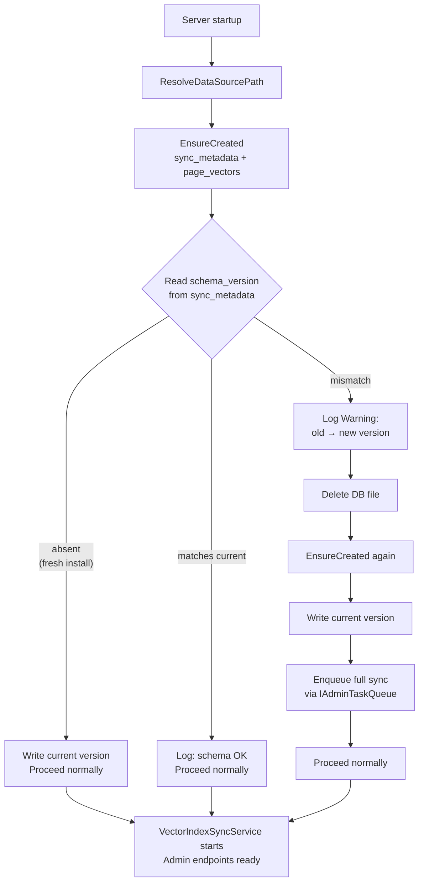

# Feature Spec: SQLite Schema Versioning — Drop-and-Reindex Upgrade Strategy

**ID**: FEAT-0057
**Status**: Draft
**Author**: MarkZither
**Created**: 2026-05-07
**Last Updated**: 2026-05-07
**GitHub Issue**: TBD
**Related Features**: FEAT-0005 (Vector Search), FEAT-0055 (Local Admin Sidecar)
**Dependencies**: FEAT-0005

---

## Executive Summary

- **Objective**: Detect SQLite schema version mismatches at startup and recover by dropping and recreating the database, then triggering an automatic full reindex so the installation is self-healing without data loss risk.
- **Primary user**: Any user who upgrades the extension after a schema-breaking change has been shipped.
- **Value delivered**: Upgrades never leave the server in a broken state; the worst outcome is a temporary empty index that refills automatically. No manual intervention or migration tooling is required.
- **Scope**: A `schema_version` row stored in `sync_metadata`; version comparison at startup; automatic drop-and-recreate on mismatch; auto-trigger of a full sync via `IAdminTaskQueue`; clear log messages explaining what happened.
- **Primary success criterion**: After upgrading to a version that changes the SQLite schema, the server starts cleanly, logs that the database was reset, and completes a full reindex without any manual action.

---

## Problem Statement

The SQLite database stores two kinds of data:

1. **`page_vectors`** — the vector embeddings for all indexed BookStack pages, managed by `SqliteCollection<int, VectorPageRecord>` from SemanticKernel.
2. **`sync_metadata`** — a key/value table (EF Core) that tracks the last successful sync timestamp.

Both are **derived data**: the source of truth is the live BookStack instance. Losing and rebuilding the index has no permanent consequences — the user just needs to wait for a reindex cycle.

`EnsureCreated()` (introduced in the band-aid fix) handles fresh installs but does nothing for existing databases when the schema changes. If a new version adds a column, renames a table, or changes the SemanticKernel vector record shape, the server will crash or corrupt data silently.

EF Core formal migrations are a poor fit here for two reasons:

1. **Partial coverage**: EF migrations only govern the `sync_metadata` table. The `page_vectors` table is owned by SemanticKernel's `SqliteCollection` and is outside EF's awareness entirely. A migration strategy that covers only half the schema provides false confidence.
2. **Complexity vs. value**: A wiki can only grow so large, and the extension may eventually need to support multiple BookStack sources or more complex index structures. The overhead of maintaining a migration history (designer workflow, bundled migration files, rollback scripts) is disproportionate for data that is freely reproducible from the live source. An explicit, documented drop-and-reindex strategy is simpler to reason about, simpler to test, and communicates the data's disposable nature clearly to contributors.

---

## Goals

1. Guarantee the server never starts in a schema-mismatched state — startup either succeeds cleanly or resets the database and recovers automatically.
2. Make schema version bumps a single-line change for contributors: increment a constant in one place.
3. Log clearly when a reset occurs so users understand why their index count briefly returns to zero.
4. Auto-trigger a full reindex after a reset so the index refills without user action.
5. Establish an explicit, documented policy that the SQLite database is **disposable derived data** and upgrades are safe precisely because of this property.

## Non-Goals

- EF Core formal migrations or incremental schema patching (see Problem Statement for rationale).
- Postgres schema versioning (Postgres uses EF migrations in a separate provider; this feature is SQLite-only).
- Multi-source or multi-tenant database management.
- User-visible UI for the reset event beyond the status bar temporarily showing zero pages.
- Preserving any subset of existing data across a schema-breaking upgrade.

---

## Requirements

### Functional Requirements

1. The server MUST define a compile-time integer constant `SqliteSchemaVersion` in the SQLite provider project.
2. On startup, after `EnsureCreated`, the server MUST read a `schema_version` row from `sync_metadata`.
3. If the `schema_version` row is absent (fresh install), the server MUST write the current `SqliteSchemaVersion` value and proceed normally.
4. If the stored version matches `SqliteSchemaVersion`, the server MUST proceed normally.
5. If the stored version does not match `SqliteSchemaVersion`, the server MUST:
   a. Log an `Warning`-level message identifying the old version, the new version, and that the database is being reset.
   b. Delete the SQLite database file.
   c. Recreate the schema via `EnsureCreated`.
   d. Write the current `SqliteSchemaVersion` to `sync_metadata`.
   e. Enqueue a full sync via `IAdminTaskQueue` so reindexing begins automatically.
6. The server MUST NOT start `VectorIndexSyncService` or handle any admin requests until schema initialisation has completed.
7. `SqliteSchemaVersion` MUST be incremented (by any positive integer, conventionally +1) whenever any of the following change:
   - The `SyncMetadataRecord` EF entity shape.
   - The `VectorPageRecord` SemanticKernel vector record shape.
   - The `SqliteCollection` collection name (`page_vectors`).
8. The server MUST log an `Information`-level message on clean startup confirming the schema version in use.

### Non-Functional Requirements

1. Schema initialisation MUST complete before the first HTTP request is accepted and before `VectorIndexSyncService.ExecuteAsync` is entered.
2. The database file deletion and recreation MUST be atomic with respect to startup — if the process is killed mid-reset, the next startup MUST detect no database and perform a fresh create (covered by the absent-row path in FR-3).
3. No synchronous blocking calls (`.Result`, `.Wait()`) are permitted in the initialisation path.
4. The `SqliteSchemaVersion` constant and its current value MUST be documented in a comment adjacent to the declaration.

---

## Design

### Schema Version Storage

The `sync_metadata` table (already present) stores key/value pairs. The schema version is stored as:

| `Key` | `Value` |
|---|---|
| `schema_version` | `"1"` (or current integer as string) |

No new tables are required.

### Startup Flow



### Component Changes

| Component | Change |
|---|---|
| `SqliteVectorStoreServiceCollectionExtensions.cs` | Extract initialisation into `SqliteDatabaseInitialiser` hosted service; inject `IAdminTaskQueue` |
| `SqliteVectorStoreServiceCollectionExtensions.cs` | Add `SqliteSchemaVersion` constant (value: `1` initially) |
| `SqliteDatabaseInitialiser` | New internal `IHostedService` in the Sqlite provider project; requires `Microsoft.Extensions.Hosting.Abstractions` package reference |
| `BookStack.Mcp.Server.Data.Sqlite.csproj` | Add `Microsoft.Extensions.Hosting.Abstractions` package reference |

### `SqliteSchemaVersion` Constant

```csharp
/// <summary>
/// Increment this value whenever the SQLite schema changes in a way that is
/// incompatible with an existing database:
/// - Any change to <see cref="SyncMetadataRecord"/> columns or types.
/// - Any change to <see cref="VectorPageRecord"/> columns, types, or vector dimensions.
/// - Any change to the SqliteCollection collection name ("page_vectors").
///
/// On startup, if the stored version does not match this constant the database
/// is dropped and recreated, and a full reindex is triggered automatically.
/// The SQLite database is derived data (source of truth: BookStack) and is
/// always safe to discard.
/// </summary>
internal const int SqliteSchemaVersion = 1;
```

---

## Acceptance Criteria

- [ ] Given a fresh install with no database file, when the server starts, then `sync_metadata` and `page_vectors` are created, `schema_version` is written as `"1"`, and an `Information` log confirms the schema version.
- [ ] Given an existing database with `schema_version = "1"` and current version `1`, when the server starts, then the database is not touched and startup proceeds normally.
- [ ] Given an existing database with `schema_version = "1"` and `SqliteSchemaVersion` bumped to `2`, when the server starts, then a `Warning` is logged, the DB file is deleted and recreated, `schema_version` is written as `"2"`, and a full sync is enqueued.
- [ ] Given the server is killed during the drop-and-recreate step (simulated by deleting the DB file manually after dropping it), when the server starts again, then the absent-row path creates the schema cleanly.
- [ ] Given a schema reset has occurred, when the full sync completes, then `GET /admin/status` returns a non-zero `totalPages` matching the BookStack page count.
- [ ] Given `SqliteSchemaVersion` is incremented by a contributor, when a PR is opened without a comment explaining the reason, then the PR description template prompts the author to document the schema change.

---

## Security Considerations

- The database file is local to the user's machine; no network exposure is introduced by this feature.
- The file deletion path uses the resolved absolute path from `ResolveDataSourcePath`; no path traversal is possible since the value is constructed programmatically and never derived from user input.

---

## Open Questions

1. **Should the old DB file be moved to a `.bak` path rather than deleted?** A backup gives a recovery window but adds complexity (cleanup policy, disk space). Given the data is fully reproducible, deletion is preferred unless a user raises a concrete need.
2. **Should the auto-triggered full sync be immediate or deferred?** Immediate is simpler and gets the index back fastest. Deferred (e.g., next scheduled cycle) avoids a potentially expensive operation during startup. Proposed: immediate, as a reset is rare and the user is already waiting for the index to be useful.
