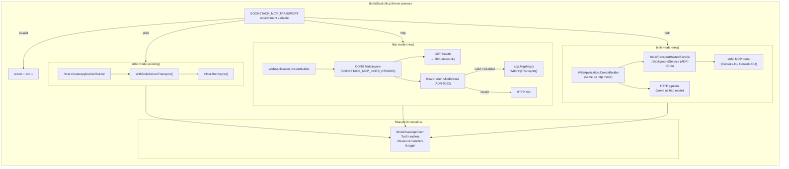

# Plan: Streamable HTTP Transport (FEAT-0017)

**Feature**: Streamable HTTP Transport
**Spec**: [docs/features/streamable-http-transport/spec.md](spec.md)
**GitHub Issue**: [#17](https://github.com/MarkZither/bookstack-mcp-server-dotnet/issues/17)
**Status**: Ready for Implementation
**Date**: 2026-04-24

---

## Referenced ADRs

| ADR | Title | Decision |
|-----|-------|----------|
| [ADR-0009](../../architecture/decisions/ADR-0009-dual-transport-entry-point.md) | Dual-Transport Entry-Point Strategy | Single binary; `BOOKSTACK_MCP_TRANSPORT` selects transport |
| [ADR-0012](../../architecture/decisions/ADR-0012-http-bearer-token-auth-middleware.md) | HTTP Bearer Token Auth Middleware | Minimal `RequestDelegate` middleware with `FixedTimeEquals` |
| [ADR-0013](../../architecture/decisions/ADR-0013-both-mode-hosting-model.md) | Both-Mode Hosting Model | stdio as `IHostedService` inside `WebApplication` |

---

## Data Model Changes

None. This feature adds no new entities, database tables, or EF Core migrations. All state is
configuration-only (environment variables resolved at startup).

---

## API Contract (Environment Variables)

The feature is configured entirely via environment variables. These are the authoritative values:

| Variable | Required | Default | Description |
|---|---|---|---|
| `BOOKSTACK_MCP_TRANSPORT` | No | `stdio` | Transport mode: `stdio`, `http`, or `both` |
| `BOOKSTACK_MCP_HTTP_PORT` | No | `3000` | HTTP listen port; overridden by `ASPNETCORE_URLS` |
| `BOOKSTACK_MCP_HTTP_AUTH_TOKEN` | No | _(empty — auth disabled)_ | Pre-shared Bearer token; treated as a secret |
| `BOOKSTACK_MCP_CORS_ORIGINS` | No | `*` | Comma-separated allowed CORS origins |
| `ASPNETCORE_URLS` | No | _(not set)_ | Standard ASP.NET Core listen URL; takes precedence over port var |

### Resolved listen URL precedence

```
ASPNETCORE_URLS  →  if set, Kestrel uses this value (standard ASP.NET Core behaviour)
BOOKSTACK_MCP_HTTP_PORT  →  otherwise, listen on http://0.0.0.0:{port}
default  →  http://0.0.0.0:3000
```

---

## Component Diagram



---

## Implementation Approach

### Phase 1 — Transport validation and `both` allow-list (Program.cs)

**Files changed**: `src/BookStack.Mcp.Server/Program.cs`

1. Extend the transport validation allow-list from `("stdio" or "http")` to
   `("stdio" or "http" or "both")`.
2. Update the validation error message to include `both` as a valid value.

### Phase 2 — HTTP middleware pipeline (Program.cs, http branch)

**Files changed**: `src/BookStack.Mcp.Server/Program.cs`

1. **CORS**: call `builder.Services.AddCors(...)` with a named policy. Read
   `BOOKSTACK_MCP_CORS_ORIGINS`; if empty default to `*`; otherwise split on comma and pass the
   origins list to `WithOrigins(...)`. Call `app.UseCors(policyName)` before `app.MapMcp()`.
2. **Health endpoint**: call `app.MapGet("/health", ...)` returning `Results.Ok(new { status = "ok" })`
   before the auth middleware is registered. Map this before `app.MapMcp()` so it is never
   intercepted by auth.
3. **Bearer auth middleware**: read `BOOKSTACK_MCP_HTTP_AUTH_TOKEN` from configuration. If set,
   encode to `ReadOnlyMemory<byte>` (UTF-8). Register via `app.Use(async (ctx, next) => { ... })`:
   - Skip auth for any path that does not start with `/mcp`.
   - Extract token after `Bearer ` from the `Authorization` header.
   - Compare using `CryptographicOperations.FixedTimeEquals(expected, provided)`.
   - If mismatch or header absent: `ctx.Response.StatusCode = 401; return;`.
   - Otherwise call `await next(ctx)`.
4. **Startup warning**: after building `app`, if auth token is empty, call
   `app.Logger.LogWarning("HTTP authentication is disabled ...")`.
5. **Listen URL**: apply `ASPNETCORE_URLS`-aware startup — call
   `app.RunAsync(url)` only when `ASPNETCORE_URLS` is not set; otherwise call `app.RunAsync()`
   without a URL argument so Kestrel picks up the environment variable.

### Phase 3 — `StdioTransportHostedService` (both mode)

**Files created**: `src/BookStack.Mcp.Server/StdioTransportHostedService.cs`

```csharp
using Microsoft.Extensions.Hosting;
using ModelContextProtocol.Server;

namespace BookStack.Mcp.Server;

internal sealed class StdioTransportHostedService(IMcpServer mcpServer) : BackgroundService
{
    protected override Task ExecuteAsync(CancellationToken stoppingToken)
        => mcpServer.RunAsync(stoppingToken);
}
```

> **Note**: The exact `IMcpServer` / `RunAsync` surface must be verified against the SDK version
> in use during implementation. If the SDK does not expose this directly, the hosted service will
> use the available equivalent entry point. This is the known unknown identified in ADR-0013.

**Files changed**: `src/BookStack.Mcp.Server/Program.cs`

Add a `both` branch that:
1. Builds `WebApplication` with the full HTTP pipeline from Phase 2.
2. Calls `builder.Logging.AddConsole(o => o.LogToStandardErrorThreshold = LogLevel.Trace)` so
   Kestrel startup messages go to `stderr`.
3. Registers `WithStdioServerTransport()` on the `IMcpServerBuilder`.
4. Registers `builder.Services.AddHostedService<StdioTransportHostedService>()`.

### Phase 4 — Integration tests

**Files created**:
- `tests/BookStack.Mcp.Server.Tests/Http/HealthEndpointTests.cs`
- `tests/BookStack.Mcp.Server.Tests/Http/BearerAuthMiddlewareTests.cs`
- `tests/BookStack.Mcp.Server.Tests/Http/CorsMiddlewareTests.cs`

**Test factory**: `tests/BookStack.Mcp.Server.Tests/Http/McpHttpTestFactory.cs`

```csharp
using Microsoft.AspNetCore.Mvc.Testing;

internal sealed class McpHttpTestFactory : WebApplicationFactory<Program>
{
    protected override void ConfigureWebHost(IWebHostBuilder builder)
    {
        builder.UseEnvironment("Test");
        builder.UseSetting("BOOKSTACK_MCP_TRANSPORT", "http");
        // Override BookStack API client with a mock / no-op
    }
}
```

**Test cases** (mapped to acceptance criteria from the spec):

| Test | Scenario | Expected |
|------|----------|----------|
| `HealthEndpoint_Returns200_WithStatusOk` | `GET /health` | 200 `{"status":"ok"}` |
| `HealthEndpoint_Bypasses_Auth` | Auth token set; `GET /health` no token | 200 |
| `Mcp_WithValidToken_Returns200` | Token set; `POST /mcp` with matching `Bearer` | 200 |
| `Mcp_WithInvalidToken_Returns401` | Token set; wrong token in header | 401 |
| `Mcp_WithNoToken_Returns401` | Token set; no `Authorization` header | 401 |
| `Mcp_NoAuthConfig_AllowsAnonymous` | No token configured; `POST /mcp` no header | 200 |
| `Cors_WithMatchingOrigin_AllowsOrigin` | `BOOKSTACK_MCP_CORS_ORIGINS=https://example.com`; preflight from that origin | `Access-Control-Allow-Origin: https://example.com` |
| `InvalidTransport_ExitsWithError` | `BOOKSTACK_MCP_TRANSPORT=bad_value` | non-zero exit |

---

## Security Notes

- `BOOKSTACK_MCP_HTTP_AUTH_TOKEN` must never be logged at any level or included in any response;
  the middleware must treat it as an opaque byte array after UTF-8 encoding.
- `FixedTimeEquals` requires that both spans have the same length before comparison; a length
  mismatch must be treated as a comparison failure without leaking which side is longer.
- `GET /health` must not expose version information, configuration values, or internal state.
- CORS default of `*` is acceptable for development; the startup log must note that `*` is set
  so operators are made aware.

---

## Out of Scope

- TLS termination within the process.
- OAuth2/OIDC client authentication.
- Per-user BookStack API token pass-through.
- Adding a `Dockerfile` to the repository (tracked separately).
- Rate-limiting the HTTP transport (tracked separately).

---

## Commands

### Build

```bash
dotnet build --configuration Release
```

### Tests

```bash
dotnet test --verbosity normal
```

### Lint / Formatting

```bash
dotnet format --verify-no-changes
```

### Local HTTP Mode

```bash
BOOKSTACK_MCP_TRANSPORT=http \
BOOKSTACK_MCP_HTTP_PORT=3000 \
BOOKSTACK_BASE_URL=https://your-bookstack-instance \
BOOKSTACK_TOKEN_SECRET=your-token-id:your-token-secret \
dotnet run --project src/BookStack.Mcp.Server
```

### Local Both Mode

```bash
BOOKSTACK_MCP_TRANSPORT=both \
BOOKSTACK_MCP_HTTP_PORT=3000 \
BOOKSTACK_MCP_HTTP_AUTH_TOKEN=dev-secret \
BOOKSTACK_BASE_URL=https://your-bookstack-instance \
BOOKSTACK_TOKEN_SECRET=your-token-id:your-token-secret \
dotnet run --project src/BookStack.Mcp.Server
```
