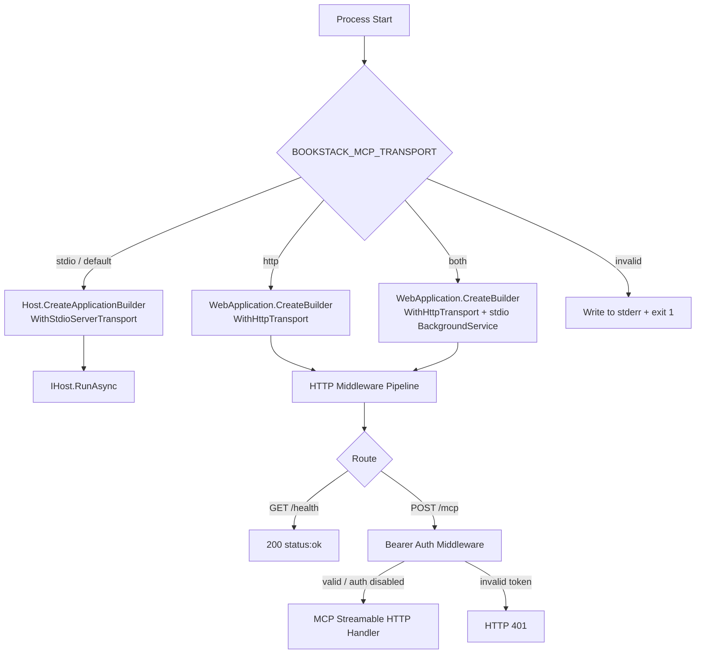

# Feature Spec: Streamable HTTP Transport

**ID**: FEAT-0017
**Status**: Approved
**Author**: GitHub Copilot
**Created**: 2026-04-24
**Last Updated**: 2026-04-24
**GitHub Issue**: [#17 — Feature: Streamable HTTP Transport](https://github.com/MarkZither/bookstack-mcp-server-dotnet/issues/17)
**Parent Epic**: [#1 — Core MCP Server](https://github.com/MarkZither/bookstack-mcp-server-dotnet/issues/1)
**Related ADRs**:
[ADR-0009](../../architecture/decisions/ADR-0009-dual-transport-entry-point.md)

---

## Executive Summary

- **Objective**: Harden and complete the Streamable HTTP transport stub so that remote Model Context
  Protocol (MCP) clients can connect to the server over HTTP with Bearer token authentication and a
  health-check endpoint.
- **Primary user**: Remote MCP clients (hosted AI workflows, cloud agents, CI pipelines) that cannot
  launch a local stdio process.
- **Value delivered**: Enables deployment of the BookStack MCP server as a standalone network service
  (container, cloud VM, or hosted service) without requiring the consuming application to manage a
  child process.
- **Scope**: `Program.cs` transport selection and HTTP middleware pipeline (auth, health), plus
  integration tests. No changes to the stdio path, tool handlers, resource handlers, or
  `IBookStackApiClient`.
- **Primary success criterion**: A remote MCP client can connect over HTTP, authenticate, invoke a
  tool, and receive a valid response; the existing stdio mode is unaffected.

---

## Problem Statement

ADR-0009 established the dual-transport entry-point strategy and committed `BOOKSTACK_MCP_TRANSPORT=http`
as a valid mode. The current implementation is a stub: it starts a `WebApplication`, mounts `/mcp`, and
listens on a port — but it has no authentication, no health-check endpoint, no Docker integration
guidance, and no tests. Remote agents cannot safely use it in any environment
beyond a local development machine.

## Goals

1. Complete the HTTP transport so a remote MCP client can connect, authenticate, and invoke tools.
2. Protect the HTTP endpoint with a configurable pre-shared Bearer token to prevent unauthorized access.
3. Expose `GET /health` so orchestration platforms (Docker, Kubernetes, load balancers) can probe
   liveness without authentication.
4. Support `ASPNETCORE_URLS` so the server integrates naturally with Docker and cloud hosting.
5. Add a `both` transport mode so a single process can serve stdio and HTTP clients concurrently.
6. Provide integration tests that verify the HTTP host starts, accepts authenticated requests, and
   rejects unauthenticated ones.

## Non-Goals

- Per-user or per-role authorization scoped to individual BookStack API tokens.
- TLS termination within the server process (handled by a reverse proxy or cloud load balancer).
- WebSocket transport or any MCP transport other than Streamable HTTP and stdio.
- Changes to the stdio transport path.
- OAuth2 or OpenID Connect client authentication.
- Rate-limiting the HTTP transport (tracked separately).

---

## Requirements

### Functional Requirements

1. The server MUST accept `BOOKSTACK_MCP_TRANSPORT` values `stdio` (default), `http`, and `both`.
2. When `BOOKSTACK_MCP_TRANSPORT=http` or `both`, the server MUST start an ASP.NET Core
   `WebApplication` that mounts the MCP endpoint at `POST /mcp` via `app.MapMcp()`.
3. When `BOOKSTACK_MCP_TRANSPORT=both`, the server MUST simultaneously serve both the stdio
   transport and the HTTP transport within a single process, sharing the same DI container and tool
   handler registrations.
4. When `BOOKSTACK_MCP_TRANSPORT=stdio`, the server MUST behave exactly as it does today; no code
   in the stdio path may be changed.
5. The HTTP host MUST respect `ASPNETCORE_URLS` when set; otherwise it MUST listen on
   `http://0.0.0.0:{BOOKSTACK_MCP_HTTP_PORT:-3000}`.
6. When `BOOKSTACK_MCP_HTTP_AUTH_TOKEN` is set to a non-empty string, every request to `POST /mcp`
   MUST carry a matching `Authorization: Bearer <token>` header; requests with a missing or
   incorrect token MUST be rejected with HTTP 401.
7. When `BOOKSTACK_MCP_HTTP_AUTH_TOKEN` is not set or is empty, the HTTP endpoint MUST proceed
   without authentication (development / local mode), and the server MUST log a `Warning`-level
   message at startup indicating that authentication is disabled.
8. `GET /health` MUST return HTTP 200 with the JSON body `{"status":"ok"}`, regardless of
   authentication configuration (the auth middleware MUST bypass this route).
9. An invalid value for `BOOKSTACK_MCP_TRANSPORT` MUST cause the server to write a descriptive
   message to `stderr` and exit with a non-zero exit code.
10. The server MUST NOT log the value of `BOOKSTACK_MCP_HTTP_AUTH_TOKEN` at any log level.
11. The server MUST NOT include the value of `BOOKSTACK_MCP_HTTP_AUTH_TOKEN` in any HTTP response
    body or header.

### Non-Functional Requirements

1. `GET /health` MUST respond within 500 ms under normal operating conditions.
2. The Bearer token authentication middleware MUST execute before any MCP request processing; a
   rejected request MUST NOT reach any tool or resource handler.
3. No synchronous blocking calls (`.Result`, `.Wait()`) are permitted in the HTTP middleware
   pipeline or request handlers.
4. The HTTP host MUST use the same `ILogger<T>` infrastructure as the stdio host; all messages
   MUST go through structured logging with named placeholders.

---

## Design

### Transport Selection Flow



### HTTP Middleware Pipeline

```
Incoming request
  ↓
Route: GET /health        → 200 {"status":"ok"}  (auth bypassed)
Route: POST /mcp + SSE    → Bearer auth check
                              ├── token valid (or auth disabled) → app.MapMcp() handler
                              └── token missing / invalid        → HTTP 401
```

> **Note**: CORS is intentionally omitted. All current MCP clients (VS Code extension, Claude
> Desktop, GitHub Copilot CLI) are native or Node.js processes; they are not browser JS and are
> not subject to CORS restrictions. CORS support can be added in a future issue if a browser-based
> MCP client use case materialises.

### Environment Variables

| Variable                      | Required | Default                  | Description                                             |
|-------------------------------|----------|--------------------------|---------------------------------------------------------|
| `BOOKSTACK_MCP_TRANSPORT`     | No       | `stdio`                  | Transport mode: `stdio`, `http`, or `both`              |
| `BOOKSTACK_MCP_HTTP_PORT`     | No       | `3000`                   | HTTP listen port (overridden by `ASPNETCORE_URLS`)      |
| `BOOKSTACK_MCP_HTTP_AUTH_TOKEN` | No     | _(empty — auth disabled)_ | Pre-shared Bearer token required by HTTP clients       |
| `ASPNETCORE_URLS`             | No       | _(not set)_              | Standard ASP.NET Core listen URL; overrides port var    |

### Sample Dockerfile

The following Dockerfile is provided as a reference for containerized deployments. Actual
`Dockerfile` placement and CI integration are tracked separately.

```dockerfile
FROM mcr.microsoft.com/dotnet/aspnet:10.0 AS base
WORKDIR /app
EXPOSE 3000

FROM mcr.microsoft.com/dotnet/sdk:10.0 AS build
WORKDIR /src
COPY ["src/BookStack.Mcp.Server/BookStack.Mcp.Server.csproj", "src/BookStack.Mcp.Server/"]
RUN dotnet restore "src/BookStack.Mcp.Server/BookStack.Mcp.Server.csproj"
COPY . .
RUN dotnet publish "src/BookStack.Mcp.Server/BookStack.Mcp.Server.csproj" \
    -c Release -o /app/publish --no-restore

FROM base AS final
WORKDIR /app
COPY --from=build /app/publish .
ENV BOOKSTACK_MCP_TRANSPORT=http
ENV BOOKSTACK_MCP_HTTP_PORT=3000
ENTRYPOINT ["dotnet", "BookStack.Mcp.Server.dll"]
```

> **Note**: Set `BOOKSTACK_MCP_HTTP_AUTH_TOKEN`, `BOOKSTACK_TOKEN_SECRET`, and `BOOKSTACK_BASE_URL`
> at runtime via `docker run -e` or an orchestration secret store; never bake secrets into the image.

---

## Acceptance Criteria

- [ ] Given `BOOKSTACK_MCP_TRANSPORT=http`, when the server starts, then `GET /health` returns
  HTTP 200 with the body `{"status":"ok"}`.
- [ ] Given `BOOKSTACK_MCP_HTTP_AUTH_TOKEN=test-secret` and a client sends
  `Authorization: Bearer test-secret`, when the client sends a valid MCP `initialize` request to
  `POST /mcp`, then the server returns a valid MCP `initialize` response.
- [ ] Given `BOOKSTACK_MCP_HTTP_AUTH_TOKEN=test-secret` and a client omits the `Authorization`
  header, when the client sends any request to `POST /mcp`, then the server returns HTTP 401.
- [ ] Given `BOOKSTACK_MCP_HTTP_AUTH_TOKEN` is not set, when the server starts in HTTP mode, then
  a `Warning`-level log entry is emitted indicating that authentication is disabled.
- [ ] Given `BOOKSTACK_MCP_TRANSPORT=stdio`, when the server starts, then stdio behavior is
  unchanged and no HTTP listener is started.
- [ ] Given `BOOKSTACK_MCP_TRANSPORT=invalid_value`, when the server starts, then it exits with a
  non-zero code and a descriptive message is written to `stderr`.
- [ ] Given an integration test that starts the HTTP host in-process using `WebApplicationFactory`,
  when the test sends `GET /health`, then the response is HTTP 200 `{"status":"ok"}`.
- [ ] Given an integration test with no `BOOKSTACK_MCP_HTTP_AUTH_TOKEN` set, when the test sends a
  valid MCP `initialize` payload to `POST /mcp`, then the server responds without requiring a
  Bearer token.

## Security Considerations

- `BOOKSTACK_MCP_HTTP_AUTH_TOKEN` MUST be treated as a secret credential: it MUST NOT appear in
  any log output (including `Debug` and `Trace`), HTTP response, or error message.
- `GET /health` is intentionally unauthenticated to support Docker and Kubernetes probes; it MUST
  NOT expose internal state, configuration values, build metadata, or version details that could
  assist an attacker.
- When `BOOKSTACK_MCP_HTTP_AUTH_TOKEN` is empty, the server operates without authentication. The
  startup warning (FR-7) serves as a gate; operators MUST set this variable for any internet-facing
  or shared-network deployment.
- TLS termination is the responsibility of the reverse proxy or cloud load balancer; the server
  MUST NOT attempt to load certificates or configure Kestrel with TLS directly.
- `BOOKSTACK_TOKEN_SECRET` (BookStack API credentials) MUST NOT be forwarded to HTTP clients or
  included in MCP response payloads; they remain server-side secrets used only for outbound
  BookStack API calls.
- The Bearer token comparison MUST use a constant-time comparison to prevent timing attacks.

## Out of Scope

- Per-user BookStack API token pass-through: all HTTP clients share the server's configured
  BookStack credentials. Multi-tenant credential management is deferred to a future feature.
- The internal concurrency mechanism for `both` mode (for example, running a stdio
  `IHostedService` alongside `WebApplication`) is deferred to implementation and planning.
- Adding a `Dockerfile` to the repository is tracked as a separate deliverable; the sample above
  is a reference only.
