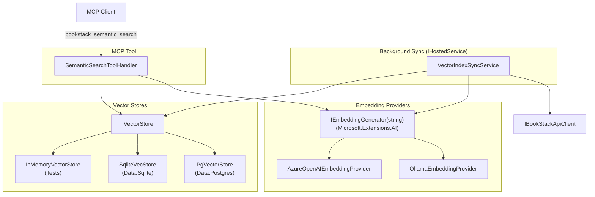
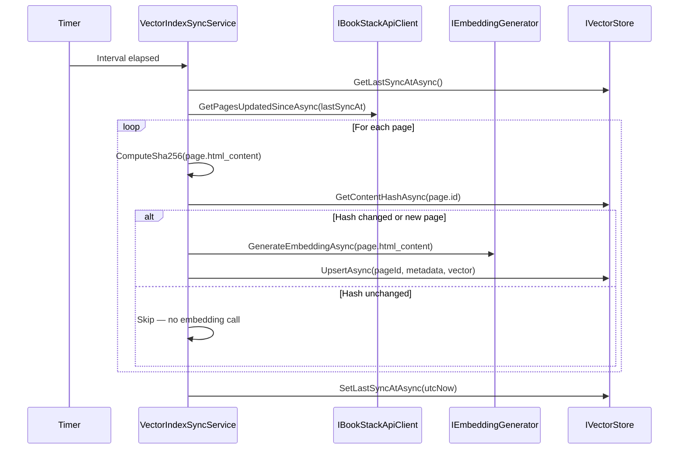

# Feature Spec: Vector Search Engine and Semantic Search MCP Tool

**ID**: FEAT-0005
**Status**: Draft
**Author**: GitHub Copilot
**Created**: 2026-04-26
**Last Updated**: 2026-04-26
**GitHub Issues**: [#5 — Vector Search Engine](https://github.com/MarkZither/bookstack-mcp-server-dotnet/issues/5),
[#11 — Semantic Search MCP Tool](https://github.com/MarkZither/bookstack-mcp-server-dotnet/issues/11)
**Parent Epic**: [#3 — Vector Search](https://github.com/MarkZither/bookstack-mcp-server-dotnet/issues/3)
**Related ADRs**:
[ADR-0002](../../architecture/decisions/ADR-0002-solution-structure.md),
[ADR-0010](../../architecture/decisions/ADR-0010-tool-handler-output-json-policy.md)

---

## Executive Summary

- **Objective**: Add a background vector indexing pipeline and a `bookstack_semantic_search` MCP tool that
  enables AI agents to discover BookStack pages by semantic meaning rather than exact keyword matches.
- **Primary user**: MCP clients (LLM agents, Claude Desktop) that need to surface relevant BookStack pages
  using natural-language queries without knowing precise keywords.
- **Value delivered**: Semantic discovery of BookStack content beyond keyword search; pages are indexed
  incrementally in the background, and results include page ID, title, URL, excerpt, and similarity score.
- **Scope**: Pages only; single embedding per page; Ollama and Azure OpenAI embedding providers; pgvector,
  SQLite-vec, and in-memory (test) vector stores. Admin status/sync UI (issue #80) is excluded.
- **Primary success criterion**: `bookstack_semantic_search` returns ranked page results for a natural-language
  query against a populated index in under 2 seconds, and returns an empty array (not an error) when the
  index is empty or no results exceed the configured threshold.

---

## Problem Statement

BookStack's existing full-text search (exposed as the `bookstack_search` tool) requires callers to supply
exact keywords. AI agents working with BookStack content frequently need to ask natural-language questions —
"how do I reset my password?", "what is our on-call policy?" — without knowing which pages contain relevant
information or what terminology those pages use.

A vector search engine that embeds page content at indexing time and answers semantic similarity queries at
search time fills this gap. The data infrastructure (pgvector, SQLite-vec data projects) is already
scaffolded in the solution; this feature wires up the embedding pipeline, the background sync service, and
the `bookstack_semantic_search` tool handler to connect them.

## Goals

1. Provide a background service that incrementally indexes BookStack pages as embedding vectors, using a
   content hash to skip re-embedding pages whose content has not changed since the last sync.
2. Expose a `bookstack_semantic_search` MCP tool that accepts a natural-language query and returns the
   top-N most semantically similar pages with their metadata and similarity score.
3. Support pluggable embedding providers (`IEmbeddingGenerator<string>` via Microsoft.Extensions.AI) and
   pluggable vector stores (`IVectorStore` abstraction), both selected at startup through configuration.
4. Degrade gracefully: an empty or unavailable index produces an empty result set, not an exception.

## Non-Goals

- Indexing chapters or books — pages only for v1.
- Chunking pages into multiple sub-document embeddings — single chunk per page for v1.
- Admin status bar, `/admin/status`, or `/admin/sync` endpoints — tracked separately as issue #80.
- SQL Server vector store — the `BookStack.Mcp.Server.Data.SqlServer` project is not targeted by this feature.
- Modifying or replacing the existing `bookstack_search` keyword-search tool.
- Hybrid re-ranking (vector + keyword).
- Deletion sync — pages deleted in BookStack are not removed from the vector index within the same sync
  cycle; eventual consistency within one polling interval is acceptable for v1.
- Entra ID / Microsoft Entra authentication for hosted deployments — future concern.

---

## Requirements

### Functional Requirements

1. The system MUST provide a `VectorIndexSyncService` (implementing `IHostedService`) that runs a
   background polling loop with a configurable interval (default: 12 hours, set via
   `VectorSearch:SyncIntervalHours`).
2. On each sync cycle, the service MUST fetch only pages whose `updated_at` field is later than the
   stored `last_sync_at` timestamp, ensuring incremental-only indexing.
3. The service MUST compute a SHA-256 hash of each page's HTML content before requesting an embedding;
   pages whose hash matches the stored `content_hash` MUST be skipped without calling the embedding
   provider.
4. The service MUST call `IEmbeddingGenerator<string>` (Microsoft.Extensions.AI) to produce a single
   embedding vector per page when re-embedding is required.
5. The service MUST upsert the following metadata alongside each embedding vector: `page_id`, `slug`,
   `title`, `url`, `updated_at`, and `content_hash`.
6. The service MUST persist a `last_sync_at` timestamp after each successful sync cycle.
7. The system MUST define an `IVectorStore` abstraction exposing at minimum `UpsertAsync`,
   `SearchAsync(vector, topN, minScore)`, `DeleteAsync(pageId)`, `GetContentHashAsync(pageId)`,
   `GetLastSyncAtAsync`, and `SetLastSyncAtAsync` operations.
8. The system MUST implement `IVectorStore` for pgvector (PostgreSQL provider,
   `BookStack.Mcp.Server.Data.Postgres`) and SQLite-vec (SQLite provider,
   `BookStack.Mcp.Server.Data.Sqlite`).
9. The system MUST implement an in-memory `IVectorStore` for use in unit tests, requiring no database.
10. The system MUST support Ollama as an `IEmbeddingGenerator<string>` provider, with configurable base
    URL (`VectorSearch:Ollama:BaseUrl`, default `http://localhost:11434`) and model name
    (`VectorSearch:Ollama:Model`, default `nomic-embed-text`).
11. The system MUST support Azure OpenAI as an `IEmbeddingGenerator<string>` provider, with configurable
    endpoint, deployment name, and API key sourced from `VectorSearch:AzureOpenAI:*` configuration keys.
12. The active embedding provider MUST be selected at startup via `VectorSearch:EmbeddingProvider`
    (`"Ollama"` | `"AzureOpenAI"`).
13. The system MUST expose a `bookstack_semantic_search` MCP tool accepting:
    - `query` (string, required) — natural-language search query
    - `top_n` (int, optional, default 5, range 1–50) — maximum number of results to return
    - `min_score` (float, optional, default 0.7, range 0.0–1.0) — minimum cosine similarity threshold
14. `bookstack_semantic_search` MUST embed `query` using the configured `IEmbeddingGenerator<string>`
    and query `IVectorStore` for the top-N results with score ≥ `min_score`.
15. `bookstack_semantic_search` MUST return results as a JSON array of objects — sorted by descending
    `score` — each containing:
    - `page_id` (int) — BookStack page identifier
    - `title` (string) — page title
    - `url` (string) — absolute URL to the page in BookStack
    - `excerpt` (string) — first 300 characters of the page's plain-text content
    - `score` (float) — cosine similarity score in the range 0.0–1.0
16. `bookstack_semantic_search` MUST return an empty JSON array (`[]`) when the vector index contains
    no entries.
17. `bookstack_semantic_search` MUST return an empty JSON array (`[]`) when no results satisfy
    `min_score`, rather than returning an error.
18. `bookstack_semantic_search` MUST return a descriptive error string (not throw) when `query` is
    null, empty, or whitespace-only, without calling the embedding provider.
19. `bookstack_semantic_search` MUST return a descriptive error string (not throw) when `top_n` is
    outside the range 1–50.
20. When `VectorSearch:Enabled` is `false`, the application MUST NOT register `VectorIndexSyncService`
    and `bookstack_semantic_search` MUST return a descriptive "feature disabled" message.

### Non-Functional Requirements

1. `bookstack_semantic_search` MUST return a complete response within 2 seconds for a vector index
   of up to 10,000 pages on a single-user workload.
2. The sync service MUST honour the application's `CancellationToken` on shutdown, completing or
   aborting in-flight operations within 30 seconds.
3. Errors encountered while processing an individual page during a sync cycle (network failure,
   embedding provider error) MUST be logged at `Warning` level and MUST NOT abort the cycle or crash
   the background service; the remaining pages and subsequent cycles proceed normally.
4. Azure OpenAI API keys and Ollama base URLs MUST be sourced exclusively from `IConfiguration` /
   `IOptions<T>` and MUST NEVER appear in log output, error strings, or MCP tool responses.
5. All requests to Azure OpenAI MUST use HTTPS; Ollama requests MAY use HTTP for local deployments.
6. `IVectorStore` and `IEmbeddingGenerator<string>` MUST be mockable in unit tests without a running
   database or embedding service.

---

## Design

### Component Diagram



### Sync Cycle Sequence



### API / Tool Interface

| Tool Name                   | Description                                          | Parameters                                                                                      | Returns                  |
| --------------------------- | ---------------------------------------------------- | ----------------------------------------------------------------------------------------------- | ------------------------ |
| `bookstack_semantic_search` | Natural-language page search by semantic similarity  | `query: string`, `top_n?: int (1–50, default 5)`, `min_score?: float (0.0–1.0, default 0.7)`   | `SemanticSearchResult[]` |

**`SemanticSearchResult` fields:**

| Field     | Type   | Description                                     |
| --------- | ------ | ----------------------------------------------- |
| `page_id` | int    | BookStack page identifier                       |
| `title`   | string | Page title                                      |
| `url`     | string | Absolute URL to the page in BookStack           |
| `excerpt` | string | First 300 characters of page plain-text content |
| `score`   | float  | Cosine similarity score (0.0–1.0)               |

### Configuration Schema

```json
{
  "VectorSearch": {
    "Enabled": true,
    "EmbeddingProvider": "Ollama",
    "SyncIntervalHours": 12,
    "Ollama": {
      "BaseUrl": "http://localhost:11434",
      "Model": "nomic-embed-text"
    },
    "AzureOpenAI": {
      "Endpoint": "",
      "DeploymentName": "",
      "ApiKey": ""
    },
    "Search": {
      "DefaultTopN": 5,
      "DefaultMinScore": 0.7
    }
  }
}
```

### File Locations

| Artifact                  | Path                                                                             |
| ------------------------- | -------------------------------------------------------------------------------- |
| Tool handler              | `src/BookStack.Mcp.Server/tools/semantic-search/SemanticSearchToolHandler.cs`    |
| Background sync service   | `src/BookStack.Mcp.Server/services/VectorIndexSyncService.cs`                    |
| Vector store abstraction  | `src/BookStack.Mcp.Server.Data.Abstractions/IVectorStore.cs`                     |
| pgvector implementation   | `src/BookStack.Mcp.Server.Data.Postgres/PgVectorStore.cs`                        |
| SQLite-vec implementation | `src/BookStack.Mcp.Server.Data.Sqlite/SqliteVecStore.cs`                         |
| In-memory implementation  | `tests/BookStack.Mcp.Server.Tests/Fakes/InMemoryVectorStore.cs`                  |
| Configuration options     | `src/BookStack.Mcp.Server/config/VectorSearchOptions.cs`                         |

---

## Acceptance Criteria

- [ ] Given a populated vector index and a natural-language query, when `bookstack_semantic_search`
      is called, then it returns a JSON array of up to `top_n` objects each containing `page_id`,
      `title`, `url`, `excerpt`, and `score`, sorted by descending `score`.
- [ ] Given an empty vector index, when `bookstack_semantic_search` is called with any query, then
      it returns `[]` without throwing an exception.
- [ ] Given an empty or whitespace-only `query`, when `bookstack_semantic_search` is called, then
      it returns a descriptive error string and does not call the embedding provider.
- [ ] Given `top_n` outside the range 1–50, when `bookstack_semantic_search` is called, then it
      returns a descriptive error string.
- [ ] Given `min_score` of 1.0 and a populated index, when `bookstack_semantic_search` is called,
      then it returns `[]` without error.
- [ ] Given `VectorSearch:Enabled` is `false`, when the application starts, then
      `VectorIndexSyncService` is not registered and `bookstack_semantic_search` returns a
      descriptive "feature disabled" message.
- [ ] Given two sync cycles where a page's HTML content has not changed, when the second cycle
      processes that page, then `IEmbeddingGenerator.GenerateEmbeddingAsync` is not called for that
      page (verified by mock assertion in unit tests).
- [ ] Given a sync cycle where the embedding provider returns an error for one page, when the cycle
      completes, then the remaining pages are processed and the service continues running.
- [ ] Given an Ollama configuration pointing to a valid local Ollama instance, when an end-to-end
      sync followed by a `bookstack_semantic_search` call is executed, then results are returned
      without error.

---

## Compliance Criteria

| ID    | Scenario                              | Input                                                         | Expected Output                                                             |
| ----- | ------------------------------------- | ------------------------------------------------------------- | --------------------------------------------------------------------------- |
| CC-01 | Happy path — populated index          | `query="how to reset password"`, `top_n=3`, index has data    | JSON array of ≤3 objects with `page_id`, `title`, `url`, `excerpt`, `score` |
| CC-02 | Empty index                           | `query="any query"`, index is empty                           | `[]` (empty JSON array, no exception)                                       |
| CC-03 | Empty query string                    | `query=""`, index populated                                   | Descriptive error string; `GenerateEmbeddingAsync` is not called            |
| CC-04 | `top_n` out of range                  | `query="test"`, `top_n=100`                                   | Descriptive error string (maximum is 50)                                    |
| CC-05 | Threshold too high — no results match | `query="test"`, `min_score=1.0`, index populated              | `[]` (empty JSON array, no exception)                                       |
| CC-06 | Feature disabled                      | `VectorSearch:Enabled=false`, any query                       | Descriptive "feature disabled" error string                                 |
| CC-07 | Content hash unchanged on second sync | Page content unchanged between two sync cycles                | `GenerateEmbeddingAsync` not called; upsert count is 0 for that page        |
| CC-08 | Must NOT — credential in logs         | Azure OpenAI API key configured; any sync or search operation | No API key, token, or credential value appears in any structured log entry  |

---

## Invariants

1. The `content_hash` stored in the vector index for a page always reflects the hash of the content that
   produced the currently stored embedding vector; a mismatch causes re-embedding on the next cycle.
2. `bookstack_semantic_search` never throws an unhandled exception; all error conditions return a
   descriptive string consistent with ADR-0010.
3. The background sync service never propagates a single-page embedding failure to the outer polling
   loop; per-page failures are isolated and logged, and the remaining pages in the cycle are processed.
4. Embedding provider credentials (API keys, base URLs) never appear in log messages, MCP tool
   output, or error strings under any code path.

---

## Security Considerations

- Azure OpenAI API keys and Ollama base URLs MUST be read from `IConfiguration` (environment variables,
  secrets manager, or Azure Key Vault) and MUST NOT be hardcoded or committed to source control.
- Credentials MUST NOT appear in structured log output at any severity level.
- The `excerpt` field returned by `bookstack_semantic_search` contains up to 300 characters of
  BookStack page content. Access control is assumed to be enforced by the BookStack API token already
  used by the server — the same trust boundary as all other content-returning tools.
- Input validation on `query`, `top_n`, and `min_score` MUST occur at the tool handler boundary
  before any downstream call is made.
- Ollama requests are local-only (HTTP to localhost); TLS is not required. Azure OpenAI requests
  MUST use HTTPS.
- The `excerpt` field MUST be truncated to a maximum of 300 characters at the tool handler layer,
  not delegated to the caller.

---

## Open Questions

*(None — all design decisions were resolved in the specification brief.)*

---

## Out of Scope

- Chapter-level and book-level embeddings (v2 consideration).
- Sub-page chunking into multiple embeddings per page (v2 consideration).
- SQL Server vector store implementation.
- Admin status/sync UI, `/admin/status`, and `/admin/sync` endpoints (issue #80).
- Entra ID / Microsoft Entra authentication for hosted deployments.
- Hybrid search (vector similarity + keyword re-ranking).
- Within-cycle deletion sync — pages deleted in BookStack persist in the vector index until the next
  sync cycle detects them as absent; this eventual consistency is acceptable for v1.
