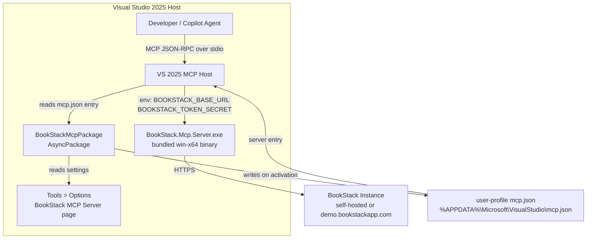
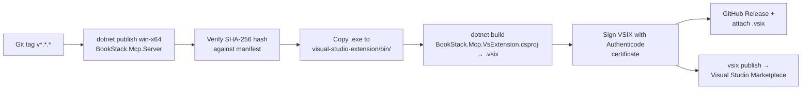

# Feature Spec: Visual Studio 2025 Extension Packaging

**ID**: FEAT-0019
**Status**: Draft
**Author**: GitHub Copilot
**Created**: 2026-05-01
**Last Updated**: 2026-05-01
**Decisions**: win-x64 only (VS 2025 runs exclusively on Windows); stdio transport only for v1; token split into
`tokenId` + `tokenSecret`; VS 2025 MCP registration via user-profile `mcp.json` (resolved in ADR-0017).
**Parent Epic**: [#4 — Marketplace Distribution](https://github.com/MarkZither/bookstack-mcp-server-dotnet/issues/4)
**Related ADRs**:
[ADR-0002](../../architecture/decisions/ADR-0002-solution-structure.md),
[ADR-0003](../../architecture/decisions/ADR-0003-cicd-github-actions.md),
[ADR-0009](../../architecture/decisions/ADR-0009-dual-transport-entry-point.md),
[ADR-0011](../../architecture/decisions/ADR-0011-vscode-extension-binary-bundling.md),
[ADR-0017](../../architecture/decisions/ADR-0017-vs2022-mcp-registration.md) *(proposed)*

---

## Executive Summary

- **Objective**: Package the BookStack MCP server as a Visual Studio 2025 extension so that .NET developers can
  install it from the Visual Studio Marketplace with a single click, without requiring a separate .NET 10 runtime or
  manual configuration.
- **Primary user**: .NET developers using Visual Studio 2025 with GitHub Copilot and a self-hosted or cloud-hosted
  BookStack instance.
- **Value delivered**: Zero-friction installation — no manual binary downloads, no PATH configuration, no JSON file
  editing. The extension bundles the pre-built win-x64 server binary, exposes connection settings through the standard
  Tools > Options dialog, and registers the MCP server so it is available immediately to GitHub Copilot in Visual
  Studio.
- **Scope**: A new `visual-studio-extension/` C# VSIX project added to the existing solution; a pre-built win-x64
  binary bundled in the VSIX; GitHub Actions release workflow additions for publishing to the Visual Studio
  Marketplace; end-user and developer documentation.
- **Primary success criterion**: A developer can install the extension from the Visual Studio Marketplace, enter their
  BookStack URL and API token in Tools > Options, and receive a working `tools/list` response from the MCP server —
  all within five minutes, with no .NET SDK on the machine.

> **VS 2025 note**: Visual Studio 2025 (version 18.x) ships with native MCP server hosting built in. The extension
> registers via the user-profile `mcp.json` file and requires no `IVsMcpServerProvider` SDK API.

---

## Problem Statement

The MCP server binary currently requires users to clone the repository, install .NET 10 SDK, run `dotnet publish`,
and manually edit `mcp.json` to register the server with Visual Studio 2025. This is an unacceptable barrier for
the target audience of .NET developers who expect a single-click Marketplace install. A Visual Studio 2025 VSIX
extension removes every manual step and delivers the same zero-friction experience already available in VS Code
via FEAT-0015.

## Goals

1. Ship a VSIX that bundles the pre-built win-x64 self-contained server binary so .NET 10 SDK is not required on the
   developer's machine.
2. Register the MCP server with VS 2025's MCP client integration by writing a server entry to the user-profile
   `mcp.json` file (documented in ADR-0017) so GitHub Copilot can discover and invoke it without manual JSON editing.
3. Expose three connection settings — **BookStack URL**, **Token ID**, and **Token Secret** — through the standard
   Tools > Options dialog with clear labels and input validation.
4. Publish the VSIX to the Visual Studio Marketplace under the `MarkZither` publisher on tagged releases via CI.
5. Produce documentation covering local development and testing, configuration reference, and usage with the public
   BookStack demo instance.

## Non-Goals

- Visual Studio Code extension — already shipped as FEAT-0015.
- `linux-x64` or `osx-x64` / `osx-arm64` binaries — Visual Studio 2022 runs exclusively on Windows.
- Streamable HTTP transport from within the extension — stdio transport only; HTTP transport targets self-hosted and
  Docker deployment scenarios.
- Windows Credential Manager or `PasswordVault` storage for the Token Secret — deferred to v2; plain VS Options
  settings are used in v1.
- Auto-updating the bundled binary between extension releases — handled by the VSIX update cycle.
- Supporting Visual Studio 2022 or earlier versions.
- Automated end-to-end Copilot integration tests in CI — VS UI automation is complex; manual acceptance testing is
  used for v1.

---

## Requirements

### Functional Requirements

1. The extension MUST bundle a single pre-built `win-x64` self-contained executable (`BookStack.Mcp.Server.exe`)
   produced by `dotnet publish` with `PublishSingleFile=true` and `SelfContained=true`.
2. The extension MUST register the MCP server with VS 2025's MCP client integration by writing a server entry to
   the user-profile `mcp.json` file (`%APPDATA%\Microsoft\VisualStudio\mcp.json`) on first activation, as
   documented in ADR-0017.
3. The extension MUST expose three settings in the Tools > Options dialog under a "BookStack" category, "BookStack
   MCP Server" sub-page:
   - **BookStack URL** — full URL of the BookStack instance, e.g., `https://demo.bookstackapp.com/`.
   - **Token ID** — BookStack API token ID, generated under BookStack → Settings → API Tokens.
   - **Token Secret** — BookStack API token secret corresponding to the Token ID.
4. The extension MUST validate that all three settings are non-empty before starting the server process. If any
   setting is blank, the extension MUST write a message to the VS Output window and display a notification — it MUST
   NOT silently start the server with empty credentials.
5. The extension MUST pass configuration to the server process via environment variables:
   `BOOKSTACK_BASE_URL` (URL value) and `BOOKSTACK_TOKEN_SECRET` (value `tokenId:tokenSecret` concatenated from the
   two token settings).
6. The extension MUST NOT log the Token Secret at any verbosity level in the VS Output window, `ActivityLog.xml`,
   or any diagnostic channel.
7. The extension MUST write the MCP server entry to the user-profile `mcp.json` on package load, and clean up the
   entry on uninstall. VS 2025 manages the process lifecycle; the extension MUST NOT spawn the server process directly.
8. The CI release workflow MUST build the win-x64 server binary, assemble the VSIX, and publish to the Visual Studio
   Marketplace when a Git tag matching `v*.*.*` is pushed.
9. The VSIX MUST include a marketplace `README.md`, an extension icon (128×128 px minimum), and a `CHANGELOG.md`.
10. The extension MUST declare a minimum required Visual Studio version of 18.0 (Visual Studio 2025) in
    `source.extension.vsixmanifest`.
11. The extension MUST gracefully handle server process crashes — it SHOULD attempt one automatic restart and surface
    a VS notification if the restart also fails.

### Non-Functional Requirements

1. Extension load — from VS 2022 startup to MCP server process availability — MUST complete within five seconds on a
   cold start on a developer workstation with SSD storage.
2. The Token Secret MUST NOT appear in VS Output window logs, `ActivityLog.xml`, exception messages, or diagnostic
   telemetry at any time.
3. The VSIX package size SHOULD be under 70 MB (single self-contained win-x64 binary at approximately 50 MB plus
   extension overhead).
4. The extension MUST be compatible with Visual Studio 2025 version 18.0 and later on Windows (x64).

---

## Design

### Repository Layout

```text
bookstack-mcp-server-dotnet/
  visual-studio-extension/
    BookStack.Mcp.VsExtension.csproj    # VSIX SDK C# project (targets net48 or net8.0-windows)
    source.extension.vsixmanifest        # Extension manifest (XML)
    BookStackMcpPackage.cs               # AsyncPackage entry point
    Options/
      BookStackOptionsPage.cs            # DialogPage — Tools > Options page
    Services/
      McpServerHostService.cs            # Server process spawn and lifecycle
    Resources/
      icon.png                           # 128x128 Marketplace icon
    bin/                                 # CI-populated; gitignored
      BookStack.Mcp.Server.exe           # win-x64 self-contained binary
    README.md                            # VS Marketplace listing README
    CHANGELOG.md
  src/
    BookStack.Mcp.Server/                # Existing server project (unchanged)
  .github/
    workflows/
      release.yml                        # Updated — adds VS VSIX build and publish step
```

The `visual-studio-extension/bin/` directory is populated at CI build time and is listed in `.gitignore`. The
`.vsixmanifest` includes the binary via an `<Asset>` element to ensure it is packed into the VSIX.

### Component Diagram



### VS 2025 MCP Registration

Visual Studio 2025 (version 18.x) ships with native MCP server hosting. The extension writes a server entry to the
user-profile `mcp.json` at `%APPDATA%\Microsoft\VisualStudio\mcp.json` on first activation. VS 2025 reads this
file on startup and manages the server process lifecycle directly. This is documented in **ADR-0017**.

```json
// %APPDATA%\Microsoft\VisualStudio\mcp.json (written by extension on activation)
{
  "servers": {
    "bookstack": {
      "type": "stdio",
      "command": "%USERPROFILE%\\.vscode\\extensions\\markzither.bookstack-mcp-server-<version>\\bin\\BookStack.Mcp.Server.exe",
      "env": {
        "BOOKSTACK_BASE_URL": "<user-configured URL>",
        "BOOKSTACK_TOKEN_SECRET": "<tokenId>:<tokenSecret>"
      }
    }
  }
}
```

> The binary path is resolved at runtime from the extension's install location via `Path.GetDirectoryName(Assembly.GetExecutingAssembly().Location)`.

### Options Page Design

The `BookStackOptionsPage` class inherits from `DialogPage` and is registered via `[ProvideOptionPage]` on
`BookStackMcpPackage`. It appears in the Tools > Options tree under **BookStack > BookStack MCP Server**.

| Label | Property | Type | Default | Notes |
|---|---|---|---|---|
| BookStack URL | `BookStackUrl` | `string` | *(blank)* | Full URL, e.g., `https://demo.bookstackapp.com/` |
| Token ID | `TokenId` | `string` | *(blank)* | API token ID from BookStack Settings |
| Token Secret | `TokenSecret` | `string` | *(blank)* | Rendered as a masked field if feasible (see OQ-4) |

### Activation Flow

```mermaid
sequenceDiagram
    participant VS  as Visual Studio 2025
    participant Pkg as BookStackMcpPackage
    participant Opt as BookStackOptionsPage
    participant Mcp as %APPDATA%/VisualStudio/mcp.json

    VS->>Pkg: InitializeAsync(cancellationToken)
    Pkg->>Opt: Load BookStackUrl, TokenId, TokenSecret
    alt any setting is blank
        Pkg->>VS: OutputWindow.Write("BookStack MCP: configure URL and token in Tools > Options")
        Pkg->>VS: ShowMessageBox(warning)
    else all settings present
        Pkg->>Mcp: Write/update server entry (binary path + env vars)
        Mcp-->>VS: VS 2025 reads entry and manages server process
        VS-->>Pkg: MCP server available to Copilot
    end
    Note over VS,Mcp: VS 2025 manages server process lifecycle — no Process.Start in extension
```

### Release Workflow Additions (`.github/workflows/release.yml`)



---

## Configuration Reference

| Tools > Options Setting | Environment Variable | Required | Default | Description |
|---|---|---|---|---|
| BookStack URL | `BOOKSTACK_BASE_URL` | Yes | *(blank)* | Full URL of the BookStack instance. Include trailing slash. |
| Token ID | *(concatenated)* | Yes | *(blank)* | API token ID from BookStack → Settings → API Tokens. |
| Token Secret | `BOOKSTACK_TOKEN_SECRET` | Yes | *(blank)* | Extension passes `TokenId:TokenSecret` as the env var value. |

> **Demo instance**: `https://demo.bookstackapp.com/` is a publicly accessible BookStack instance for testing.
> Log in at `https://demo.bookstackapp.com/login` and generate an API token under Settings → API Tokens.

---

## Documentation Requirements

The following documentation MUST be produced as part of this feature and reviewed before the feature moves to
`Approved`.

### 1. Marketplace README (`visual-studio-extension/README.md`)

MUST cover:

- What the extension does (one paragraph)
- Prerequisites (BookStack instance + API token; no .NET SDK required)
- Quick-start: install extension → Tools > Options → enter URL + token → open GitHub Copilot Chat → verify with a
  BookStack query
- Screenshot: Tools > Options dialog with BookStack settings filled in
- Screenshot: VS 2025 Copilot Chat showing a BookStack MCP tool response
- Configuration reference table (same as above)
- Supported platforms: Windows x64 only (VS 2025 is Windows-only)
- Link to `https://demo.bookstackapp.com/` for users without a self-hosted instance
- Link to GitHub issues for bug reports

### 2. Local Testing Guide

MUST cover:

**Build the server binary and open in Visual Studio**

```powershell
# 1. Build win-x64 self-contained server binary
cd src\BookStack.Mcp.Server
dotnet publish -c Release -r win-x64 --self-contained true `
    -p:PublishSingleFile=true `
    -o ..\..\visual-studio-extension\bin\

# 2. Open the solution in Visual Studio 2025
#    Set BookStack.Mcp.VsExtension as the startup project
# 3. Press F5 to launch an Experimental VS Instance with the extension loaded
# 4. In the Experimental Instance: Tools > Options > BookStack > BookStack MCP Server
# 5. Set BookStack URL, Token ID, and Token Secret; open GitHub Copilot Chat
```

**Verify the server binary responds standalone (PowerShell)**

```powershell
$env:BOOKSTACK_BASE_URL = "https://demo.bookstackapp.com/"
$env:BOOKSTACK_TOKEN_SECRET = "tokenId:tokenSecret"
$init = '{"jsonrpc":"2.0","id":1,"method":"initialize","params":' +
        '{"protocolVersion":"2024-11-05","capabilities":{},' +
        '"clientInfo":{"name":"test","version":"0.0.1"}}}'
echo $init | .\visual-studio-extension\bin\BookStack.Mcp.Server.exe
```

Expected: a JSON-RPC `initialize` response on stdout with no errors on stderr.

### 3. CHANGELOG (`visual-studio-extension/CHANGELOG.md`)

MUST follow [Keep a Changelog](https://keepachangelog.com/) format. Initial entry:

```markdown
## [0.1.0] - YYYY-MM-DD

### Added

- Initial release. Bundles BookStack MCP server win-x64 binary.
- Tools > Options integration for BookStack URL, Token ID, and Token Secret.
- Automatic MCP server registration on extension activation.
```

---

## Acceptance Criteria

- [ ] Given the VSIX installed from the Visual Studio Marketplace (or sideloaded), when BookStack URL, Token ID, and
  Token Secret are set in Tools > Options, then the MCP server entry is written to the user-profile `mcp.json` and
  VS 2025 completes the `initialize` handshake within five seconds.
- [ ] Given any of the three required settings is blank when the extension activates, then the VS Output window
  contains a message directing the user to Tools > Options and no `mcp.json` entry is written.
- [ ] Given all three settings are present, when VS 2025 starts, then `BookStack.Mcp.Server.exe` is running as a
  child process managed by the VS 2025 MCP host within five seconds.
- [ ] Given `BookStack URL = https://demo.bookstackapp.com/` and a valid demo API token, when GitHub Copilot Chat in
  VS 2025 sends a query that requires the BookStack `books_list` tool, then the MCP tool returns a non-empty list of
  books.
- [ ] Given the extension is active, when Visual Studio is closed normally, then VS 2025 terminates the
  `BookStack.Mcp.Server.exe` process and it does not remain as an orphan.
- [ ] Given a Git tag `v*.*.*` is pushed to GitHub, when the release workflow completes successfully, then the `.vsix`
  is attached to the GitHub Release and the extension version on the Visual Studio Marketplace is updated to match the
  tag.
- [ ] Given the VSIX is built by CI, when the package size is measured, then it is under 70 MB.
- [ ] Given the extension is running with a Token Secret configured, when the VS Output window and `ActivityLog.xml`
  are inspected at any log level, then the Token Secret value does not appear.
- [ ] Given the extension is installed, when Tools > Options is opened in VS 2025, then a "BookStack MCP Server" page
  is present under a "BookStack" category containing three labelled input fields: BookStack URL, Token ID, and Token
  Secret.
- [ ] Given the extension F5-launched in an Experimental VS Instance, when BookStack URL, Token ID, and Token Secret
  are configured, then GitHub Copilot Chat in the Experimental Instance can invoke BookStack MCP tools successfully.

---

## Security Considerations

- The Token Secret MUST be passed only via environment variable to the server child process — it MUST NOT appear in
  VS Output window logs, `ActivityLog.xml`, crash dumps, exception messages, or diagnostic telemetry.
- VS Options storage persists settings to `%APPDATA%\Microsoft\VisualStudio\<version>\privateregistry.bin`, which
  VS encrypts at rest using the Windows Data Protection API (DPAPI). A future iteration SHOULD migrate the Token
  Secret to Windows Credential Manager (`Windows.Security.Credentials.PasswordVault`) for defence-in-depth, but
  this is out of scope for v1.
- The `mcp.json` entry written by the extension includes the Token Secret as a plain env var value. This file is
  readable by the current Windows user. This is equivalent to the VS Code settings approach in FEAT-0015 and is
  acceptable for v1.
- The pre-built win-x64 binary is a CI artifact. The release workflow MUST verify the SHA-256 hash of the binary
  against a signed manifest before packing the VSIX, to prevent supply-chain substitution.
- The VSIX MUST be Authenticode-signed before submission to the Visual Studio Marketplace. The signing certificate
  and strategy are to be confirmed (see OQ-2).
- The extension MUST NOT make any outbound network calls — all network I/O is the server process's responsibility.
- Input values from the Options page MUST NOT be logged or included in telemetry, even in debug builds.

---

## Open Questions

- [x] **OQ-1**: RESOLVED — VS 2025 uses user-profile `mcp.json`. No `IVsMcpServerProvider` API needed. See ADR-0017.
- [x] **OQ-3**: RESOLVED — minimum version is 18.0 (VS 2025). VS 2022 not targeted.
- [ ] **OQ-2**: Does the Visual Studio Marketplace require the VSIX to be signed with a publicly trusted certificate,
  or is a self-signed Authenticode certificate sufficient? What is the certificate procurement and storage strategy
  for the CI pipeline?
- [ ] **OQ-4**: Should `TokenSecret` be rendered as a masked (password) field in the VS Options dialog? `DialogPage`
  does not natively support password rendering — confirm feasibility of a custom `UITypeEditor` or `TypeConverter`,
  or defer to v2.
- [x] **OQ-5**: RESOLVED — extension project targets `net10.0-windows` only.

---

## Out of Scope

- Visual Studio Code extension — already shipped as FEAT-0015.
- `linux-x64` and `osx-x64` / `osx-arm64` binaries — Visual Studio 2025 runs exclusively on Windows.
- Streamable HTTP transport within the extension — stdio transport is used for v1.
- Windows Credential Manager / `PasswordVault` storage for Token Secret — deferred to v2.
- Supporting Visual Studio 2019 or earlier.
- Automated end-to-end Copilot integration tests in CI — deferred; VS UI automation is complex.
