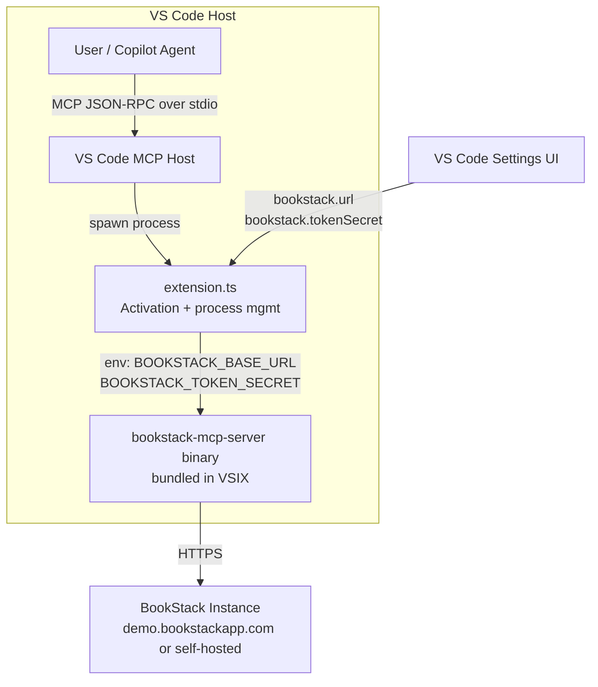
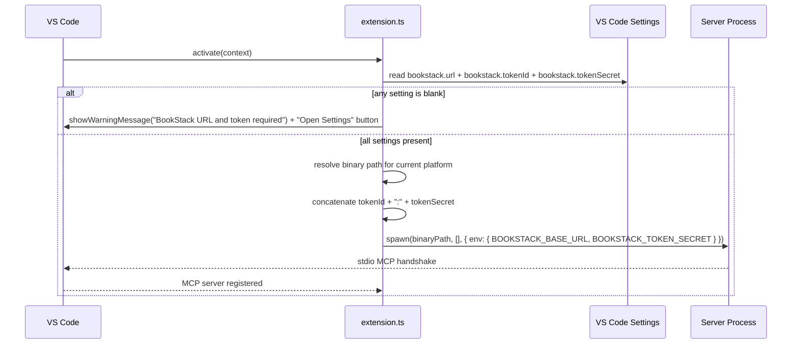
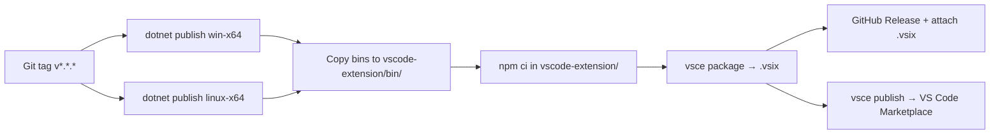

# Feature Spec: VS Code Extension Packaging

**ID**: FEAT-0015
**Status**: Approved
**Author**: GitHub Copilot
**Created**: 2026-04-22
**Last Updated**: 2026-04-22
**Decisions**: macOS target deferred (no test environment); plain VS Code settings for v1 (SecretStorage deferred to v2); token split into `bookstack.tokenId` + `bookstack.tokenSecret`
**GitHub Issue**: [#15 — Feature: VS Code Extension Packaging](https://github.com/MarkZither/bookstack-mcp-server-dotnet/issues/15)
**Parent Epic**: [#4 — Marketplace Distribution](https://github.com/MarkZither/bookstack-mcp-server-dotnet/issues/4)
**Related ADRs**:
[ADR-0002](../../architecture/decisions/ADR-0002-solution-structure.md),
[ADR-0003](../../architecture/decisions/ADR-0003-cicd-github-actions.md),
[ADR-0009](../../architecture/decisions/ADR-0009-dual-transport-entry-point.md),
[ADR-0011](../../architecture/decisions/ADR-0011-vscode-extension-binary-bundling.md)

---

## Executive Summary

- **Objective**: Package the BookStack MCP server as a VS Code extension so that developers can install it from the VS Code Marketplace with a single click, without requiring .NET installed on the host machine.
- **Primary user**: .NET developers and knowledge workers who use VS Code with GitHub Copilot or another MCP-compatible AI assistant and run a BookStack instance.
- **Value delivered**: Zero-friction installation — no manual binary downloads, no PATH configuration, no JSON editing in `settings.json`. The extension registers the MCP server automatically and prompts for the two required settings (URL + token).
- **Scope**: A new `vscode-extension/` project alongside the existing server; pre-built binaries for **win-x64 and linux-x64** bundled inside the VSIX (macOS deferred — no test environment available); GitHub Actions release workflow for `vsce publish`; end-user and developer documentation.
- **Primary success criterion**: A user can install the `.vsix` from the Marketplace, enter their BookStack URL and API token, and get a working `tools/list` response from the MCP server — all within five minutes.

---

## Problem Statement

The MCP server binary (FEAT-0008) currently requires users to clone the repository, install .NET 10, run `dotnet publish`, and manually edit `settings.json` or `mcp.json` to register the server. This is an unacceptable barrier for the target audience of knowledge workers and developers who expect a single-click Marketplace install. Packaging as a VS Code extension removes every manual step.

## Goals

1. Ship a `.vsix` that bundles pre-built server binaries for **win-x64 and linux-x64** so .NET is not required on the user's machine. macOS is deferred to a future release when a test environment is available.
2. Contribute an `mcpServers` entry point to VS Code so the server is registered automatically on extension activation.
3. Expose `bookstack.url` and `bookstack.tokenSecret` as VS Code settings, with clear descriptions and validation, so users never touch `settings.json` manually.
4. Provide an in-extension walkthrough that guides first-time users from install through to a working MCP connection, using `https://demo.bookstackapp.com/` as the demo instance.
5. Publish to the VS Code Marketplace under the `MarkZither` publisher on tagged releases via CI.
6. Write documentation covering: local install and testing, debug workflow, configuration reference, and using the demo instance.

## Non-Goals

- Visual Studio (VSIX for VS 2022+) packaging — tracked separately in [#13](https://github.com/MarkZither/bookstack-mcp-server-dotnet/issues/13).
- Supporting .NET runtime already on PATH as the sole distribution mechanism (bundled binaries are required for consistent UX).
- macOS (osx-x64 / osx-arm64) binary — deferred; no test environment available.
- Implementing book/shelf filtering within the scope of this feature — tracked as [#54](https://github.com/MarkZither/bookstack-mcp-server-dotnet/issues/54).
- Supporting the Streamable HTTP transport from within the extension (stdio only; HTTP transport is for self-hosted / Docker scenarios).
- Auto-updating the bundled binary between extension releases (handled by extension update cycle).
- `vscode.SecretStorage` for the API token — deferred to v2; plain VS Code settings are used in v1.

---

## Requirements

### Functional Requirements

1. The extension MUST declare an `mcpServers` contribution in `package.json` that starts the bundled server binary via `command` + `args` using the stdio transport.
2. The extension MUST contribute three VS Code settings:
   - `bookstack.url` (string, required) — URL of the BookStack instance, e.g. `https://demo.bookstackapp.com/`.
   - `bookstack.tokenId` (string, required) — BookStack API token ID. Generated under BookStack → Settings → API Tokens.
   - `bookstack.tokenSecret` (string, required) — BookStack API token secret corresponding to the token ID above.
3. The `mcpServers` contribution MUST pass `bookstack.url`, `bookstack.tokenId`, and `bookstack.tokenSecret` to the server process; `extension.ts` MUST concatenate them as `${bookstack.tokenId}:${bookstack.tokenSecret}` and pass the result via the `BOOKSTACK_TOKEN_SECRET` environment variable.
4. The extension MUST select the correct bundled binary at runtime based on `process.platform` (`win32` → `bookstack-mcp-server.exe`, `linux` → `bookstack-mcp-server-linux`). If the platform is unsupported (e.g. macOS), the extension MUST surface a clear error message and not attempt to spawn a binary.
5. If any of the three required settings is blank, the extension MUST surface a VS Code warning notification with an "Open Settings" action button — it MUST NOT silently launch the server with empty credentials.
6. The extension MUST include an `extensionKind: ["workspace"]` declaration so the server process runs on the machine where the workspace files are located (local or remote/SSH).
7. The VSIX MUST bundle pre-built binaries for `win-x64` and `linux-x64` produced by `dotnet publish` with `PublishSingleFile=true` and `SelfContained=true`.
8. The CI release workflow MUST build both platform binaries, assemble the VSIX, and publish to the VS Code Marketplace when a tag matching `v*.*.*` is pushed.
9. The VSIX MUST include a marketplace `README.md`, an `icon.png` (128×128 px minimum), and a `CHANGELOG.md`.

### Non-Functional Requirements

1. Extension activation — from VS Code startup to MCP server process launch — MUST complete within three seconds on a cold start.
2. The API token MUST NOT be logged by the extension at any log level; it MUST be passed only via environment variable to the child process.
3. The VSIX package size SHOULD be under 100 MB (two self-contained binaries at ~50 MB each).
5. The extension MUST support VS Code `^1.95.0` (minimum version that shipped stable `mcpServers` contribution point support).

---

## Design

### Repository Layout

```
bookstack-mcp-server-dotnet/
  vscode-extension/
    package.json              # Extension manifest
    package-lock.json
    tsconfig.json
    src/
      extension.ts            # Activation entry point
    media/
      icon.png                # Marketplace icon (128×128 px)
    docs/
      WALKTHROUGH.md          # In-extension walkthrough content
    README.md                 # Marketplace listing README
    CHANGELOG.md
    .vscodeignore             # Excludes dev files from VSIX
  src/
    BookStack.Mcp.Server/     # Existing server project (unchanged)
  .github/
    workflows/
      ci.yml                  # Existing — adds extension lint step
      release.yml             # New — builds binaries + publishes VSIX
```

The two platform binaries (win-x64, linux-x64) are placed into `vscode-extension/bin/` at CI build time and listed under `.vscodeignore` include patterns to ensure they are packed into the VSIX.

### Component Diagram



### `package.json` Contribution Shape

```jsonc
{
  "name": "bookstack-mcp-server",
  "displayName": "BookStack MCP Server",
  "publisher": "MarkZither",
  "version": "0.1.0",
  "engines": { "vscode": "^1.95.0" },
  "extensionKind": ["workspace"],
  "contributes": {
    "mcpServers": {
      "bookstack": {
        "command": "${extensionPath}/bin/bookstack-mcp-server-${platform}",
        "args": [],
        "env": {
          "BOOKSTACK_BASE_URL": "${config:bookstack.url}",
          "BOOKSTACK_TOKEN_SECRET": "${config:bookstack.tokenSecret}"
        }
      }
    },
    "configuration": {
      "title": "BookStack MCP Server",
      "properties": {
        "bookstack.url": {
          "type": "string",
          "default": "",
          "markdownDescription": "URL of your BookStack instance, e.g. `https://demo.bookstackapp.com/` or `https://wiki.example.com/`."
        },
        "bookstack.tokenId": {
          "type": "string",
          "default": "",
          "markdownDescription": "BookStack API token ID. Generate a token under BookStack → **Settings → API Tokens**."
        },
        "bookstack.tokenSecret": {
          "type": "string",
          "default": "",
          "markdownDescription": "BookStack API token secret corresponding to `bookstack.tokenId`."
        }
      }
    }
  }
}
```

> **Note**: `${platform}` is resolved at activation time in `extension.ts` to `bookstack-mcp-server.exe` (win32) or `bookstack-mcp-server-linux` (linux). Any other platform shows an unsupported-platform error.

### Activation Flow



### Release Workflow (`.github/workflows/release.yml`)



---

## Configuration Reference

| VS Code Setting | Environment Variable | Required | Default | Description |
|---|---|---|---|---|
| `bookstack.url` | `BOOKSTACK_BASE_URL` | Yes | *(blank)* | Full URL of your BookStack instance. Must include trailing slash. Example: `https://demo.bookstackapp.com/` |
| `bookstack.tokenId` | *(concatenated)* | Yes | *(blank)* | API token ID from BookStack → Settings → API Tokens. |
| `bookstack.tokenSecret` | `BOOKSTACK_TOKEN_SECRET` | Yes | *(blank)* | API token secret. The extension passes `tokenId:tokenSecret` as the env var value. |

> **Demo instance**: `https://demo.bookstackapp.com/` is a publicly accessible BookStack instance for testing.
> API tokens for the demo can be generated by logging in at `https://demo.bookstackapp.com/login` (use any registered account).
> Content is reset periodically so it is safe to use for testing reads and writes.

---

## Documentation Requirements

The following documentation MUST be produced as part of this feature and reviewed before the feature moves to `Approved`:

### 1. Marketplace README (`vscode-extension/README.md`)

MUST cover:
- What the extension does (one paragraph)
- Prerequisites (BookStack instance + API token; no .NET required)
- Quick-start: install → open settings → enter URL + token → open Copilot Chat → verify with `@bookstack list all books`
- Screenshot: settings UI with `bookstack.url`, `bookstack.tokenId`, and `bookstack.tokenSecret` filled in
- Screenshot: Copilot Chat showing a BookStack tool response
- Link to the demo instance (`https://demo.bookstackapp.com/`) for users without a self-hosted instance
- Configuration reference table (same as above)
- Supported platforms table (win-x64, linux-x64) with a note that macOS support is planned for a future release
- Link to GitHub issues for bug reports

### 2. Local Testing Guide (section in README or separate `CONTRIBUTING.md`)

MUST cover:

**Install without Marketplace (`F5` / `.vsix` sideload)**

```bash
# 1. Build server binary for your platform (use win-x64 on Windows)
cd src/BookStack.Mcp.Server
dotnet publish -c Release -r linux-x64 --self-contained true -p:PublishSingleFile=true -o ../../vscode-extension/bin/
# On Windows:
# dotnet publish -c Release -r win-x64 --self-contained true -p:PublishSingleFile=true -o ..\..\vscode-extension\bin\

# 2. Install dependencies
cd ../../vscode-extension
npm ci

# 3. Package as .vsix (optional — for sideload testing)
npx vsce package

# 4. Install from .vsix in VS Code
# VS Code → Extensions → ⋯ → Install from VSIX…
```

**Press F5 to launch Extension Development Host**

- Open `vscode-extension/` in VS Code.
- Press **F5** — this opens a new VS Code window with the extension loaded from source.
- In the Extension Development Host window, open any folder, set `bookstack.url` and `bookstack.tokenSecret` in Settings, and open GitHub Copilot Chat.
- The MCP server starts automatically; verify with `@bookstack list all shelves`.

**Verify server responds without VS Code**

```bash
# Confirm the binary works standalone (useful for CI smoke test)
BOOKSTACK_BASE_URL=https://demo.bookstackapp.com/ \
BOOKSTACK_TOKEN_SECRET=tokenId:tokenSecret \
./bin/bookstack-mcp-server-linux \
  <<< '{"jsonrpc":"2.0","id":1,"method":"initialize","params":{"protocolVersion":"2024-11-05","capabilities":{},"clientInfo":{"name":"test","version":"0.0.1"}}}'
```

Expected: JSON-RPC `initialize` response on stdout with no errors on stderr.

### 3. Debug Guide

MUST cover:

**Extension-side debugging (TypeScript)**

1. Open `vscode-extension/` in VS Code.
2. Place breakpoints in `src/extension.ts`.
3. Press **F5** → the Extension Development Host launches with the TypeScript debugger attached.
4. The **Debug Console** in the host window shows extension output.
5. Use **Developer: Toggle Developer Tools** (`Ctrl+Shift+I`) in the Extension Development Host for the full DevTools console.

**Server-side debugging (.NET)**

Because the server runs as a child process over stdio, standard attach-to-process debugging applies:

1. Add `System.Diagnostics.Debugger.Launch()` temporarily to `Program.cs` (remove before committing).
2. Launch the Extension Development Host (`F5`).
3. When VS Code activates the extension and spawns the server, a JIT debugger prompt appears — attach VS Code's .NET debugger.

Alternatively, run the server standalone with environment variables set and attach from **Run → Attach to Process**.

**Reading extension logs**

- **Output panel** → select **BookStack MCP Server** channel for extension activation messages.
- **Server stderr** is captured by VS Code and forwarded to the same output channel.
- Set `"bookstack.logLevel": "debug"` (future setting) to increase server verbosity.

**Common issues**

| Symptom | Likely cause | Fix |
|---|---|---|
| "MCP server failed to start" | Binary not executable (linux/osx) | `chmod +x vscode-extension/bin/bookstack-mcp-server-linux` |
| No tools in Copilot | Settings blank | Set `bookstack.url` + `bookstack.tokenSecret` in Settings |
| 401 Unauthorized | Wrong token format | Token must be `<tokenId>:<tokenSecret>` not just the secret |
| Timeout on tools/list | Wrong URL (no trailing path) | Ensure URL ends with `/` e.g. `https://demo.bookstackapp.com/` |
| macOS Gatekeeper blocks binary | Binary not signed | See code-signing step in release workflow |

### 4. CHANGELOG (`vscode-extension/CHANGELOG.md`)

MUST follow [Keep a Changelog](https://keepachangelog.com/) format. Initial entry:

```markdown
## [0.1.0] - YYYY-MM-DD
### Added
- Initial release. Bundles BookStack MCP server for win-x64, linux-x64, osx-x64.
- `bookstack.url` and `bookstack.tokenSecret` settings.
- Automatic MCP server registration on activation.
```

---

## Acceptance Criteria

- [ ] Given the `.vsix` installed from Marketplace (or sideloaded), when `bookstack.url` and `bookstack.tokenSecret` are set, then the MCP server process starts and VS Code's MCP host completes the `initialize` handshake within 3 seconds.
- Given any of the three required settings is blank, when the extension activates, then a warning notification appears with an "Open Settings" action — no server process is spawned.
- [ ] Given the Extension Development Host launched with **F5**, when breakpoints are set in `extension.ts`, then the TypeScript debugger hits them on activation.
- [ ] Given `bookstack.url = https://demo.bookstackapp.com/` and a valid demo API token, when Copilot Chat sends `list all books`, then the MCP tool returns a non-empty list of books from the demo instance.
- [ ] Given a win-x64 machine, when the extension is installed, then `win/bookstack-mcp-server.exe` is used and not the linux or osx binary.
- [ ] Given a tagged release `v*.*.*` pushed to GitHub, when the release workflow completes, then the `.vsix` is attached to the GitHub Release and the extension version on the Marketplace is updated.
- [ ] Given the extension installed on a macOS machine, when the server binary runs, then Gatekeeper does not block it (binary is ad-hoc or developer-signed).
- [ ] Given the README, when a first-time user follows the Quick-Start steps using `https://demo.bookstackapp.com/`, then they achieve a working MCP connection without consulting any other documentation.

---

## Security Considerations

- The API token is passed only via environment variable to the child process — it MUST NOT appear in extension logs, the Output channel, or any diagnostic telemetry.
- `bookstack.tokenSecret` SHOULD be stored in VS Code's secret storage (`vscode.SecretStorage`) rather than plain workspace settings in a future iteration (deferred — see Open Questions).
- The bundled binary is a pre-built artifact; the CI pipeline MUST verify the SHA-256 hash of each binary against a manifest before packing the VSIX, to prevent supply-chain substitution.
- The extension MUST NOT make any outbound network calls itself — all network I/O is the server's responsibility.
- CORS and authentication for the HTTP transport are out of scope; this extension uses stdio only.

---

## Open Questions

- **Resolved — Token format**: Two separate settings — `bookstack.tokenId` and `bookstack.tokenSecret` — concatenated by `extension.ts` as `tokenId:tokenSecret` before passing to the server via `BOOKSTACK_TOKEN_SECRET`. Better UX than asking users to know the combined format.
- [ ] **macOS support**: Deferred — no test environment available. Track as a follow-up issue when a macOS CI runner or test machine is available. osx-x64 and osx-arm64 binaries would both be needed.
- **Resolved — Secret storage**: `bookstack.tokenSecret` uses plain VS Code settings in v1. `vscode.SecretStorage` deferred to v2.
- **Resolved — macOS target**: osx-x64 and osx-arm64 are out of scope for v1.
- **Resolved — Book/shelf scope filtering**: Filed as [#54](https://github.com/MarkZither/bookstack-mcp-server-dotnet/issues/54) for a future release.

---

## Out of Scope

- Visual Studio 2022 VSIX packaging — [#13](https://github.com/MarkZither/bookstack-mcp-server-dotnet/issues/13).
- macOS (osx-x64 / osx-arm64) — no test environment; deferred to a future release.
- Streamable HTTP transport within the extension — stdio only.
- Auto-update of the bundled binary outside of the normal extension update cycle.
- Telemetry or usage analytics.
- Book/shelf scope filtering — tracked as [#54](https://github.com/MarkZither/bookstack-mcp-server-dotnet/issues/54).
- `vscode.SecretStorage` for the API token — deferred to v2.
